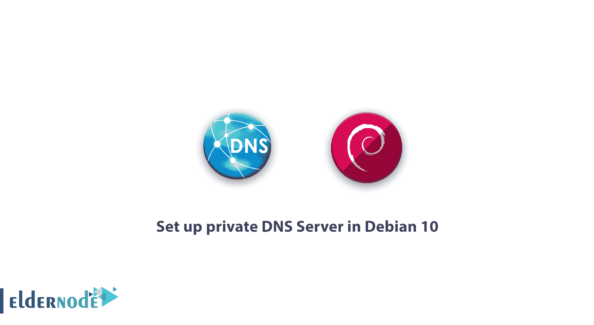

# 在 Debian 10 - Eldernode 博客中设置私有 DNS 服务器

> 原文：<https://blog.eldernode.com/private-dns-server-in-debian-10/>



了解如何在 Debian 10 Linux 中一步步设置私有 DNS 服务器。Bind 是一种 DNS 服务，它为您的 ip 地址分配一个唯一的名称，这实际上称为域名。这使得在互联网上甚至在局域网(LAN)上解析 ip 地址变得更加容易。一个网络只能有一个域名。当域名解析为其 ip 地址时，此操作被标识为正向区域，当 ip 地址引用其名称时，它被称为反向区域。在这篇文章中，我们试着教你**如何在 Debian 10** 中建立一个私有 DNS 服务器。可以在 [Eldernode](https://eldernode.com/) 到[购买 VPS](https://eldernode.com/vps/) 服务器访问各种套餐。

## **在 Debian 10** 中设置私有 DNS 服务器

Bind 代表伯克利互联网域名，在 Linux 中被称为 DNS 服务。Bind 是我们将在本文中安装的最流行的域名服务之一。在本教程中，我们将首先安装 Bind，然后在第二步中，我们将在内部网络中构建一个区域。和我们在一起。

## 教程在 Debian 10 中设置私有 DNS 服务器

### 如何在 Debian 10 Linux 中安装和调整 Bind

**1。**首先，设置好你的 Debian 10 主机。

请注意，主机名必须是 [FQDN](https://en.wikipedia.org/wiki/Fully_qualified_domain_name) ，域名必须是您想要使用的域。**比如**，问题中的域名是 **eldernode.local** ，我们把服务器**叫做 Srv.eldernode.com**。

**2。然后输入下面的命令，用最新的更新来装备你的 Debian:**

```
apt update
```

**3。**完全更新后，重新启动系统一次。

```
reboot
```

### 如何在 Debian Stretch 中安装 Bind

**1。**输入以下命令来安装绑定服务和软件包:

```
apt -y install bind9 bind9utils dnsutils
```

**2。**安装后，使用以下命令启动绑定服务:

```
systemctl start bind9
```

### 了解如何在 Debian 10 中设置 Bind 并构建 Zone

**1。**用编辑器打开 **etc/bind/named.conf** 文件:

```
vi /etc/bind/named.conf
```

输入以下语句来设置绑定存储文件及其工作方式:

```
include "/etc/bind/named.conf.options";
```

```
include "/etc/bind/named.conf.local";
```

```
# add
```

```
include "/etc/bind/named.conf.internal-zones";
```

到目前为止，您已经熟悉了 Bind 的安装和设置。现在，我们将为内部网络构建一个区域。

**2。**用编辑器打开**etc/bind . named . conf . internal-zones**文件。

该文件与在绑定设置中添加的文件相同。如果您已更改其名称，则必须在此部分添加相同的名称:

```
vi /etc/bind/named.conf.internal-zones
```

**3。**然后复制并粘贴以下语句，创建并设置一个区域:

```
# create new  # define for internal section  view "internal" {          match-clients {                  localhost;                  10.0.0.0/24;          };          # set zone for internal          zone "eldernode.local" {                  type master;                  file "/etc/bind/srv.eldernode.local";                  allow-update { none; };          };          # set zone for internal *note          zone "0.0.10.in-addr.arpa" {                  type master;                  file "/etc/bind/0.0.10.db";                  allow-update { none; };          };          include "/etc/bind/named.conf.default-zones";  };
```

***注意:*** 在上述语句中，注意在变红的字段中，必须输入您的域名、IP 范围和反向区域名称。

### 如何确定绑定响应范围(Debian 10 中的私有 DNS 服务器)

现在，如果您需要设置绑定服务器响应范围，您应该执行以下操作。

**1。**用编辑器打开**etc/bind/named . conf . options/**文件。

```
vi /etc/bind/named.conf.options
```

**2。**然后输入以下命令，限制 Bind 响应特定的 IP 范围:

```
options {            directory "/var/cache/bind";           # query range you allow          allow-query { localhost; 10.0.0.0/24; };          # the range to transfer zone files          allow-transfer { localhost; 10.0.0.0/24; };          # recursion range you allow          allow-recursion { localhost; 10.0.0.0/24; };            dnssec-validation auto;            auth-nxdomain no;    # conform to RFC1035          # change if not use IPV6          listen-on-v6 { none; };  };
```

这里完成了内部网络的绑定和区域构建的安装和调整。

添加或编辑每个区域以及使用以下命令提到的文件后，必须重新启动绑定服务一次:

```
systemctl restart bind9
```

***注意:***DNS 服务将使用端口 53 以及 TCP 和 UDP 协议，因此在您的系统防火墙中为这两种协议打开该端口。

## 结论

也许 DNS 的主要目的是方便网络请求。记住名称总是很容易的，这就是为什么我们给每个网络的 ip 地址分配一个名称的原因。在这篇文章中，我们试图教你如何在 Debian 10 中建立一个私有的 DNS 服务器。如果你也对 [Ubuntu](https://blog.eldernode.com/tag/ubuntu/) 发行版感兴趣，可以参考文章[如何在 ubuntu 20.04](https://blog.eldernode.com/private-dns-server-on-ubuntu-20-04/) 上设置私有 DNS 服务器。