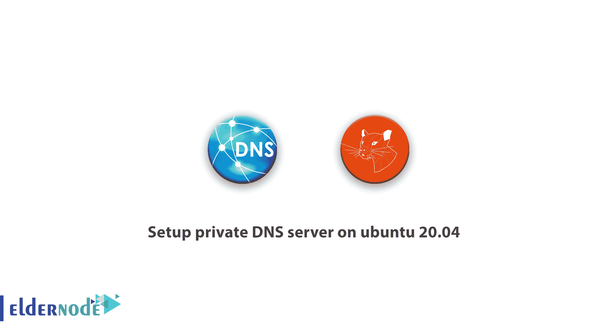

# 如何在 ubuntu 20.04 - Eldernode 上设置专用 DNS 服务器

> 原文：<https://blog.eldernode.com/private-dns-server-on-ubuntu-20-04/>



服务器配置管理讨论的一个重要部分是通过设置适当的“域名系统”(DNS)，提供一种通过名称检查网络连接和 IP 地址的简单方法。使用 [FQDN](https://en.wikipedia.org/wiki/Fully_qualified_domain_name) 代替 IP 地址来指代网络中的地址，使得配置服务和应用更加容易，并且增加了存储配置文件的能力。为专用网络设置个人 DNS 是改善服务器管理的一个好方法。在这篇文章中，我们试图完全教你如何**在 ubuntu 20.04** 上设置一个私有 DNS 服务器。如果需要购买 [Ubuntu VPS](http://eldernode.com/ubuntu-vps/) 服务器，可以在 [Eldernode](https://eldernode.com/) 中看到可用的包。

## 在 ubuntu 20.04 上设置私有 DNS 服务器

在本文中，我们将了解如何在 [Ubuntu](https://blog.eldernode.com/tag/ubuntu/) 20.04 上使用服务器名称软件(BIND)设置内部 DNS 服务器。您的客户端服务器可以使用此名称服务器来解析主机名称和私有 IP 地址。这提供了一种集中管理内部主机名称和私有 IP 地址的方式，当您需要将工作环境扩展到多台主机时，这一点非常重要。跟随我们继续这篇文章，阅读**教程在 ubuntu 20.04** 上设置私有 DNS 服务器。

### 在 ubuntu 20.04 上设置私有 DNS 服务器的先决条件

要学习本教程，您必须具备以下基础设施。请注意，所有服务器必须位于同一个数据中心，并在它们之间启用专用网络:

**–**一台新安装了 Ubuntu 20.04 版本的服务器，作为主 DNS 服务器，名为 ns1

**–**第二台 Ubuntu 20.04 服务器作为辅助 DNS 服务器，名为 ns2(推荐)。

**–**同一数据中心内将使用 DNS 服务器的其他服务器。

***注意:*** 在这些额外的服务器上，必须通过 sudo 用户配置访问权限，并且必须使用防火墙。

#### 在 ubuntu 20.04 上设置专用 DNS 服务器的示例基础设施和目标

鉴于本文的目的，以下是我们的一些假设:

**1。**我们有两台服务器将用作我们的名称服务器。在本文中，我们将这些服务器称为 **ns1** 和 **ns2** 。

**2。**我们有另外两台客户端服务器将使用我们正在创建的 DNS 基础设施。这些服务器被称为**主机 1** 和**主机 2** 。当然，您可以向这个基础设施中添加任意数量的服务器。

**3。**所有这些服务器都位于一个数据中心。我们假设这个数据中心的名称是 **nyc3** 。

**4。所有这些服务器都有专用网络，位于子网 **10.128.0.0。/16** 。当然，您必须根据服务器的规格来更改这些内容。**

**5。**所有服务器都连接到位于“【example.com】T2 域的项目。因为我们的 DNS 系统是完全内部私有的，所以不需要购买域名。但是，使用域有助于防止对公共可路由域的干扰。

***注:*** 根据上述假设，很明显，名为“nyc3.example.com”的命名方案适用于指代私有子网或区域。因此，主机 1 的 FQDN 应该是 host1.nyc3.example.com。

请注意，您现有的设置可能有所不同；但是，为说明如何配置 DNS 服务器而提供的示例字母和 IP 地址是完全运行的内部 DNS 的示例。您可以通过替换现有环境中的主机名和专用 IP 地址来轻松使用这些设置。如果您使用多个数据中心，您可以在每个相应的数据中心内创建一个内部 DNS。

## 如何在 DNS 服务器上安装 BIND

请注意，在本教程中，**红色**中突出显示的项目通常是变量，您应该根据服务器的规格用值来替换它们。例如，如果你看到一个变量是 host1.nyc3.example.com 的 T2，你必须输入你的服务器的 FQDN。类似地，用您的服务器的 IP 地址替换您的 **host1_private_IP** 。

通过输入以下命令，更新名为 **ns1** 和 **ns2** 的两个 DNS 服务器上的 apt 包:

```
sudo apt-get update
```

现在使用以下命令安装 BIND:

```
sudo apt-get install bind9 bind9utils bind9-doc
```

### 了解如何在 IPv4 模式下设置绑定

您必须设置绑定到 IPv4 才能继续，因为我们的专用网络只使用 IPv4。在两台服务器上，通过输入以下命令编辑默认的 bind9 设置:

```
sudo nano /etc/default/bind9
```

将值“ **-4** ”添加到选项参数的末尾。事情是这样的:

```
...    OPTIONS="-u bind -4"
```

完成后，**保存**，**关闭**文件。然后重新启动 BIND 以使更改生效:

```
sudo systemctl restart bind9
```

既然已经安装了 BIND，就可以配置主 DNS 服务器了。

## 如何配置主 DNS 服务器

绑定配置由几个文件组成，所有这些文件都包含在名为 **named.conf** 的原始配置文件中。这些文件的名称以名为的**开头，因为这是 BIND 运行的进程的名称。“域名守护程序”的缩写。我们从配置选项文件开始。**

### 如何在 DNS 服务器上配置选项文件

在 **ns1** 服务器上打开 **named.conf.options** 文件进行编辑:

```
sudo nano /etc/bind/named.conf.options
```

在选项块上方，创建一个名为“trusted”的新 ACL。

***注:*** ACL 代表“访问控制列表”。

这是我们定义允许返回 DNS 查询的客户端列表的地方。此列表包括您在同一个 ns1 数据中心拥有的服务器。使用我们之前介绍的示例中的私有 IP 地址，我们将 ns1、ns2、host1 和 hst2 添加到可信客户端列表中:

```
acl "trusted" {          10.128.10.11;    # ns1 - can be set to localhost          10.128.20.12;    # ns2          10.128.100.101;  # host1          10.128.200.102;  # host2  };    options {            . . .
```

一旦创建了可信 DNS 客户端列表，您需要编辑选项块。现在该块的开头如下:

```
 . . .  };    options {          directory "/var/cache/bind";          . . .  }
```

在目录下添加突出显示的配置行，并替换 ns1 服务器的 IP 地址。所以应该是这样的:

```
 . . .    };    options {          directory "/var/cache/bind";            recursion yes;                 # enables resursive queries          allow-recursion { trusted; };  # allows recursive queries from "trusted" clients          listen-on { 10.128.10.11; };   # ns1 private IP address - listen on private network only          allow-transfer { none; };      # disable zone transfers by default            forwarders {                  8.8.8.8;                  8.8.4.4;          };            . . .  };
```

完成后，保存并关闭 named.conf.options 文件。上述配置指定只有您的可信服务器(即可信服务器)可以查询外部域的 DNS 服务器。

接下来，我们配置本地文件来指定 DNS 区域。

### 了解如何配置本地文件

在 ns1 服务器上打开 named.conf.local 文件进行编辑:

```
sudo nano /etc/bind/named.conf.local
```

这个文件应该只有一些注释。在这个文件中，我们指定了正向和反向区域。DNS 区域专用于管理和定义 DNS 记录。因为我们的域在“**nyc3.example.com**”子域内，我们将把它作为我们的转发区域。由于私有 IP 地址都在 IP 10.128.0.0/16，所以我们设置了一个反向区域，在这个范围内定义反向搜索。

使用以下命令添加转发区域。请确保替换您的区域名称，并在允许传输目录中添加辅助 DNS 服务器的专用 IP 地址:

```
zone "nyc3.example.com" {      type master;      file "/etc/bind/zones/db.nyc3.example.com"; # zone file path      allow-transfer { 10.128.20.12; };           # ns2 private IP address - secondary  };
```

假设专用子网是 10.128.0.0/16，您可以通过添加以下命令来创建一个反向区域。请注意，我们的反向区域字母以 128.10 开始，这是反向的 10.128:

```
 . . .  };    zone "128.10.in-addr.arpa" {      type master;      file "/etc/bind/zones/db.10.128";  # 10.128.0.0/16 subnet      allow-transfer { 10.128.20.12; };  # ns2 private IP address - secondary  };
```

如果您的服务器分布在多个子网中；但都在同一个数据中心；您需要确保为每个单独的子网创建一个额外的区域和一个区域文件。当您编辑完所有想要的区域后，**保存**并**关闭**名为**的. conf.local** 文件。

既然在 BIND 中指定了区域，我们需要创建相应的正向和反向区域文件。

### 了解如何创建转发区域文件

转发区域文件是存储 DNS 记录用于转发 DNS 检查的地方。这意味着，例如，当 DNS 收到“**host1.nyc3.example.com**”的名称查询时，它会在转发区域文件中查找相应的 IP 地址以解析 host1。

首先，我们创建一个目录来存放我们的区域文件。根据 **named.conf.local** 配置，这个位置应该是 **etc/bind/zones/** :

```
sudo mkdir /etc/bind/zones
```

现在，我们基于 **db.local** 示例区域文件设计我们的前向区域文件。根据以下命令将其复制到适当的位置:

```
sudo cp /etc/bind/db.local /etc/bind/zones/db.nyc3.example.com
```

现在我们编辑我们的转发文件:

```
sudo nano /etc/bind/zones/db.nyc3.example.com
```

最初，该文件如下所示:

```
$TTL    604800  @       IN      SOA     localhost. root.localhost. (                                2         ; Serial                           604800         ; Refresh                            86400         ; Retry                          2419200         ; Expire                           604800 )       ; Negative Cache TTL  ;  @       IN      NS      localhost.      ; delete this line  @       IN      A       127.0.0.1       ; delete this line  @       IN      AAAA    ::1             ; delete this line
```

第一步是编辑 SOA 记录。因此，我们将 FQDN 服务器 ns1 替换为 localhost，然后用 admin.nyc3.example.com 替换 root.localhost。每次编辑区域文件时，都必须在重新启动命名进程之前增加其序列号。我们将该值增加到 3，因此它看起来像这样:

```
@       IN      SOA     ns1.nyc3.example.com. admin.nyc3.example.com. (                                3         ; Serial                                  . . .
```

然后我们删除文件末尾的三条记录(在 SOA 之后)。

***注意:*** 如果您不确定要删除哪些行，请务必在上面的“**删除此行**”部分中指定。

在服务器记录文件的末尾，添加以下行的名称。请确保用您自己的值替换这些项目。第二列也表明这些是 NS 记录:

```
. . .    ; name servers - NS records      IN      NS      ns1.nyc3.example.com.      IN      NS      ns2.nyc3.example.com.
```

现在，将记录 A 添加到属于该分区的主机中。这包括所有我们希望以“**nyc3.example.com**”结尾的服务器。请注意，您必须替换所需的私有 IP 地址和 IP 地址。

我们已经使用专用 IP 地址和本指南中指定的地址为 ns1、ns2、主机 1 和主机 2 添加了记录:

```
. . .    ; name servers - A records  ns1.nyc3.example.com.          IN      A       10.128.10.11  ns2.nyc3.example.com.          IN      A       10.128.20.12    ; 10.128.0.0/16 - A records  host1.nyc3.example.com.        IN      A      10.128.100.101  host2.nyc3.example.com.        IN      A      10.128.200.102
```

**保存**db.nyc3.example.com 的**文件并退出。最终的前向区域文件示例看起来像这样:**

```
$TTL    604800  @       IN      SOA     ns1.nyc3.example.com. admin.nyc3.example.com. (                    3     ; Serial               604800     ; Refresh                86400     ; Retry              2419200     ; Expire               604800 )   ; Negative Cache TTL  ;  ; name servers - NS records       IN      NS      ns1.nyc3.example.com.       IN      NS      ns2.nyc3.example.com.    ; name servers - A records  ns1.nyc3.example.com.          IN      A       10.128.10.11  ns2.nyc3.example.com.          IN      A       10.128.20.12    ; 10.128.0.0/16 - A records  host1.nyc3.example.com.        IN      A      10.128.100.101  host2.nyc3.example.com.        IN      A      10.128.200.102
```

现在让我们配置反向区域文件:

### 如何创建反向区域文件

定义 DNS PTR 记录的反向区域用于响应反向 DNS 查询。也就是说，当 DNS 接收到基于 **10.128.100.101** 的查询时，例如，它在反向区域文件中查找相应的 FQDN，在这种情况下是“【host1.nyc3.example.com】T3”。

在 ns1 服务器上，我们为 named.conf.local 文件中指定的每个反向区域创建一个反向区域文件。反向区域文件基于样本区域文件 **db.127** 创建。使用以下命令将其复制到适当的位置。请确保您的反转文件的名称与反转区域的定义相匹配:

```
sudo cp /etc/bind/db.127 /etc/bind/zones/db.10.128
```

编辑对应于在 **named.conf.local** 中定义的反转区域的反转区域文件:

```
sudo nano /etc/bind/zones/db.10.128
```

最初，该文件如下所示:

```
$TTL    604800  @       IN      SOA     localhost. root.localhost. (                                1         ; Serial                           604800         ; Refresh                            86400         ; Retry                          2419200         ; Expire                           604800 )       ; Negative Cache TTL  ;  @       IN      NS      localhost.      ; delete this line  1.0.0   IN      PTR     localhost.      ; delete this line
```

与 forward zone 文件编辑方法一样，我们需要更改 **SOA 记录**，并将序列号值增加 1。该文件如下所示:

```
@       IN      SOA     ns1.nyc3.example.com. admin.nyc3.example.com. (                                3         ; Serial                                  . . .
```

现在我们编辑文件末尾的两条记录(在 SOA 记录之后)。如果不确定要删除哪些行；在上面的部分中，这些行标有注释“删除此行”。在文件的底部，用下面几行添加您的名称服务器。一定要把名字换掉。另请注意，第二列指定这些是 NS 记录:

```
. . .    ; name servers - NS records        IN      NS      ns1.nyc3.example.com.        IN      NS      ns2.nyc3.example.com.
```

然后，为其 IP 地址在子网文件区域中被编辑的所有服务器添加 PTR 记录。

在我们看到的示例中，这些主机包括所有主机，因为它们都位于子网 10.128.0.0/16 中。请注意，第一列至少包含了服务器私有 IP 地址的两个反向部分。请确保替换您的私人信件和 IP 地址:

```
. . .    ; PTR Records  11.10   IN      PTR     ns1.nyc3.example.com.    ; 10.128.10.11  12.20   IN      PTR     ns2.nyc3.example.com.    ; 10.128.20.12  101.100 IN      PTR     host1.nyc3.example.com.  ; 10.128.100.101  102.200 IN      PTR     host2.nyc3.example.com.  ; 10.128.200.102
```

**保存**反向区域文件并退出。如果您需要添加其他反向区域文件，也对它们重复上述步骤。我们最终的反向区域文件将如下所示:

```
$TTL    604800  @       IN      SOA     nyc3.example.com. admin.nyc3.example.com. (                                3         ; Serial                           604800         ; Refresh                            86400         ; Retry                          2419200         ; Expire                           604800 )       ; Negative Cache TTL  ; name servers        IN      NS      ns1.nyc3.example.com.        IN      NS      ns2.nyc3.example.com.    ; PTR Records  11.10   IN      PTR     ns1.nyc3.example.com.    ; 10.128.10.11  12.20   IN      PTR     ns2.nyc3.example.com.    ; 10.128.20.12  101.100 IN      PTR     host1.nyc3.example.com.  ; 10.128.100.101  102.200 IN      PTR     host2.nyc3.example.com.  ; 10.128.200.102
```

### 教程检查绑定配置结构

运行以下命令检查 **named.conf *** 文件的结构:

```
sudo named-checkconf
```

如果您的命名配置文件没有任何结构错误，您将返回到命令提示符，而不会看到任何错误。但是如果配置文件有任何问题，您应该检查错误消息并返回到本指南的“配置主 DNS 服务器”部分，并在修复错误后再次运行 **named-checkconf** 命令。

执行 **named-checkzone** 命令来检查区域文件的正确性。该命令的第一个参数是区域的名称，第二个参数是相应的区域文件，这两个参数都必须在 **named.conf.local** 文件中定义。

以**为例，要查看“【nyc3.example.com】”转发区的配置，运行以下命令。确保用您的服务器规格替换突出显示的项目:**

```
`sudo named-checkzone nyc3.example.com db.nyc3.example.com`
```

**运行以下命令检查" **128.10.in-addr.arpa** "反向区域配置。更改数字以匹配您的反转区域和文件:**

```
`sudo named-checkzone 128.10.in-addr.arpa /etc/bind/zones/db.10.128`
```

**一旦确定所有的配置文件和区域都没有错误，就可以重新启动绑定服务了。**

### **如何在 DNS 服务器上重启绑定**

**使用以下命令重新启动 BIND:**

```
`sudo systemctl restart bind9`
```

**如果您启用了 UFW 防火墙，请使用以下命令打开绑定访问:**

```
`sudo ufw allow Bind9`
```

**您的主 DNS 服务器现在已经启动并运行，可以响应 DNS 查询。**

## **如何配置二级 DNS 服务器**

**在大多数情况下，设置一个在主服务器出现故障时响应查询的辅助 DNS 服务器是一个好主意。幸运的是，配置辅助 DNS 服务器要容易得多。**

**在 **ns2** 服务器上打开 **named.conf.options** 文件:**

```
`sudo nano /etc/bind/named.conf.options`
```

**在文件开头，使用所有受信任服务器的私有 IP 地址创建一个 ACL:**

```
`acl "trusted" {          10.128.10.11;   # ns1          10.128.20.12;   # ns2 - can be set to localhost          10.128.100.101;  # host1          10.128.200.102;  # host2  };    options {            . . .`
```

**在目录后，添加以下命令:**

```
 `recursion yes;          allow-recursion { trusted; };          listen-on { 10.128.20.12; };      # ns2 private IP address          allow-transfer { none; };          # disable zone transfers by default            forwarders {                  8.8.8.8;                  8.8.4.4;          };`
```

****保存**并关闭 **named.conf.options** 文件。这个文件现在看起来应该和 ns1 服务器上的 **named.conf.options** 文件一模一样，除了它被配置为监听 ns2 私有 IP 地址。然后打开 **named.conf.local** 文件:**

```
`sudo nano /etc/bind/named.conf.local`
```

**定义与主 DNS 服务器上的主区域相对应的区域。请注意，在这种情况下，类型将等于“ **slave** ”，因此文件不包含路径，并且存在必须设置为等于原始专用 DNS IP 地址的主目录。如果您已经在主 DNS 服务器上定义了几个反向区域，您应该确保将它们都添加到这里:**

```
`zone "nyc3.example.com" {      type slave;      file "db.nyc3.example.com";      masters { 10.128.10.11; };  # ns1 private IP  };    zone "128.10.in-addr.arpa" {      type slave;      file "db.10.128";      masters { 10.128.10.11; };  # ns1 private IP  };`
```

**现在**保存**并关闭 **named.conf.local** 文件。运行以下命令检查配置文件:**

```
`sudo named-checkconf`
```

**检查完成后，重新启动 BIND:**

```
`sudo systemctl restart bind9`
```

**通过如下方式更改 UFW 防火墙，允许 DNS 连接通过:**

```
`sudo ufw allow Bind9`
```

**主 DNS 服务器和辅助 DNS 服务器现已配置为解析专用网络和相应的 IP 地址。接下来，我们将客户端服务器配置为使用私有 DNS 服务器。**

## **了解如何配置 DNS 客户端**

**在所有被称为“可信”的 ACL 服务器可以查询 ACL 服务器之前，我们必须将它们中的每一个配置为使用 **ns1** 和 **ns2** 作为名称服务器。这个过程取决于操作系统的类型；但是对于大多数 Linux 发行版来说，它需要在 **etc/resolv.conf/** 文件中添加名称服务器。**

### **如何配置 Ubuntu 20.04 客户端**

**使用 Netplan 配置 **Ubuntu 20.04** 操作系统上的网络，这允许您编写标准化的网络配置，并将其应用于后端网络软件。要配置 DNS，我们需要编辑网络规划配置文件。**

**首先，通过使用 ip address 命令查询专用子网，找到与您的专用网络相关的目录:**

```
`ip address show to 10.128.0.0/16`
```

****输出:****

```
`3: eth1: <BROADCAST,MULTICAST,UP,LOWER_UP> mtu 1500 qdisc fq_codel state UP group default qlen 1000  inet 10.128.100.101/16 brd 10.128.255.255 scope global eth1  valid_lft forever preferred_lft forever`
```

**在这个例子中，私有接口被称为 **eth1** 。然后在 **etc/netplan/** 中创建一个名为 00-private-nameservers.yaml 的文件:**

```
`sudo nano /etc/netplan/00-private-nameservers.yaml`
```

**我们将以下内容放在这个文件中。**

*****注意:*** 您必须更换您的专用网络接口，名为 ns1 和 ns2 的 d ns 服务器地址，以及您的 DNS 区域:**

```
`network:      version: 2      ethernets:          eth1:                                 # Private network interface              nameservers:                  addresses:                  - 10.128.10.11                # Private IP for ns1                  - 10.132.20.12                # Private IP for ns2                  search: [ nyc3.example.com ]  # DNS zone`
```

**请注意，Netplan 对其配置文件使用 YAML 数据序列化格式。因为 YAML 使用缩进和空格来定义其数据结构，所以您需要确保您的定义具有正确的缩进结构，这样就不会出现错误。**

**在这一步中，保存文件并退出。然后，我们必须用 netplan try 命令告诉 Netplan 尝试使用新的配置文件。如果出现导致网络中断的问题，网络计划将在一段时间后自动取消更改，并将状态恢复为:**

```
`sudo netplan try`
```

****输出:****

```
`Warning: Stopping systemd-networkd.service, but it can still be activated by:    systemd-networkd.socket  Do you want to keep these settings?      Press ENTER before the timeout to accept the new configuration      Changes will revert in 120 seconds`
```

**如果输出端的倒计时正确完成，新配置将至少运行到不会断开 SSH 连接的程度。按 Enter 键接受新配置。**

**现在检查系统 DNS 解析器，查看是否应用了 DNS 配置:**

```
`sudo systemd-resolve –status`
```

**向下滚动查看与您的专用网络接口相关的部分。可能会首先列出 DNS 服务器的私有 IP 地址，然后准备好备用值。您的域应该出现在“DNS 域”部分:**

****输出:****

```
`. . .  Link 3 (eth1)        Current Scopes: DNS         LLMNR setting: yes  MulticastDNS setting: no        DNSSEC setting: no      DNSSEC supported: no           DNS Servers: 10.128.10.11                        10.128.20.12                        67.207.67.2                        67.207.67.3            DNS Domain: nyc3.example.com  . . .`
```

## **结论**

**在本文中，我们试图让你完全熟悉私有 DNS 服务器，并教你如何在 ubuntu 20.04 上设置私有 DNS 服务器。您现在可以使用 IP 地址而不是 IP 地址来指定您的专用网络连接。这使得配置服务和应用程序变得更容易，因为您不再需要记住它们的私有 IP 地址，并且文件更容易阅读和理解。此外，您现在可以将您的配置更改到一个位置，即主 DNS 服务器，以便它指向一个新的服务器，并且您不需要编辑不同的配置文件，这使得维护更容易。**