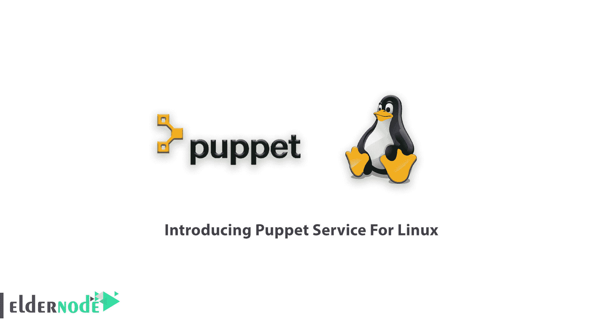
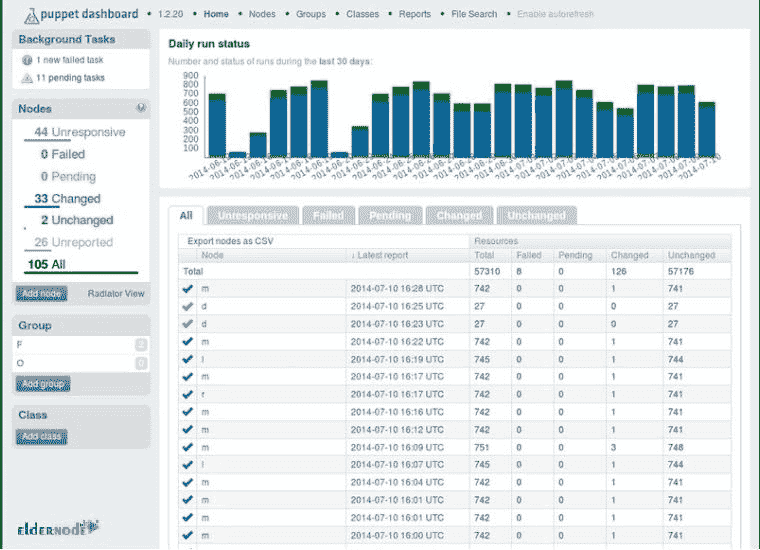
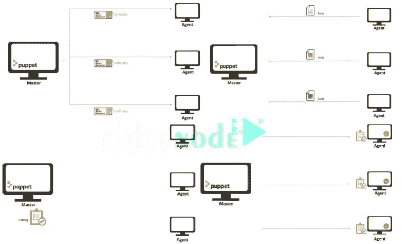
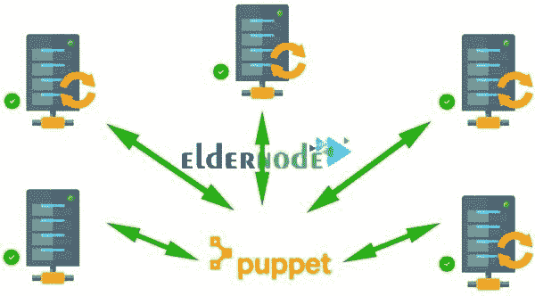

# Linux 木偶服务介绍- Eldernode 博客

> 原文：<https://blog.eldernode.com/puppet-service-for-linux/>



作为管理员，这里是你应该停下来阅读的正确地方。通过这篇文章，我们可以了解一个管理项目。Puppet 帮助您通过网络自动配置所有的计算机系统。这种开源软件现在受 Apache 许可。因为它对 Microsoft Windows 的配置有一些限制，所以它对于类似 Unix 的操作系统来说是完美的。因此，我们将通过**为 Linux** 引入 Puppet 服务来切入正题。购买一台完美的 VPS 有时就像给一个孩子买一个木偶一样困难，他想要一个[专用的](https://eldernode.com/dedicated-server/)木偶。但是让我们保证最好的 [Linux VPS](https://eldernode.com/linux-vps/) 软件包和 24/7 支持。

## **Linux 教程傀儡服务**

Puppet 是用 Ruby 编程语言编写的。如果作为系统管理员，你习惯于做一些重复性的工作，比如安装或配置服务器，你可以通过编写脚本让它们自动完成。你可以在下面看到木偶仪表盘:



### 

### 木偶如何工作

每隔 1800 秒，**代理**(可以在任何支持的操作系统上配置)节点检查代理中是否有任何要更新的内容。如果是，代理从**主**(只能是 [Linux](https://blog.eldernode.com/tag/linux/) )那里获取必要的傀儡代码，开始按要求行动。代理将事实发送给主代理，主代理将目录发送给代理，这是该过程最终达到代理所应用的配置的方式。



Puppet 使用“DSL”即 T2 域和 T4 域来描述系统的配置。此外，为了将您的软件、服务器、存储和网络保持在优化和一致的状态，您需要管理配置。当您能够使用系统状态的历史记录来管理项目时，结果将是令人满意的。如果您认为由于大量的基础设施工作，这是不可能的，那么请继续阅读本指南，以便更加熟悉 Puppet Service。下图向你展示了 Puppet 是如何自动管理服务器的



### 傀儡的服务和工具

为了在有或没有傀儡主人的情况下进行管理，傀儡可以提供许多用于编译傀儡代理的核心服务和管理工具。例如傀儡命令、在 Windows 中运行傀儡命令、在*nix 系统上的傀儡代理、在 Windows 上的傀儡代理、傀儡应用和傀儡设备。

### 木偶的服务和平台

要运行 Puppet master(一个 Ruby 应用程序)服务，您有两种选择:使用 Puppet 服务器或 Rock 服务器。傀儡服务器是傀儡服务器的名字。当您选择 Puppet 服务器时，您的重负载可以安全地执行，但是从服务的角度来看，它们是相同的。有了傀儡主人，你可以自由地编译任意数量的傀儡代理节点。如果您使用的是 Red Hat Enterprise Linux、RHEL 衍生的发行版、Fedora、Debian 和 Ubuntu，那么 Puppet Server 的软件包已经由 Puppet 提供。虽然 1.0 版 Puppet 服务器与 Puppet 3.7.4 和更高版本兼容，但与 Puppet 4.0 不兼容，Puppet 服务器是一个单独的 Puppet 版本。

### 傀儡服务器 VS 红宝石傀儡

Puppet 服务器很容易安装，并提供更好的性能，但你也将面临一个缓慢的启动时间比你最近的使用。

您可以使用一些针对您正在运行的操作系统的已知命令行来轻松控制(启动和停止)服务，例如:

```
Service Puppetserver
```

```
Restart
```

```
Service Puppetserver status
```

**结论**

在本文中，您阅读了 Linux 的 Puppet 服务简介。你可以使用你喜欢的任何版本的木偶。开源木偶可以在木偶网站上找到。或者**傀儡企业**使用商业版并使用其特殊功能。

In this article, you read the Introducing Puppet Service For Linux. You can use any version of Puppet you prefer. The **Open-source Puppet** is available on Puppet’s website. Or the **Puppet Enterprise** to use the commercial version and use its special features.