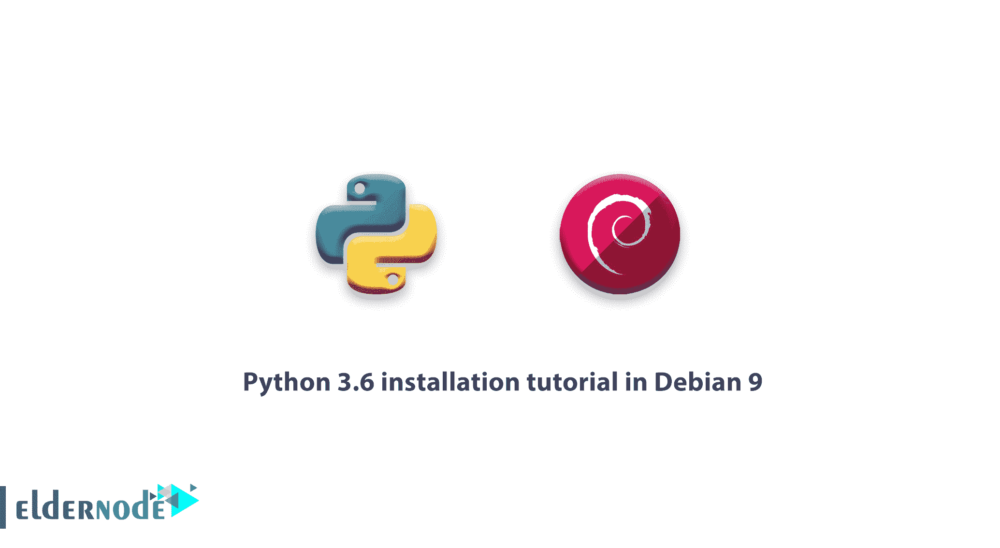

# Debian 9 中的 Python 3.6 安装教程——教程 Linux | Eldernode

> 原文：<https://blog.eldernode.com/python-3-6-installation-tutorial-in-debian-9/>



如何在 Debian 9 中安装 Python 3.6？

在 [Debian 9 教程](https://eldernode.com/tag/tutorial-debian-9/)系列的这一节，我们将教你如何在 Debian 9 中安装 Python 3.6，这样如果你需要使用 Python，你只需输入几个命令就可以安装了。

**Python 是什么？**

Python 是一种综合性的、高级的、面向对象的、脚本化的开源编程语言，由 Fan Rasam 于 1991 年在荷兰设计。

它的创建哲学强调了两个主要目标:编写程序的高可读性和它的简短性和相对高效率。

这种语言的关键字以最少的方式准备，并且在用户可用的库面前非常广泛。

与其他一些常见的编程语言不同，在这些语言中，代码块是在 acolyte 中定义的，Python 使用编写和移动程序文本之间的空间来指定代码块。这意味着相同数量的空格被放置在每个块的行的开头，并且这个数量在内部代码的块中增加。因此，代码块自动具有规则的外观。

好了，到目前为止，我们已经用这个 [Python](https://www.python.org/) 定义为你服务了。现在请继续关注在 Debian 9 上安装 Python 3.6 的更多内容。

注意:请注意，所有命令都将使用 root 访问权限输入，如果您没有 root 访问权限，则必须使用 sudo 组中的用户执行命令，并在所有命令之前输入 Sudo 命令。

### **Debian 9 中 Python 3.6 安装教程**

1)首先，输入以下命令来更新一次储罐和包。

```
apt-get update && sudo apt-get upgrade 
```

2)更新完成后，输入以下命令以安装 Python 3.6 先决条件。

```
apt-get install -y make build-essential libssl-dev zlib1g-dev  apt-get install -y libbz2-dev libreadline-dev libsqlite3-dev wget curl llvm  apt-get install -y libncurses5-dev libncursesw5-dev xz-utils tk-dev 
```

3)现在，通过输入以下命令，从官方网站下载 Python 包。

```
wget https://www.python.org/ftp/python/3.6.4/Python-3.6.4.tgz 
```

4)下载后解压。

```
tar xvf Python-3.6.4.tgz 
```

5)从压缩模式中删除文件后，输入以下命令转到 Python 目录。

```
cd Python-3.6.4 
```

6)现在该输入以下命令安装 Python 了。

```
./configure --enable-optimizations  make -j8 
```

7)最后，输入以下命令安装 Python。

```
make altinstall 
```

这样，你就可以直接从官方网站安装 Python 了。

我们希望你喜欢在 Debian 9 中安装 Python 3.6 的教程。

如有疑问或问题，可向[提问系统](https://eldernode.com/ask/)咨询，提供指导。