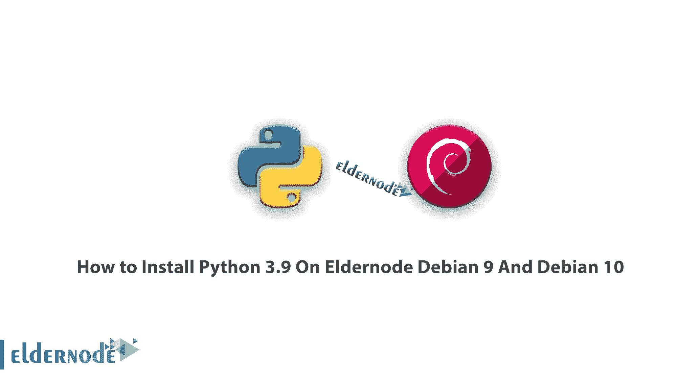

# 如何在 Debian 9 和 Debian 10 上安装 Python 3.9 | elder node

> 原文：<https://blog.eldernode.com/python-3-9-on-debian-9-and-debian-10/>



教程**如何在 Debian 9 和 Debian 10 上安装 Python 3.9**。Python 预装在大多数 Linux 发行版中，在其他所有发行版中作为一个包提供。一旦新版本发布，用户需要学习如何安装和使用它。要很好地体验所有这些指南，选择你的完美 [VPS 服务器](https://eldernode.com/vps/)包，并购买一个。

## 教程在 Debian 9 和 Debian 10 上安装 Python 3.9

好消息是，无论您是编程新手还是有经验的开发人员，学习和使用 Python 都很容易。让我们回顾下面的三个步骤，以确保我的话。

### 第一步:在 Debian 9 和 Debian 10 上设置 Python 3.9

您需要更新和升级系统以使用高级打包工具。为此，您可以使用 **apt** 命令。

```
sudo apt update    sudo apt -y upgrade
```

要检查系统中是否安装了 Python 3 的版本，可以在步骤 1 的过程完成后使用下面的命令。

```
python3 -V
```

### 第 2 步:搭建虚拟环境

您可以为您的每个项目设置单独的依赖关系，这就是为什么您购买了 [VPS](https://eldernode.com/vps/) 环境来防止干扰您的其他项目。另一个好处是可以更好地控制 Python 项目以及如何处理不同版本的包。

您可以使用 **venv** 模块，它是标准 Python 3 库的一部分。

```
sudo apt install -y python3-venv
```

安装完成后，您可以创建环境并选择将 Python 编程环境放入哪个目录，或者使用 **mkdir** 创建一个新目录，如下所示:

```
mkdir environments    cd environments
```

当您位于您希望环境所在的目录中时，创建一个环境。

```
python3.9 -m venv my_env
```

什么是 **pyvenv** ？pyvenv 建立了一个包含一些项目的新目录

```
ls my_env
```

### 第三步:如何创建“你好，世界！”程序

您已经准备好创建一个传统的“Hello，World！”现在，您已经设置好了虚拟环境。要测试您的环境并提供机会让您更熟悉 Python(如果您还不熟悉的话)，您可以通过打开命令行文本编辑器(如 nano)并创建一个新文件来完成:

```
(my_env) [[email protected]](/cdn-cgi/l/email-protection);~/environments$ nano hello.py
```

当文本文件在终端中打开时，你可以打出你的程序。

要退出 [nano](https://blog.eldernode.com/how-to-work-with-nano-editor-in-linux/) ，当出现提示时，键入 **CTRL** 和 **X** 键并按 **y** 保存。最后，一旦您退出 nano 并返回到您的 shell，让我们运行程序:

```
(my_env) [[email protected]](/cdn-cgi/l/email-protection);~/environments$  python hello.py
```

要离开这个环境，只需输入命令 **deactivate** 就可以返回到原来的目录。