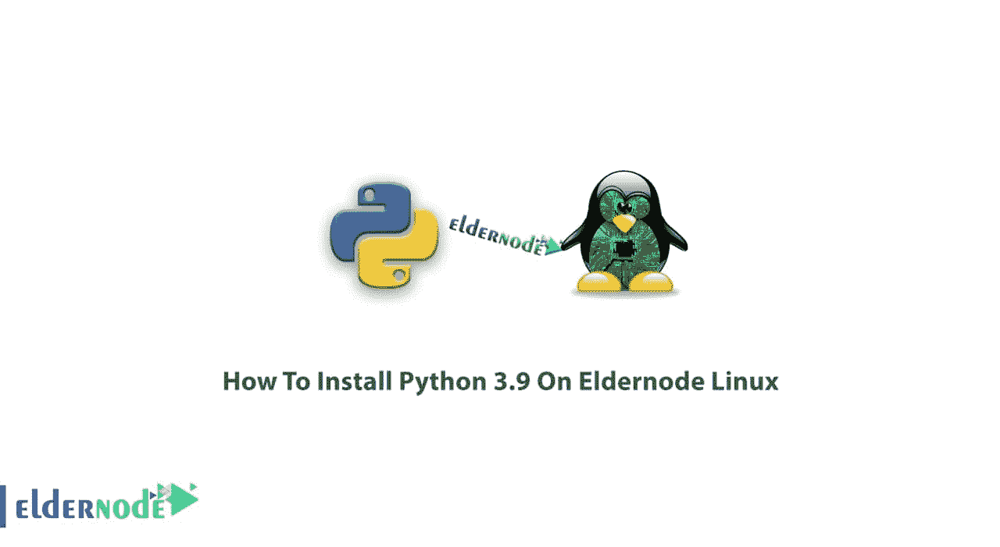

# 在 Eldernode Linux | Eldernode 上安装 Python 3.9

> 原文：<https://blog.eldernode.com/python-3-9-on-eldernode-linux/>



教程如何**在 Eldernode Linux 上安装 Python 3.9**。在本文中，您将回顾所有关于 [Linux](https://blog.eldernode.com/tag/linux/) 的 Python 安装指南。购买您自己的 [Linux VPS](https://eldernode.com/linux-vps/) 联系 [Eldernode](https://eldernode.com/) 支持团队，帮助您获得最好的服务。

### 什么是 Python，我们为什么使用它？

乍一看，我们都知道 **Python** 是一种编程解释语言。 [Python](https://www.python.org/) 能够自动化一系列特定的任务，因为它被用作 web 应用程序的“脚本语言”。另一方面，你可以看到维基百科、[、谷歌](https://www.google.com/)、雅虎、欧洲核子研究中心和美国国家航空航天局，以及许多其他组织，都在使用这种世界上流行的语言，这种语言因其易理解和多功能性而闻名。

## 教程在 Eldernode Linux 上安装 Python 3.9

让我们看看这种语言的核心理念是什么:

**1-** 漂亮总比难看好。

**2-** 显性比隐性好。

**3-** 简单胜于复杂。

**4-** 复杂比复杂好。

**5-** 可读性很重要。

非常有趣！不是吗？

Python 在编程视觉效果合成器 Nuke、3D 建模器和动画包方面也很成功。如果你正在进行科学和数学计算，你甚至可以闭着眼睛选择它。

## 如何在 Eldernode Linux 上安装 Python 3.9

加入我们，学习安装世界上最流行的编程语言之一。让我们完成本指南的步骤，并达到这个目标:

### 第一步:检查 Python 3 的稳定最新版本

首先，你需要**检查**你安装了哪个版本的 Python 3。键入以下命令查看:

### 第二步:在 Eldernode Linux 上安装 Python 3.9 的开发包

要刷新系统包缓存，并**安装** Python 3.9，请运行以下命令:

```
sudo apt update
```

```
sudo apt install python3.9
```

### 第三步:提取 Tarball

下载完成后，您应该使用您选择的提取器应用程序来提取 tarball:

```
tar -xf Python-3.9.0.tar.xz
```

### 第四步:在 Linux 终端配置脚本

此时，您将导航到配置脚本，并在通过键入以下命令提取 Python tarball 后在您的 Linux 终端中执行它:

```
cd Python-3.*  ./configure
```

***注意*** :这可能需要几次，请等到成功完成后再继续。

### 步骤 5:开始构建过程

您的系统上可能已经安装了 Python 的一个版本，如果您需要同时安装新版本，请运行下面的命令:

```
sudo make altinstall
```

再次请注意，这可能需要几次。

另外，如果您需要用这个新版本替换您当前的 Python 版本，请尝试使用您的包管理器卸载您当前的 Python 包:

```
sudo make install
```

### 步骤 6:在 Eldernode Linux 上验证 Python 3.9 的安装

虽然您没有遇到任何错误，但是您可以确保最新的 Python 已经安装在您的 Linux 系统上。但是，可以通过在终端中键入以下命令进行验证:

```
python3 --version
```

运筹学

```
python --version
```

### 步骤 7:创建虚拟环境(可选)

为了帮助你将程序目录或包与其他目录或包隔离开来，Python 提供了一个名为**venv**(**v**I virtual**e**n 环境)的包。要创建虚拟环境，请在 Python 终端中输入以下内容:

```
python3.9 -m venv example
```

使用上面的命令，您可以创建一个包含一些子目录的新目录。接下来，要激活虚拟环境，请输入:

```
$ source example/bin/activate  (example) $
```

***注意*** :您的终端提示( **$** )现在前面是一个环境名。

最后，您可以在决定停用虚拟环境的任何时候使用**停用**命令

```
(example) $ deactivate
```

### 步骤 8:如何卸载 Python3.9(可选)

使用以下命令卸载 Python3.9 软件包:

```
sudo apt remove --autoremove python3.9 python3.9-minimal
```

## **结论**

在本文中，您了解了如何在 Eldernode Linux 上安装 Python 3.9。从现在开始，您将知道如何在您的 Linux 系统上设置 Python 3 编程环境。此外，你可以阅读更多关于如何在 Windows 10 上设置 Python 虚拟环境的内容。