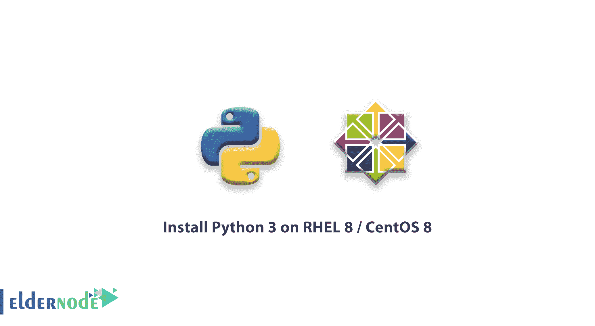

# 教程在 RHEL 8 / CentOS 8 | ElderNode 博客上安装 Python 3

> 原文：<https://blog.eldernode.com/python-3-on-rhel-8-centos-8/>



在 RHEL 8 / [CentOS 8](https://eldernode.com/centos-vps/) 上安装 Python 3，Python 广泛应用于服务器管理或 DevOPS 结构管理的各个层面。所以熟悉这门语言会对你有用的。在本文中，我们想教你如何在 RHEL 8 / CentOS 8 上安装 Python。

在这些操作系统上安装 Python 并不困难。您可以使用包管理器来安装 Python 版本 3。

### 如何在 RHEL 8 / **CentOS 8** 上安装 **Python 3**

步骤 1–安装 Python 3

要在 RHEL 8 和 CentOS 8 上安装 Python，请使用以下命令:

```
$ sudo dnf install python3 
```

安装 python 后，可以使用命令，可以看到 Python 的可执行文件:

```
$ which python3  /usr/bin/python3
```

您可以通过使用 [python](https://www.python.org/) 3 命令来使用 Python。但是单独使用 python 命令是不可能的，我们将在下一步中解决这个问题。

步骤 2–设置 python 的默认版本

在 Linux 中使用 python 命令时，会出现以下消息:

```
$ python  bash: python: command not found...
```

要解决该问题，可以使用 alternatives 命令来解决该问题。要解决 python 3 的问题，请使用以下命令:

```
$ sudo alternatives --set python /usr/bin/python3
```

执行上述命令后，您可以在服务器上检查 python 命令的执行情况:

```
$ python -V  Python 3.0.06
```

或者，如果您使用 python 命令，您可以查看有关 Python 的其他信息:

```
$ python  Python 3.0.06 (default, Oct 16 2019, 15:28:01)   [GCC 8.2.1 20180905 (Red Hat 8.2.1-3)] on linux2  Type "help", "copyright", "credits" or "license" for more information.  >>>
```

您也可以使用以下命令将 python 设置重置为默认值:

```
$ sudo alternatives --auto python
```

祝你好运。