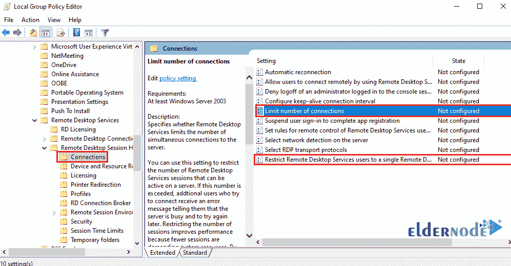

# 如何在 Windows 服务器上设置 RDP 限制-教程设置 RDP 限制

> 原文：<https://blog.eldernode.com/rdp-limit-on-windows-server/>


如何在 Windows Server 上设置 RDP 限制？有时使用 [Windows 虚拟服务器](https://eldernode.com/windows-vps/)的用户可能会遇到限制远程桌面数量的问题。在本文中，我们将教你如何在 Windows Server 中设置[远程桌面](https://support.microsoft.com/en-us/help/4028379/windows-10-how-to-use-remote-desktop)限制。

[Windows 服务器](https://eldernode.com/tag/windows-server/)中的远程桌面默认同时设置为 1 个远程桌面。因此您将无法将多个遥控器连接到您的服务器。在本教程的其余部分，我们将指出一种方法，您将能够为您的服务器启用 999999 远程访问权限。

**注意:** 远程桌面每会话会占用 RAM 和服务器处理器的空间。如果你需要大量的远程桌面，你的服务器应该有好的内存和处理器。

## 在 Windows Server 上设置远程桌面限制

**1。** 首先，由管理员用户进入你的 Windows 服务器桌面环境。

**2。** 然后按下 Winkey + R 或**右键点击开始菜单上的**并选择运行打开运行窗口。

**3。** 运行窗口打开后，键入 gpedit.msc ，点击 OK 。


**4。** 几秒钟后，您的组策略窗口将会打开。

**5。** 点击行政模板菜单将其打开。


**6。** 现在，按照以下顺序转到所需路径:

Windows 组件 > 远程桌面服务 > 远程桌面会话主机 > 连接

**7。** 在下面的页面中，你要进行两项设置。



**8。T3 首先，点击限制连接数将其打开。**

选择启用选项后，在指定字段输入**允许的连接数**，点击应用。


**9。**T3 选择**将远程桌面服务用户限制到单个远程桌面服务会话**选项将其打开。然后将设置设为禁用并点击应用。


**10。** 设置完上述两项后，打开一个命令提示符窗口，输入以下命令更新您系统上的组策略:

```
gpupdate
```


现在你可以同时拥有多个远程桌面。

**注意:** 如果要将设置恢复到原来的状态，禁用它们。

**亦作，见:**

[如何使用 RDP 将文件传输到 Windows 服务器](https://eldernode.com/transfer-file-using-rdp-to-windows-server/)

[了解如何简单地更改默认 RDP 端口](https://eldernode.com/change-the-default-rdp-port-simply/)

[在 windows 10 中启用远程桌面的 4 种方式](https://eldernode.com/4-ways-to-enable-remote-desktop/)

[从注册表更改桌面远程协议](https://eldernode.com/change-desktop-remote-protocol-from-registry/)

**尊敬的用户**，我们希望您能喜欢这个[教程](https://eldernode.com/category/tutorial/)，您可以在评论区提出关于本次培训的问题，或者解决[老年人节点培训](https://eldernode.com/blog/)领域的其他问题，请参考[提问页面](https://eldernode.com/ask)部分，并尽快提出您的问题。腾出时间给其他用户和专家来回答你的问题。

如何在 Windows Server 上设置 RDP 限制？

好运。