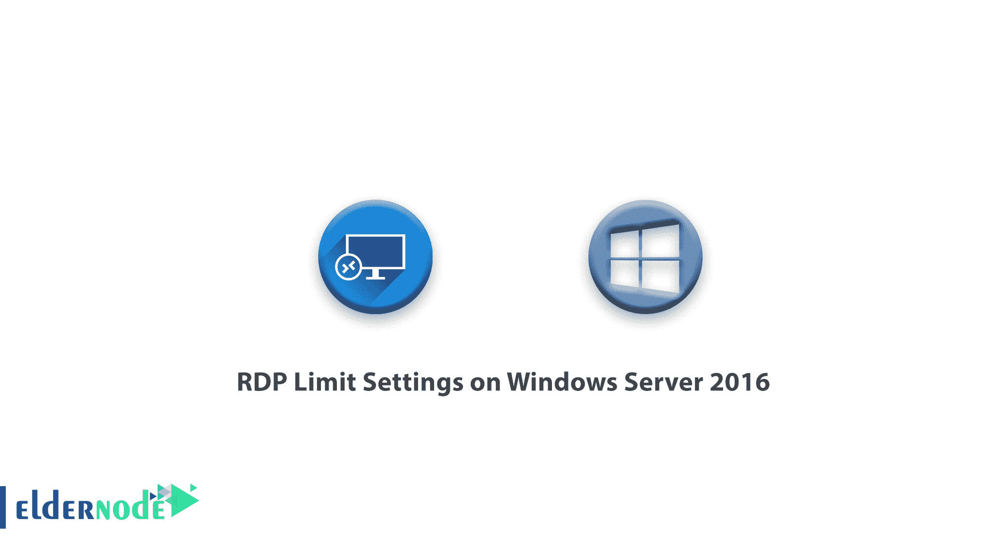
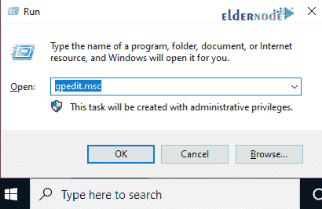
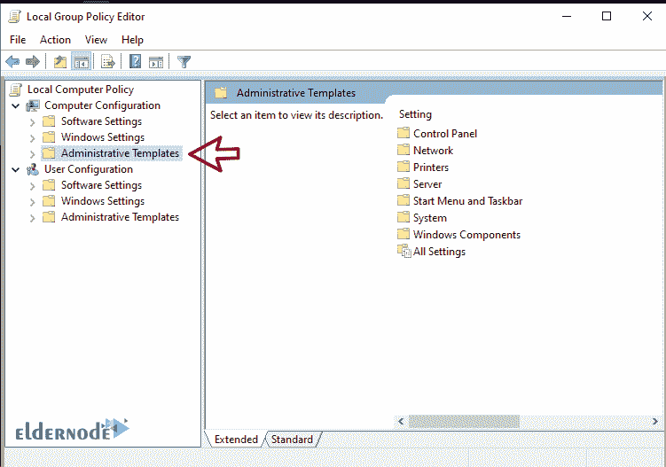
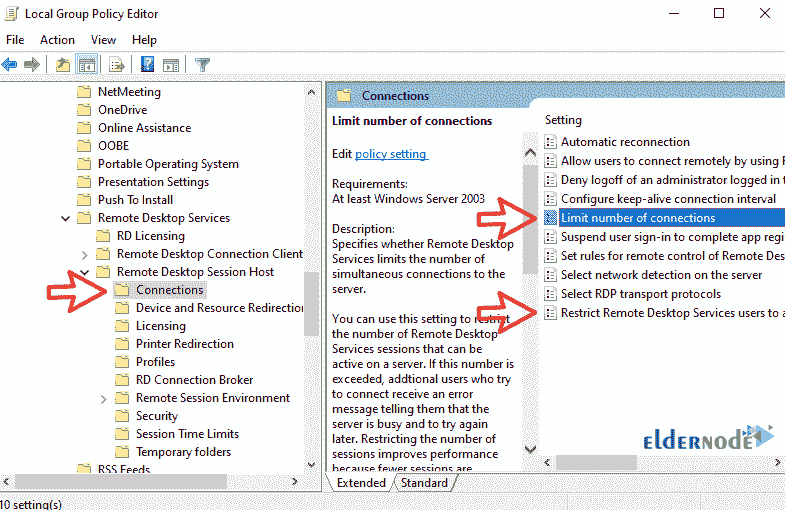
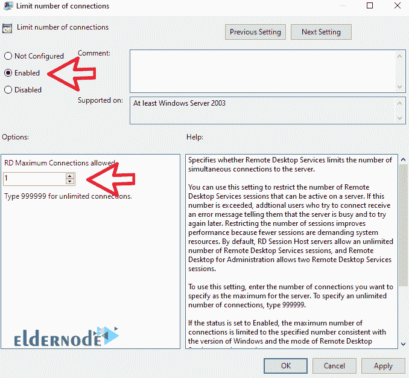

# Windows Server 2016 上的 RDP 限制设置- Eldernode

> 原文：<https://blog.eldernode.com/rdp-limit-settings-on-windows-server-2016/>



大多数使用 [Windows VPS](https://eldernode.com/windows-vps/) 服务器的用户很难限制远程桌面的数量。在本文中，我们将介绍 Windows Server 2016 上的 RDP 限制设置。你可以从 eldernode 购买 [RDP 服务器](https://eldernode.com/buy-rdp/)。

Windows Server 2016 上的远程桌面默认设置为同时 1 个远程桌面，你将无法在你的服务器上运行多个远程。在这个[教程](https://eldernode.com/category/tutorial/)中，我们将指出如何为你的服务器启用 999999 远程访问。

**注:** 远程桌面每个会话会占用一个 RAM 和一个服务器处理器的空间。所以请记住，如果您需要大量的远程桌面，您的服务器必须有良好的 RAM 和处理器。

该方法也将在[Windows Server 2012](https://www.microsoft.com/en-us/evalcenter/evaluate-windows-server-2012)和 2012R2 上使用，并已经过测试。

## Windows Server 2016 上的 RDP 限制设置

**1-** 首先用管理员用户登录你的 Windows server 桌面。

**2-** 然后通过按下 Winkey + R 或**在开始菜单上右击**并选择运行来打开运行窗口。

**3-** 运行窗口打开后，键入 gpedit.msc ，点击 OK 。



**4-** 几秒钟后，您的 Windows 组策略将会打开。

**5-** 点击行政模板 **菜单**打开。



**6-** 现在按以下顺序转到所需路径。

```
Windows Components > Remote Desktop Services > Remote Desktop Session Host > Connections 
```

**7-** 你需要在这个页面上做两个调整。



**8-** 首先，点击限制连接数将其打开。然后选择启用并在指定字段中输入允许的连接数，点击应用。



**9-** 然后选择**将远程桌面服务用户限制到一个单独的远程桌面服务会话**打开，将设置设为禁用，点击应用。

10-设置完这两项后，打开一个命令提示符窗口，输入以下命令来更新您系统上的组策略。

现在，您可以同时拥有多个远程桌面。

**注意:** 如果想让设置恢复到原来的状态，就把设置恢复到原来的状态或者禁用。

**尊敬的用户**，我们希望您能喜欢这个[教程](https://eldernode.com/category/tutorial/)，您可以在评论区提出关于本次培训的问题，或者解决[老年人节点培训](https://eldernode.com/blog/)领域的其他问题，请参考[提问页面](https://eldernode.com/ask)部分，并尽快提出您的问题。腾出时间给其他用户和专家来回答你的问题。

Windows Server 2016 上的 RDP 限制设置。

好运。