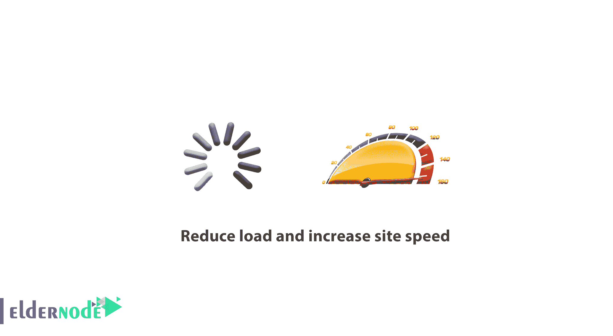

# 如何降低负载，提高站点速度——站点速度优化

> 原文：<https://blog.eldernode.com/reduce-load-and-increase-site-speed/>



如何降低负载，提高站点速度？在不断增长的环境中，服务器正确发挥其作用非常重要。然而，当你的服务器崩溃或者你超过分配给你的虚拟带宽时，会有个高峰时间。

服务器可能会因为各种原因而崩溃。每起事故的原因都有几种可能。这可能会让一小部分开发人员感到困惑。

我们在管理网站时遇到的一件事是，在很多情况下，这些网站并不是世界上最快的网站。虽然很多网站慢的原因是因为主机服务器的配置，但是网站的性能还是有一些问题是你可以控制的。

在这篇文章中，我们为您提供最佳的解决方案来**减少服务器负载**和**为成长中的网站节省带宽**。

> Eldernode 提供安全快速的[虚拟主机](https://eldernode.com/linux-hosting/)，优质的性能特性。

在本文的续篇中， **11 招** 降低**服务器负载**和**节省带宽**将被传授。和我们在一起。

## 如何降低负载和提高现场速度

### 1。用 CSS 代码代替图片


使用图像会使变慢你的**网站**和增加消耗的**带宽**。不要在你的网站后台使用animage而是使用 CSS 代码。

比如，如果你想用纯红做背景，你应该用 CSS 代码后面的代替【red-bg.jpg】后面的:

背景色:# F00

使用 CSS，您可以调整任何 CSS 部分的颜色或背景图像。

### 2。优化你的图片


大多数网站一半以上的带宽被图片消耗，优化这些图片是改善 web 服务器消耗带宽的最好方法。

优化网站图片以适应互联网空间，并使其尽可能小。

**注意:** 千万不要用()。bmp 文件，它们非常大！

您在网站上使用的图像的最佳文件格式是 jpeg ( )。jpg 或者 gif ( )。gif )。这些格式针对互联网进行了优化。

一个很好的经验法则是尽量不要制作大于 10 KB 的图像。在处理移动图像和动画时，很难遵循这个规则。但是如果你能做到这一点，你将会看到服务器使用的带宽有显著的不同。

互联网上有各种程序和应用程序可以将图像转换成各种格式。

如何降低负载，增加站点 speed-Eldernode.com

**注:** 有多种针对图像的优化程序。确保您使用的软件在图像尺寸缩小的情况下仍能保持其质量！

如果您使用 **Photoshop** ，您可以使用“保存到 Web 和设备”选项(**Alt**+**Shift**+**Ctrl**+**S**)来压缩您的图像，以优化它并使用最小的带宽。

如果你的图像有大量的颜色，你应该选择 JPEG 或 T2 格式。

### 3。缩短你的 CSS 代码


由于大量的**额外空间**，CSS 文件可能会非常大。CSS 摘要功能非常出色。使用这个功能是减少一个 CSS 文件中的代码量的一个很好的方法，并且让你下载快很多倍并且编辑更容易。

例如，使用以下代码:

```
margin: 2px 1px 3px 4px (top, right, bottom, left)
```

而不是代码…

```
1 margin-top: 2px;  2 margin-right: 1px;  3 margin-bottom: 3px;  4 margin-left: 4px
```

4。删除代码、不必要的 HTML 标签和空格


你可以通过删除 HTML 文件中的空格，甚至删除注释(如果不需要的话)，来**压缩**你的页面大小。因为文件中的每一个额外字符都意味着文件大小的增加。

无论你使用 HTML 图像编辑器还是记事本，你的 **HTML 文件**都会包含额外的内容，比如不必要的空格、返回、 meta 标签、HTML 元素中的默认值等等。这些东西让你的网页变大，却没有达到任何特定的目的。

较大的网页需要较长的加载时间，增加了 web 服务器的数据流量，并浪费了宝贵的带宽。

5。使用 AJAX 或 JavaScript 库


AJAX 是一种网页技术，用于使用 JavaScript 连接到服务器，而无需重新加载页面。

一般来说，一个网站的相关页面由很大一部分内容组成。使用的传统方法，所有这些内容都被加载到的每个请求中。但是如果使用 AJAX，web 应用程序将只请求它需要更新的那部分内容。因此，它在减少加载时间的带宽消耗方面非常有效。

如何降低负载，增加站点 speed-Eldernode.com

6。禁用热链接文件


术语热链接是指将图片或下载从您的网站链接到其他网站。

**基本上**，图片都在你的网站上，其他网站只链接图片标签到你的网站，所以他们使用你的带宽。

**注:** 如果别人所谓的热链接你的视频文件，他们是在使用带宽，而你最终会为此买单。

你可以很容易地通过加上一个''来防止这种情况。图像文件夹中的 htaccess 文件。

通过这样做，只有您网站的页面将被允许显示图像，而您网站或您授权的网站之外的另一个链接将显示一个红色十字而不是图像。

```
1 RewriteEngine On  2 RewriteCond %{HTTP_REFERER} !^$    3 RewriteCond %{HTTP_REFERER} !^http(s)?://(.*\.)?yourserver.com [NC]  4 RewriteRule \.(jpeg|jpg|gif|png)$ - [F]
```

7。用 GZIP 压缩你的 HTML 和 PHP 文件


类似于 **CSS 文件**， HTML 文件包含大量空白和未使用的部分。

如果您使用的是 PHP ，您可以使用 mod_gzip 模块请求 Apache web 服务器压缩您的内容。

mod_gzip 是一个用于 [Apache](https://www.apache.org/) 的模块(在 Apache 的 Linux 和 Windows 版本上都有)，它可以在能够理解压缩内容的浏览器的任何请求中显著减小网页的大小。

**记住**，这个模块的好处是，只有当从浏览器发送压缩内容的请求时，服务器上的压缩功能才会启用。如果浏览器没有发送这样的请求或者不能理解压缩内容，服务器也将传送未压缩内容。

最简单的方法是使用[。htaccess 文件](https://eldernode.com/htaccess-and-its-applications/)。

我们建议使用这个文件，因为它运行起来更简单。

。htaccess 方法允许你稍后配置服务器**。**

****现在**给加上下面一行。htaccess 启用 GZIP 压缩:**

**如果您可以为 PHP 压缩函数添加一个序列，那么您应该在页面顶部的网页的标题中插入下面一行:**

```
`php_value output_handler ob_gzhandler`
```

```
`< ? ob_start("ob_gzhandler");?>`
```

**8。使用免费的网页和图片托管网站来嵌入你的网站文件**

****

**如果你想在不消耗带宽的情况下分享大文件，把它们托管在免费或付费的主机上，比如 [Flickr](https://www.flickr.com/photos/tags/flicker/) 、[皮卡萨](https://picasa.google.com/)、 [PhotoBucket](https://photobucket.com/) 、 [ImageShack](https://imageshack.com/) 和 [rapidshare](https://www.rapidshare.com.cn/) 。**

**上传文件后，将文件的链接放在你的博客或网站上。**

**这节省了大量的带宽。**

****提示:** 在这样做之前，和你的虚拟主机公司谈谈他们是否允许你这样做。**

**9。尽可能避免附件**

****

**如果您计划将一个已经放在 Internet 上其他地方的文件上传到您的服务器，最好是使用指向同一文件的链接，而不是将它的副本放在您的服务器上。**

**上传一个文件会增加**带宽消耗**和**服务器负载**。但是您可以通过使用互联网上已有的文件链接来节省时间，因为您不再需要上传文件。**

**10。网站缓存**

****

**缓存是一种从**现成的**内存中恢复数据的方法(缓存)。**

**不是每次使用服务器资源都重新创建相同的所需信息，而是从缓存中读取这些信息。**

**另一个好主意是缓存你的网站，但是**在 HTTP 头中设置**一个截止日期。**

**因此，标题中设置的时间告诉浏览器内容在缓存中保留多长时间。**

**大多数网站图片永远不会改变，把它们保存在本地是个好主意。**

**使用 mod_headers 进行缓存**

```
`1 # 1 YEAR  2 <filesmatch "\.(flv|ico|pdf|avi|mov|ppt|doc|mp3|wmv|wav)$"="">    3 Header set Cache-Control "max-age=29030400, public"  4 </filesmatch>    5  6 # 1 WEEK    7 <filesmatch "\.(jpg|jpeg|png|gif|swf)$"="">  8 Header set Cache-Control "max-age=604800, public"    9 </filesmatch>  10    11 # 3 HOUR  12 <filesmatch "\.(txt|xml|js|css)$"="">    13 Header set Cache-Control "max-age=10800"  14 </filesmatch>    15  16 # NEVER CACHE    17 <filesmatch "\.(html|htm|php|cgi|pl)$"="">  18 Header set Cache-Control "max-age=0, private, no-store, no-cache, must-revalidate"    19 </filesmatch>`
```

**带 mod_expires 的缓存**

```
`1 ExpiresActive On  2 ExpiresDefault A0    3  4 # 1 YEAR    5 <filesmatch "\.(flv|ico|pdf|avi|mov|ppt|doc|mp3|wmv|wav)$"="">  6 ExpiresDefault A9030400    7 </filesmatch>  8    9 # 1 WEEK  10 <filesmatch "\.(jpg|jpeg|png|gif|swf)$"="">    11 ExpiresDefault A604800  12 </filesmatch>    13  14 # 3 HOUR    15 <filesmatch "\.(txt|xml|js|css)$"="">  16 ExpiresDefault A10800"    17 </filesmatch>`
```

**11.缓存 RSS 源**

****

**众所周知，RSS 是一种使网站管理员能够在互联网上轻松发布内容的技术。**

**缓存提要时，会在一定时间内从本地磁盘读取。在该时间到期后， RSS 提要将被重新加载。这允许 RSS 提要内容保留在显示中并加速整个过程。**

****缓存 RSS 提要**减少了带宽消耗，因为网络服务器不必从其服务器下载相同的 RSS 提要。**

****亦作，见:****

**[如何清除浏览器缓存](https://eldernode.com/clear-the-browser-cache/)**

****尊敬的用户**，我们希望您能喜欢这个[教程](https://eldernode.com/category/tutorial/)，您可以在评论区提出关于本次培训的问题，或者想解决[老年人节点培训](https://eldernode.com/blog/)领域的其他问题，请参考[提问页面](https://eldernode.com/ask)部分，并尽快提出您的问题。腾出时间给其他用户和专家来回答你的问题。**

**如何降低负载，增加站点 speed-Eldernode.com**

**好运。**

**Goodluck.**