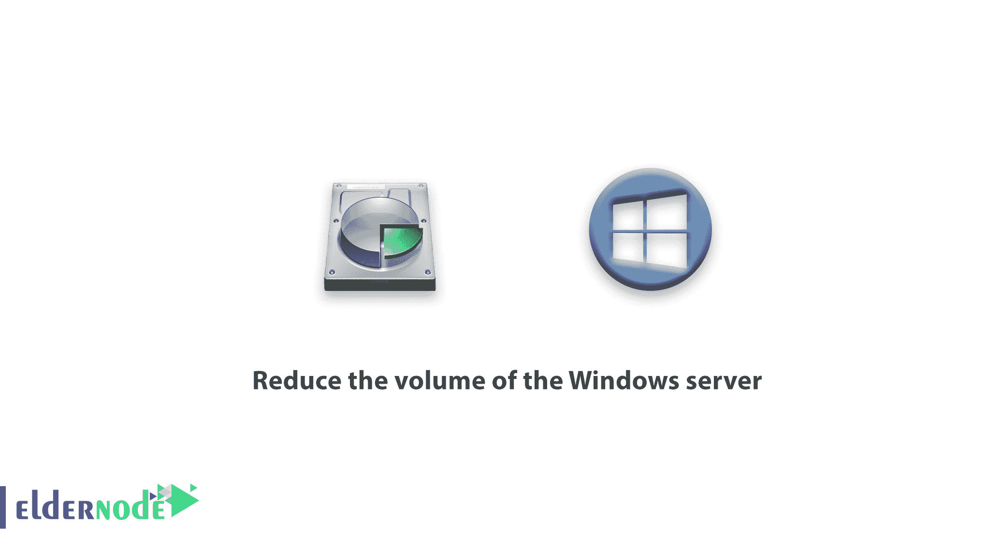

# 减小 Windows server - Eldernode 的体积

> 原文：<https://blog.eldernode.com/reduce-the-volume-of-the-windows-server/>



减小 Windows 服务器的体积。虚拟使用 Windows Server 的人最关心的一个问题是硬盘的容量。在这篇文章中，我们将教你如何通过删除 [Windows VPS](https://eldernode.com/windows-vps/) 服务器教程系列中不必要的文件来减少 Windows Server 的体积。

Windows 是一个大型操作系统，因为它拥有大多数服务文件和功能，所以用户不可能使用其硬盘大小。

Windows 是一个大型操作系统，由于其服务文件和功能，用户无法高效地使用其硬盘卷。

首先，附加文件是什么？如果删除了，不会给 Windows 带来麻烦吗？

答案是 Windows 虚拟服务器中默认不使用的一些服务的文件在 Windows 目录中，你从来不使用，尤其是在虚拟服务器中！

例如，DHCP roll 在互联网上的虚拟服务器上不工作，但是它的文件是可用的，并且你的硬盘很忙。

在本文中，我们将帮助您减少 Windows Server 的容量，以便您可以删除服务器上不使用的一些卷和功能文件，从而增加硬盘上的可用空间。

注意:您可以通过 Windows DVD 重新安装 Windows Rolls 和功能文件。

## 减小 Windows 服务器的体积

**1。** 首先，登录你的 Windows 虚拟服务器。

**2。** 用管理员权限打开 PowerShell。

**3。** 现在可以用[Uninstall-windows feature](https://docs.microsoft.com/en-us/windows-server/administration/server-manager/install-or-uninstall-roles-role-services-or-features)命令删除不必要和无用的包了。

例如，使用下面的命令，我们将删除 DHCP 包。

```
Uninstall-WindowsFeature DHCP -Remove 
```

通过输入以下命令，所有用于安装该卷的 DHCP 文件将被删除。

**注意:** 卸载后，要完全执行该命令，必须重新启动 Windows。

请注意，输入上述命令需要时间，每个包可能需要 3 到 7 分钟。

**4。** 删除后，输入以下命令查看该服务中文件的状态。

```
Get-WindowsFeature DHCP 
```

输入上述命令后，您将看到类似于以下语句的输出，这表明没有该服务的安装文件。

```
PS C:\Users\Administrator> Get-WindowsFeature DHCP    **Output  **   Display Name                                            Name                       Install State  ------------                                            ----                       -------------  [ ] DHCP Server                                         DHCP                             Removed 
```

这样，通过删除不必要的软件包，您就可以从硬盘上删除 9GB 的空间。

**重要提示:** 我们建议您先安装好想要的 roll 和功能，然后将未使用的软件包中的文件删除，这样以后就不会有任何问题了。

**尊敬的用户**，我们希望您能喜欢这个[教程](https://eldernode.com/category/tutorial/)，您可以在评论区提出关于本次培训的问题，或者解决[老年人节点培训](https://eldernode.com/blog/)领域的其他问题，请参考[提问页面](https://eldernode.com/ask)部分，并尽快提出您的问题。腾出时间给其他用户和专家来回答你的问题。

好运。