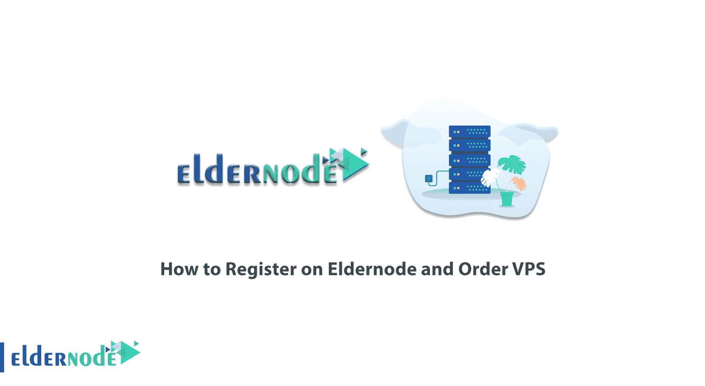
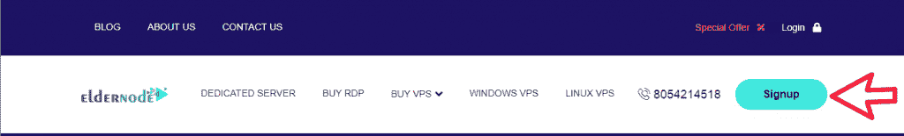
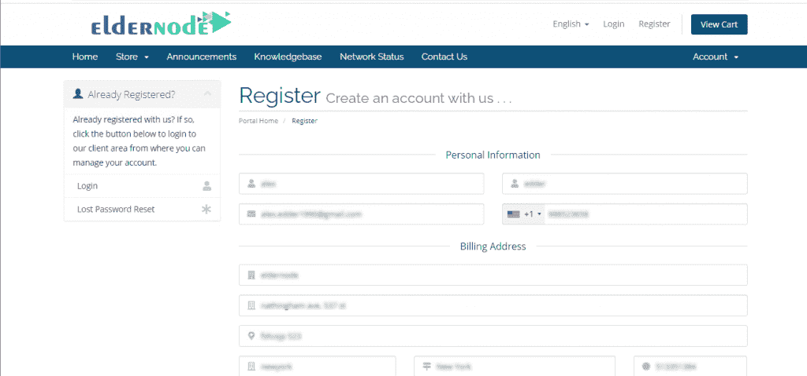
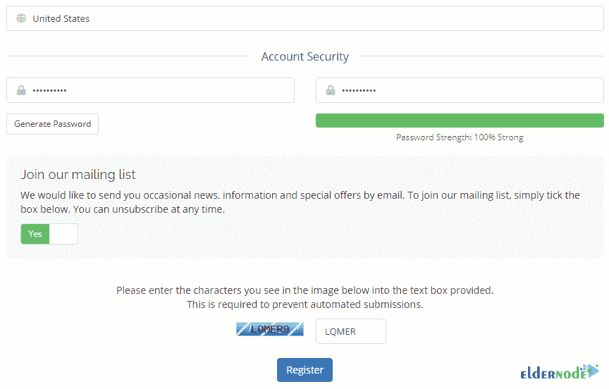
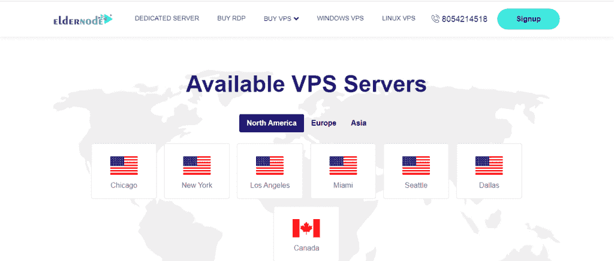
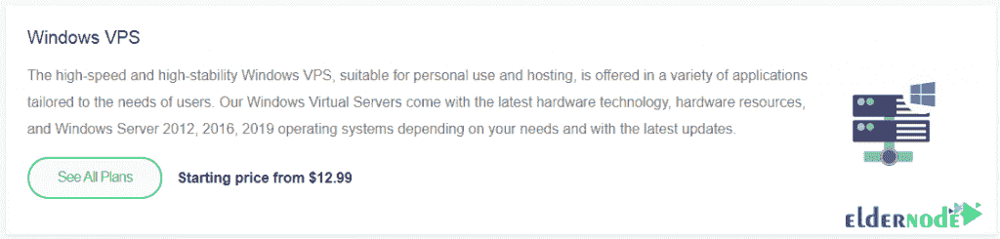
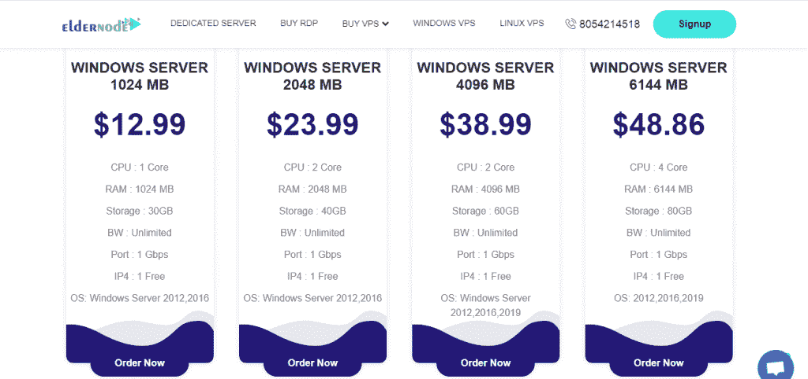
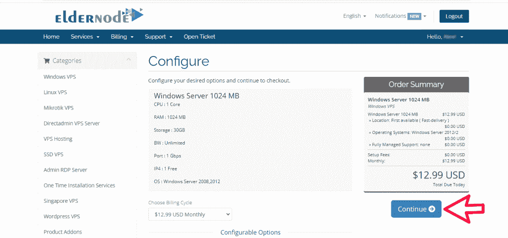
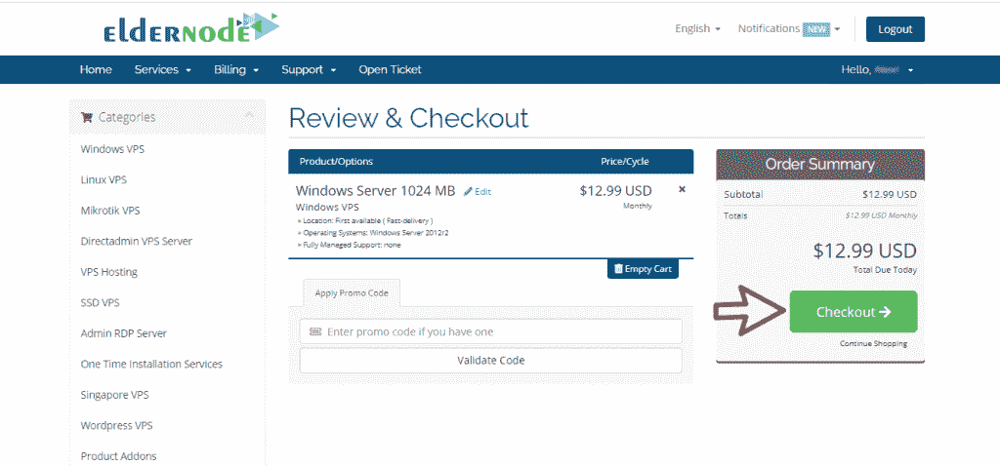
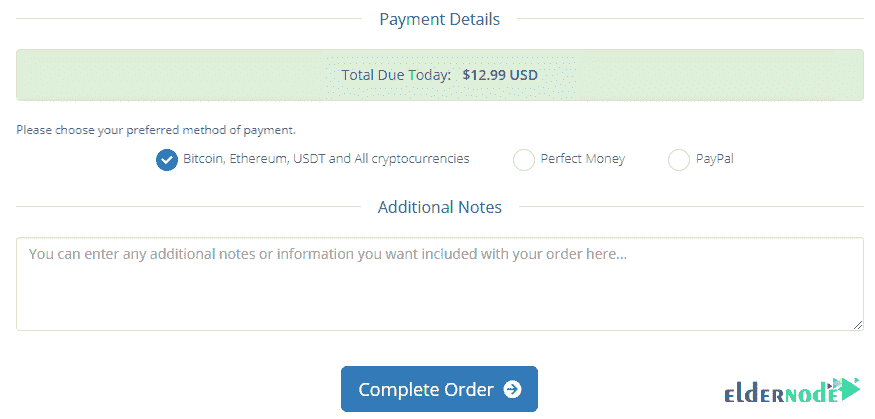

# 如何在 Eldernode 上注册并订购 VPS - Eldernode 博客

> 原文：<https://blog.eldernode.com/register-on-eldernode-and-order-vps/>

如果这是你第一次想买一台 [VPS 服务器](https://eldernode.com/vps/)，可能看起来很简单，其实不然。您需要根据自己的需求购买服务，并仔细计算硬件使用量。需要注意的是，购买的第一步是在网站上注册。加入我们来学习你**如何在 Eldernode 上注册并订购 VP**。

## **教程在 Eldernode 上注册并订购 VP**

[Eldernode](https://eldernode.com/) 根据用户需求，对其 VPS 服务器服务有多种方案。根据他们的需求，每个人都可以购买一台 VPS 服务器或请求所需的硬件资源服务。

Eldernode 中提供的 VPS 服务器的优势有:

**–**[专用的](https://blog.eldernode.com/tag/dedicated-server/)硬件资源

**–**多个地点

**–**一周 7 天，一天 24 小时

**–**完全 Root 访问权限

**–**提供所需的操作系统

**–**云基础设施

**–**在声誉良好的数据中心使用最强大、最现代化的服务器

**–**以三种方式存钱的可能性

请继续阅读本文，学习如何注册和订购 VPS。

### **如何在老年人节点注册**

**第一步，打开 [Eldernode 网站](https://eldernode.com/)。然后点击右上角菜单中的**注册**。**

****

**打开的页面包括 3 个部分:**个人信息**、**账单地址**和**账户安全**。仔细填写这 3 个部分的信息，在页面底部输入安全码后，点击**注册**。**

****

****

**您的注册成功了。继续阅读本文，了解如何订购 VPS。**

### ****如何在 Eldernode** 上订购 VP**

**当您在 Eldernode 成功注册帐户后，请继续与我们联系，教您如何订购 VPS 服务器。第一步，你得再去一遍网站首页。然后点击主菜单中的**购买 VPS** 选项。**

****

**在打开的页面中，您将看到 VPS 包的可用选项。你在这个页面上看到的平台是 [Windows VPS](https://eldernode.com/windows-vps/) 、 [Linux VPS](https://eldernode.com/linux-vps/) 、 [Mikrotik VPS](https://eldernode.com/mikrotik-vps-server/) 和 [RDP 管理](https://eldernode.com/buy-rdp/)服务器。如果您想订购这些 VPS，您必须点击**查看该部分的所有计划**。**

**如果你愿意，你可以从这个页面上的位置购买 VPS 服务器。请注意，如果您正在考虑的地点不在选项之内，您可以通过**实时聊天**部分联系我们的专家并订购您的服务器。**

****

**在这里，我们将教你如何购买一台 **Windows VPS** 服务器。请注意，这同样适用于其他 VPS 服务器。**

**在 Windows vps 部分的 VPS 页面上，单击**查看所有计划**。**

****

**您可以在打开的页面中看到不同的计划。查看计划的功能后，您必须选择所需的计划。所以现在点击**订购**。**

****

**在下一步中，您可以看到您订购的服务器的规格。点击页面右侧的**继续**。**

*****注意:*** 在左栏可以看到其他类别的 VPS 服务器。**

****

**然后你要点击**结账**支付。**

****

**在**付款详情**部分，从可用的付款选项中选择您喜欢的方式。最后，点击**完成订单**。**

****

## **结论**

**要使用 Eldernode 提供的服务，第一步是在网站上注册。在本文中，我们试图向您解释如何在 Eldernode 中注册，然后我们教您如何订购 VPS 服务。**