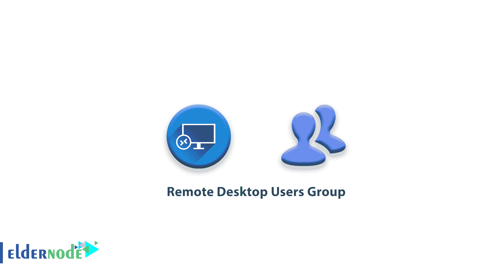
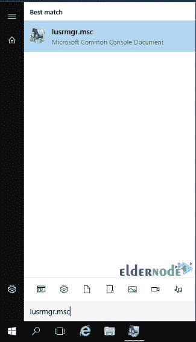
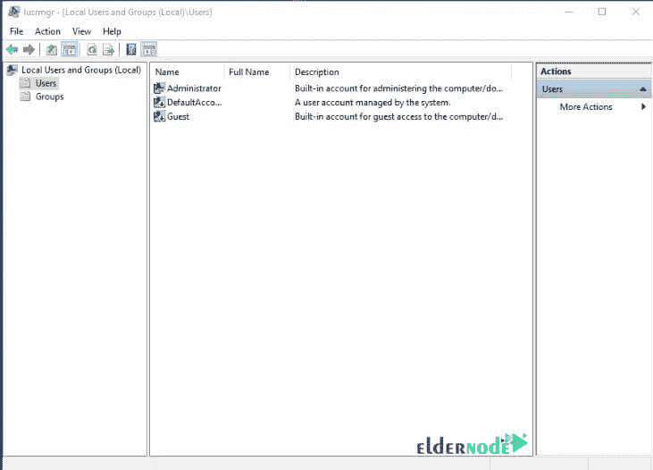
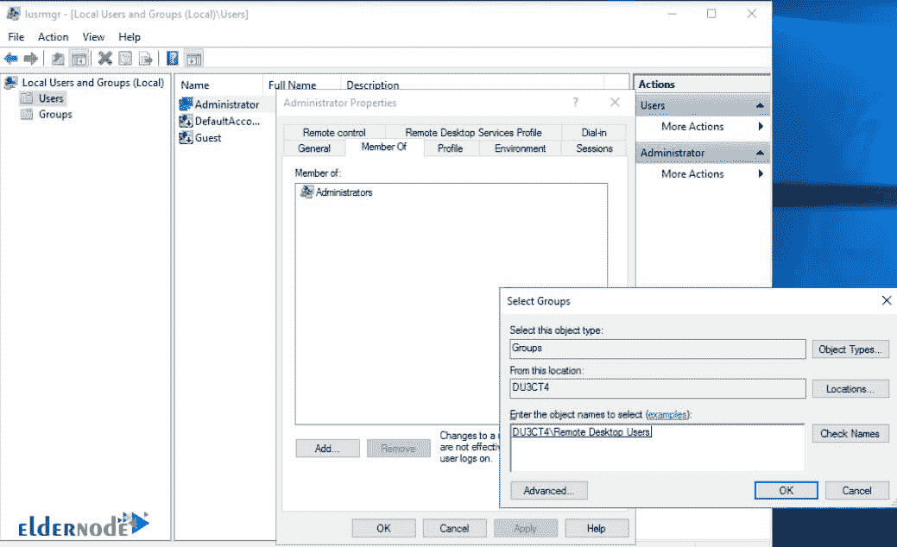

# 远程桌面用户组-

> 原文：<https://blog.eldernode.com/remote-desktop-users-group/>

远程桌面用户组。Windows Server 是 Windows 系列的一个版本，旨在安装在服务器上。与 Windows 桌面版本相比，它更稳定，更不容易崩溃，并且支持强大的服务器硬件以及大量的内存和 CPU。

如果您在您的[专用服务器](https://eldernode.com/dedicated-server/)上使用虚拟机，或者 Windows 安装在专用服务器 / 物理服务器上，您可以通过激活[远程桌面](https://eldernode.com/tag/remote-desktop/)轻松考虑 Windows 服务器桌面。

远程桌面用户组也授权其成员通过 RDP (远程桌面协议)安全连接到服务器。本文将介绍远程桌面用户组的基础知识。

在本文中，您将能够向群组添加用户，了解权限和基本的用户管理。以下信息涵盖了在 Windows 服务器上为 [Windows Server 2012](https://eldernode.com/tag/windows-server-2012/) 和 [Windows Server 2016](https://eldernode.com/tag/windows-server-2016/) 配置**远程桌面用户组**的方法。

远程桌面用户组。

## 管理本地用户和组

Windows 服务器上的用户和组有多种不同的管理方式。最用户友好的方式是通过本地用户和组界面。

有几种方法可以打开界面。最简单的就是**运行** lusrmgr.msc 。Lusrmgr.msc 可以通过搜索开始菜单、命令行或者通过运行对话框来启动。

这些方法允许您轻松地找到用户和组。

*

### 用户管理

一旦你打开**本地用户和群组**界面，你会看到**左边**的两个文件夹，一个是用户，一个是群组。通过选择 Users，您将看到服务器上本地用户的完整列表。

通过**右键** 用户、群组、一个用户名，或者中间窗格的空白区域，也可以看到各种相关任务。

有几种方法可以通过本地用户和组界面添加新用户。这些方法都会打开同一个新用户对话框，然后**可以在其中配置**用户名、密码和其他选项。

选择以下选项之一**创建新用户**:

#### 创建新用户的第一种方式

**1。T3 从屏幕左侧选择用户文件夹。**

**2。** 点击动作菜单。

**3。**T3 选择新用户… 。

#### 创建新用户的第二种方法

**1。从左侧选择用户文件夹**

**2。从**右侧**窗格中点击更多动作。**

**3。**T3 选择新用户… 。

#### 创建新用户的第三种方法

**1。在用户文件夹上右击**。

**2。**T3 选择新用户… 。

#### 创建新用户的第四种方法

**1。T3 从屏幕左侧选择用户文件夹。**

**2。** **在中间页面的空白区中右键单击**

**3。T3 选择新用户… 。**

创建新用户或确定现有用户的用户名后，就可以将该用户分配到一个组中了。

**注:** 分配到一个组的用户称为组成员。

### 群组管理

可以通过几种方式进行组管理。以下选项涵盖了将新成员分配到 th e 远程桌面用户组的几种最常见的方式:

#### 团体管理的第一种方式

**1。T3 在本地用户和组界面的左窗格中选择用户文件夹。**

**2。T3 通过双击**用户**打开用户属性窗口。**

**3。T3 选择页签的成员。**

**4。T3 点击添加… 。**

**5。** 在文本框中输入远程桌面用户，点击确定。

#### 群体管理的第二种方式

**1。T3 在本地用户和组界面的左窗格中选择组文件夹。**

**2。双击**远程桌面用户组。

**3。T3 点击添加… 。**

**4。**T3 在文本框中输入用户名，点击确定。

#### 群体管理的第三种方式

**1。T3 打开系统设置通过**右键**打开开始菜单。**

**2。** 选择系统。

**3。T3 选择高级系统设置。**

**4。** 选择遥控器标签。

**5。** 点击选择用户……按钮。

**6。T3 点击添加按钮。**

**7。T3 在文本框中输入用户名，点击确定。**

#### 群体管理的第四种方式

**1。T3 打开服务器管理器。**

**2。从左侧窗格中选择本地服务器。**

**3。T3 点击电脑名称旁边的蓝色文字。**

**4。T3 选择遥控器标签。**

**5。** 点击选择用户……按钮。

**6。T3 点击添加按钮。**

**7。** 现在在文本框中输入用户名，点击确定。

当选择用户或群组时，您也可以使用**高级……**按钮，而不是键入其名称。

点击“高级… ”按钮，然后点击立即查找按钮，将出现用户列表供选择。

默认情况下，远程桌面用户组没有成员，只有管理员组的成员可以通过连接。

添加到远程桌面用户组的成员被视为非管理用户。这些用户将**无法**执行大多数管理任务，例如安装软件、管理 IIS ，或者重启服务器。

如果用户需要管理能力，用户将需要对该任务的显式访问权限，或者需要成为管理员的成员。

### 测试组成员资格

当**配置**新用户和群组成员资格时，一旦完成，您应该总是检查群组成员资格。

审查组成员资格通常通过本地用户和组界面来执行。除了验证成员身份，我们还建议您尝试与最新的远程桌面用户组成员进行远程桌面连接。

一旦您使用远程桌面用户组的最新成员登录，您可以通过从**命令行**运行命令 whoami /groups 来进一步验证组设置是否正确。

这个命令的**输出**列出了用户名及其相关的组名。

**亦作，见:**

[如何使用 RDP 将文件传输到 Windows 服务器](https://eldernode.com/transfer-file-using-rdp-to-windows-server/)

[了解如何简单地更改默认 RDP 端口](https://eldernode.com/change-the-default-rdp-port-simply/)

[在 windows 10 中启用远程桌面的 4 种方式](https://eldernode.com/4-ways-to-enable-remote-desktop/)

[如何在 Windows 服务器上设置 RDP 限制](https://eldernode.com/rdp-limit-on-windows-server/)

[教程在 Windows Server 2019 上启用 RDP](https://eldernode.com/enable-rdp-on-windows-server-2019/)

**尊敬的用户**，我们希望您能喜欢这个[教程](https://eldernode.com/category/tutorial/)，您可以在评论区提出关于本次培训的问题，或者解决[老年人节点培训](https://eldernode.com/blog/)领域的其他问题，请参考[提问页面](https://eldernode.com/ask)部分，并尽快提出您的问题。腾出时间给其他用户和专家来回答你的问题。

好运。