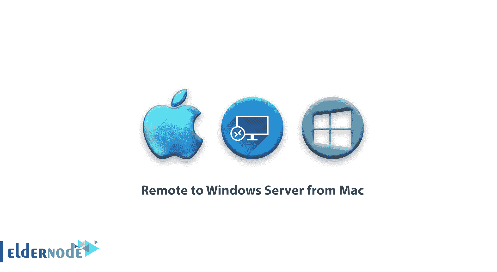
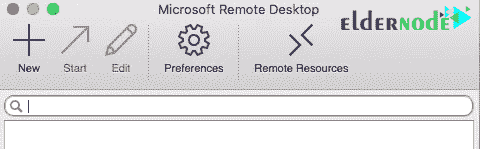
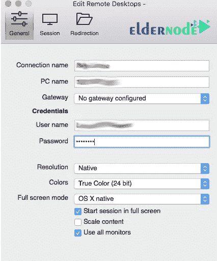
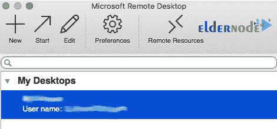
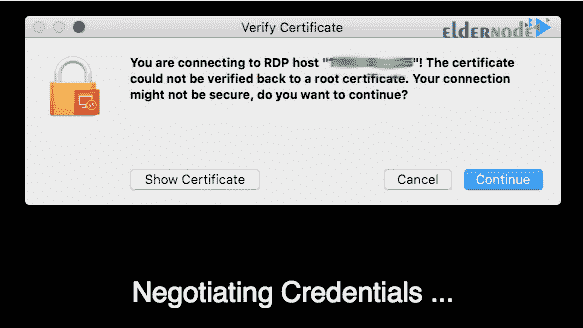
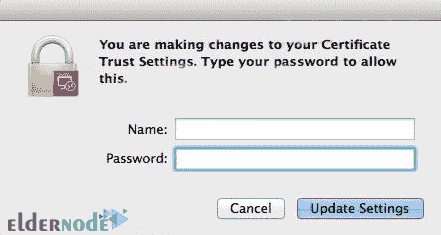

# 如何从 Mac 远程到 Windows 服务器-教程从 Mac 远程

> 原文：<https://blog.eldernode.com/remote-to-windows-from-mac/>

如何从 Mac 远程访问 Windows 服务器？从 Mac 远程访问 Windows 服务器是这个操作系统的用户经常面临的问题之一。但是微软通过提供一个应用工具解决了这个问题，这样苹果电脑用户就可以很容易地连接到他们的 T2 视窗服务器。

RDP 是微软为其所有操作系统默认设置的 Windows 服务器远程控制协议。如果您的操作系统是 Windows，并且您想要远程连接到您的 [Windows 虚拟服务器](https://eldernode.com/windows-vps/)，您可以简单地通过打开远程桌面连接窗口进行连接。

如果你用的是非 Windows 操作系统，那就需要另辟蹊径了。以前，像 VLC 这样的软件被用来从其他操作系统连接和控制 Windows 服务器。 VLC 很容易安装和使用，但它在你服务器上的服务随时可能被停止，你无法使用它。

为了解决这个问题，微软已经将其远程桌面软件分发到大多数操作系统，现在你可以用它们来远程运行你的 Windows 服务器。

在之前的文章中，我们研究了如何从 Android 设备连接 windows vps。在这篇文章中，我们将教你如何从 Mac 远程操作 Windows 服务器。

## 从 Mac 远程到 Windows 服务器

**1。** 首先，通过以下链接下载和在你的 Mac 上安装微软远程桌面软件:

**微软 mac 版远程桌面**

**2。** 从应用程序文件夹中找到和运行软件。

**3。打开软件后，点击新增选项。**

**4。** 输入您的服务器的名称、 IP 地址、端口等详细信息。

**5。** 保存输入的信息后，**双击已创建的连接上的**。

**6。** 连接后会收到警告使用证书。在这一部分，点击显示证书选项。

**7。T3 选择证书点击继续。通过在您的系统上安装证书，您将看不到这些步骤的频率。**

**8。** 安装证书，如果下面的窗口打开，输入您的 **Mac** 用户名和密码。

**9。** 安装好证书后，你就连接上了，你会看到你的服务器的桌面屏幕。

**亦作，见:**

[如何从 android 设备连接 VPS](https://eldernode.com/how-to-connect-vps-from-an-android-device/)

[如何使用 RDP 将文件传输到 Windows 服务器](https://eldernode.com/transfer-file-using-rdp-to-windows-server/)

**尊敬的用户**，我们希望您能喜欢这个[教程](https://eldernode.com/category/tutorial/)，您可以在评论区提出关于本次培训的问题，或者解决[老年人节点培训](https://eldernode.com/blog/)领域的其他问题，请参考[提问页面](https://eldernode.com/ask)部分，并尽快提出您的问题。腾出时间给其他用户和专家来回答你的问题。

好运。