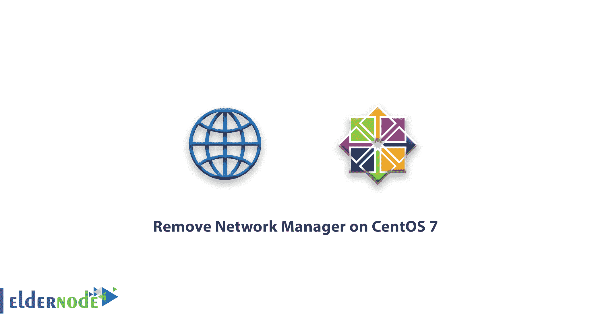

# 如何在 CentOS 7 上删除网络管理器-什么是网络管理器

> 原文：<https://blog.eldernode.com/remove-network-manager-centos-7/>



通过最近的文章，您已经熟悉了网络管理器。在本文中，我们将向您介绍如何在 CentOS 7 中删除网络管理器。网络管理器是新一代 Linux 中最智能、最强大的 Linux 工具之一。这个工具，但有时会中断其他服务，你需要删除它。

## 如何在 CentOS 7 上移除网络管理器

### 介绍网管

**网络管理器** 是一个有用且强大的备份工具，一般安装在 Linux 上。并且与图形环境一起使用，并且具有智能控制 Linux 网络服务的能力。

**特性** 该服务包括监控 [Linux](https://eldernode.com/tag/Linux/) 网络的状态，以及基于速度和自动化的网卡移动。以及该工具的其他功能，包括管理和控制蓝牙、无线。这个工具在图形环境或者客户端版本的 Linux 版本中非常有用。

**有了这个工具** ，你将**能够**将所有东西保存在一个文件中，而不是在几个不同的文件中设置 **DNS** 或 **IP** 。并使您的设置更快。

**尽管有这些功能** ，这个工具还是会给服务器上的其他服务造成问题，比如缺少网络控制访问和被其他软件和服务更改。

**例如** ，在安装了[虚拟主机](https://eldernode.com/linux-hosting/)控制面板如 cPanel 后，网络的控制和管理将由 cPanel 提供，由于网络管理器的条件不允许更改任何服务，您将在 cPanel 安装之初遇到错误。

**，** 在安装 cPanel 或网络管理器出现问题的工具之前，需要移除此工具并使用您的 Linux 网络服务。

**[购买 Linux 虚拟主机](https://eldernode.com/linux-hosting/)**

### 教程 CentOS 7 上移除网络管理器

**1-** 首先进入你的 [CentOS 7](https://www.centos.org/download/) 终端的环境。

**2-** 然后输入以下命令停止**网络管理器**服务，退出 Linux 启动。

```
systemctl stop NetworkManager.service  systemctl disable NetworkManager.service
```

**3-** 转到/**etc/sys config/network-scripts/**目录。

```
cd /etc/sysconfig/network-scripts
```

**4-** 通过输入 **ls** 命令找到您的网络配置文件。

比如，我们的网卡名称是 **eno2657** ，所以我们会如下图打开这个文件。

```
vi eno2657
```

**注意** :接口通常在这个列表的顶部。

**注** :也可以使用**纳米编辑器**进行更轻松的编辑。

打开网络接口设置后，您会看到您的网络信息。所以，你需要给它加上下面的短语。

```
NM_CONTROLLED=no
```

**注** :以上短语必须以**大写**和**小写**字母的形式输入。

导入后，**保存**文件并退出。

**5—**现在输入下面的命令启动默认的 Linux 网络服务 Centos 来启动活动和接口管理。

```
systemctl enable network.service  chkconfig network on
```

这样，你就把接口控制权从**网络管理器**转移到了 Linux 网络的内部服务。

**最后** ，为防止网管干扰，建议您输入以下命令将其从您的 Linux 中整体移除。

```
yum remove NetworkManager 
```

输入上述命令后，该服务将被 **完全删除** ，您将不再需要担心其他重要服务会中断该服务。

亲爱的用户，我们希望这篇教程能对你有所帮助，如果你有任何问题或想查看我们的用户关于这篇文章的对话，请访问[提问页面](https://eldernode.com/ask)。也为了提高你的知识，有这么多有用的教程为[老年节点培训](https://eldernode.com/blog/)准备。

#### **不要错过**

[初始设置 centos 8](https://eldernode.com/initial-set-up-centos-8/)