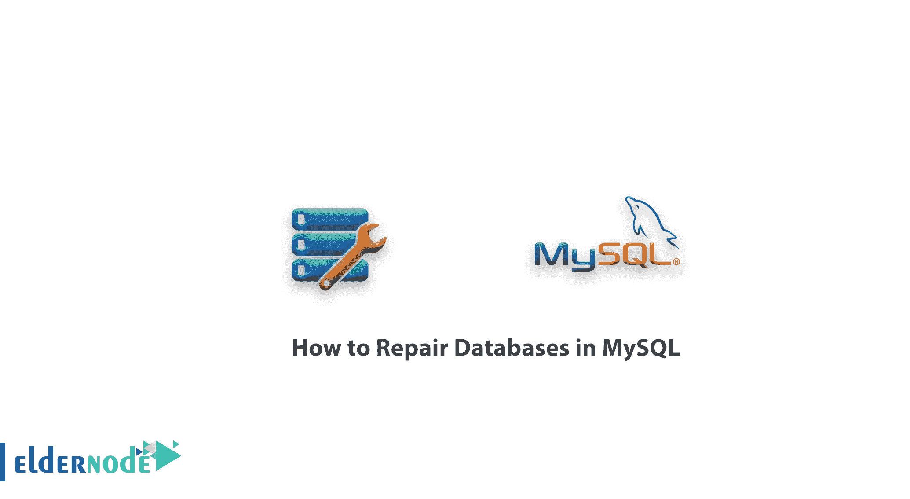
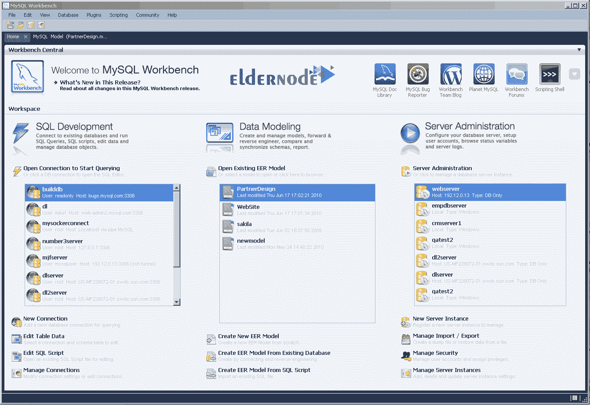

# 如何修复 MySQL -教程 ElderNode 博客中的数据库

> 原文：<https://blog.eldernode.com/repair-databases-in-mysql/>



如何修复 MySQL 中的数据库？有时候，一个 MySQL 数据库会**崩溃**。这个问题可以用 cPanel 、 phpMyAdmin 或者 WHM 修复。**本文**解释了如何修复 MySQL 数据库和表。

MySQL 包括几个工具，可以用来检查和修复数据库表。跟随我们修复 MySQL 数据库。

[**购买 SSD VPS 托管服务器**](https://eldernode.com/ssd-vps/)

### 第一步:备份数据库

在尝试修复任何数据库之前，您必须首先**将其恢复**。要从所有数据库中备份所有文件，请按照以下步骤操作:

**1。使用 [SSH](https://en.wikipedia.org/wiki/Secure_Shell) 登录**到你的服务器。

**2。为你的 Linux 发行版使用适当的命令停止 MySQL 服务器:**

**–**对于 CentOS 和 Fedora ，键入以下命令:

```
service mysqld stop
```

**–**对于 Debian 和 Ubuntu ，键入以下命令:

```
service mysql stop
```

**3。****下面的命令**根据当前时间(确切地说，是自 1970 年 1 月 1 日以来的秒数)将所有数据库中的所有文件复制到一个目录名。

这确保了每个数据库备份都存储在具有唯一名称的文件夹中。为了增加保护，您可以(也应该)将数据库文件分离到远离服务器的位置。

```
cp -rfv /var/lib/mysql /var/lib/mysql$(date +%s)
```

**4。** 重启MySQL 服务器使用适合您的 Linux 发行版的命令:

**–**对于 CentOS 和 Fedora ，键入以下命令:

```
service mysqld start
```

**–**对于 Debian 和 Ubuntu ，键入以下命令:

```
service mysql start
```

### 第二步:用 MYSQLCHECK 检查并修复一个表

备份数据库后，您就可以进行故障排除了。当**修复**正在运行时， mysqlcheck 应用程序使您能够检查 MySQL 数据库。当您想要在数据库**中工作而不停止**整个 MySQL 服务时，这个特性非常有用。

此外， mysqlcheck 用于使用 **MyISAM** 或 **InnoDB** 数据库引擎的表中。

要使用 mysqlcheck ，请遵循以下步骤:

**1。** 作为根用户，键入以下命令:

```
cd /var/lib/mysql
```

**2。** 到将数据库替换为您要检查的数据库的名称，键入以下命令:

```
mysqlcheck DATABASE
```

前面的命令检查指定数据库中的所有表。或者，键入以下命令来检查数据库中的特定表。

用数据库名替换数据库，用要检查的表名替换表:

```
mysqlcheck DATABASE TABLE
```

**3。** Mysqlcheck 检查指定的数据库和表。如果一个表通过了检查，mysqlcheck 会为该表显示 OK 。但是，如果 mysqlcheck 报告了一个表错误，请键入以下命令尝试修复它。

用数据库名替换数据库,用表名替换表:

```
mysqlcheck -r DATABASE TABLE
```

**4。** 如果 mysqlcheck 不能成功修复表或表，转到下面的方法。

### 第三步:识别具体的发动机

如果运行 mysqlcheck 不能解决问题，下一步就是对数据库表中使用的引擎进行特定的诊断。

对于您的表数据库存储引擎，请遵循以下适当的过程。

#### 用 myisamchk 修复 MyISAM 表

如果你为一个表使用了一个 MyISAM 存储引擎，你可以运行 myisamchk 程序来修复它。

为此，请按照下列步骤操作:

**注意:**myisamchk 程序只适用于在 MyISAM 存储引擎上运行的表，而不适用于 InnoDB 引擎。

**1。使用适当的命令停止 MySQL 服务器Linux 发行版:**

**–**为 CentOS 和 Fedora :

```
service mysqld stop
```

**–**对于 Debian 和 Ubuntu :

```
service mysql stop
```

**2。** 键入以下命令:

```
cd /var/lib/mysql
```

**3。** 切换到数据库所在的目录。例如，如果数据库名为 Customers，请键入 CD Customers。

**4。** 键入以下命令，用您想要检查的表的名称替换表:

```
myisamchk TABLE
```

要检查数据库中的所有表，请键入以下命令:

```
myisamchk * .MYI
```

如果前面的命令不起作用，可以尝试从 myisamchk 中删除可能无法正常运行的临时文件。

为此，请转到/var/lib/mysql 文件夹，然后键入以下命令:

```
ls * / *. TMD
```

如果有 TMD 文件，输入以下命令删除它们:

```
rm * / *. TMD
```

然后尝试再次运行 myisamchk 。

**5。** 要尝试修复一个表，键入下面的命令并用您想要修复的表的名称替换表:

```
myisamchk --recover *TABLE*
```

**6。** 重启MySQL 服务器使用适合您的 Linux 发行版的命令:

**–**为 CentOS 和 Fedora :

```
service mysqld start
```

**–**对于 Debian 和 Ubuntu :

```
service mysql start
```

**7。** 测试修好的表或表。



#### 执行 InnoDB 恢复过程

如果您将 InnoDB 存储引擎用于数据库表，您可以运行 **InnoDB 恢复进程**。为此，请按照下列步骤操作:

**1。** 使用文本编辑器打开你服务器上的 my.cnf 文件。 my.cnf 文件的**位置**取决于您的 L inux 发行版:

**–**在 CentOS 和 Fedora 中， **my.cnf 文件**位于/etc 目录下。

**–**在 Debian 和 Ubuntu 中， **my.cnf 文件**位于/etc/mysql 目录下。

**2。** 在 **my.cnf** 文件中，找到【mysqld】部分。

**3。** 在【mysqld】部分添加下面一行:

```
innodb_force_recovery=4
```

**4。** 保存对 **my.cnf** 文件的修改。

然后使用合适的命令重启MySQL 服务器用于你的 Linux 发行版:

**–**为 CentOS 和 Fedora :

```
service mysqld restart
```

**–**对于 Debian 和 Ubuntu :

```
service mysql restart
```

**5。** 键入以下命令，将的所有数据库导出到 databases.sql 文件中:

```
mysqldump --all-databases --add-drop-database --add-drop-table > databases.sql
```

**6。** 启动**MySQL 程序**，然后尝试使用 DROP DATABASE 命令删除损坏的数据库。

如果 MySQL 无法删除数据库，可以在关闭 MySQL 服务器后，在步骤 8 中手动删除。

**7。** 停止**MySQL 服务器**使用适合您的 Linux 发行版的命令:

**–**为 CentOS 和 Fedora :

```
service mysqld stop
```

**–**对于 Debian 和 Ubuntu :

```
service mysql stop
```

**8。** 如果在第 6 步中不能删除数据库，输入以下命令手动删除。

用您想要删除的数据库的名称替换数据库名:

```
cd /var/lib/mysql  rm -rf *DBNAME*
```

**提示:** 确保你**没有删除**MySQL 目录或 performance_schema ！

**9。** 用你最喜欢的文本编辑器打开你服务器上的 my.cnf 文件。然后将以下命令放入【mysqld】部分:

```
# innodb_force_recovery = 4
```

该模式**禁用** InnoDB 恢复。

**10。** 保存对 my.cnf 文件的修改。然后使用适用于您的 Linux 发行版的适当命令启动MySQL 服务器:

**–**为 CentOS 和 Fedora :

```
service mysqld start
```

**–**对于 Debian 和 Ubuntu :

```
service mysql start
```

**11。** 输入以下命令从**步骤 5** 中创建的备份文件中恢复数据库:

```
mysql < databases.sql
```

**12。** 重建数据库测试。

**尊敬的用户**，我们希望您能喜欢这个[教程](https://eldernode.com/category/tutorial/)，您可以在评论区提出关于本次培训的问题，或者解决[老年人节点培训](https://eldernode.com/blog/)领域的其他问题，请参考[提问页面](https://eldernode.com/ask)部分，并尽快提出您的问题。腾出时间给其他用户和专家来回答你的问题。

好运。