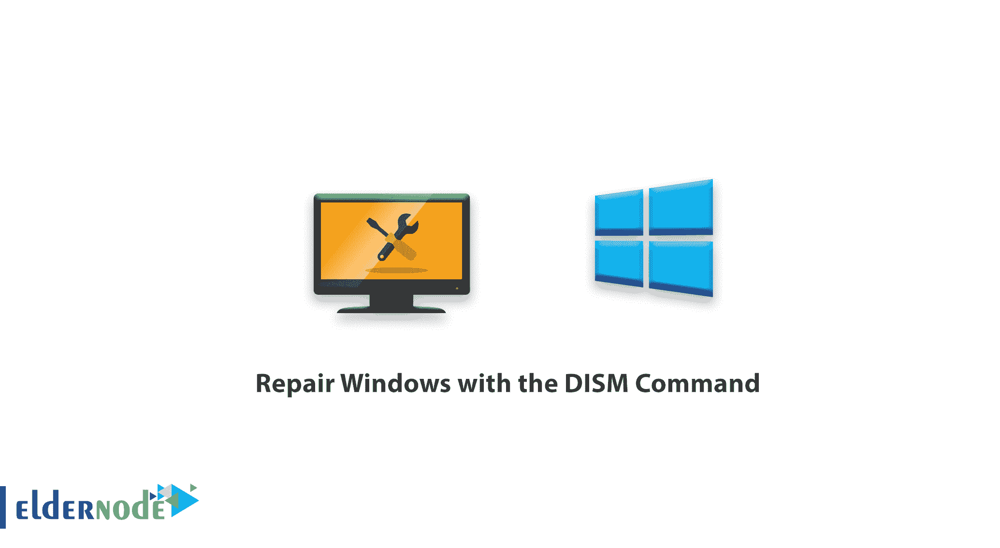

# 如何使用 DISM 命令修复 Windows-Windows VPS 服务器

> 原文：<https://blog.eldernode.com/repair-windows-with-dism-command/>



如何用 DISM 命令修复窗口？你可能遇到过这样的情况:在使用 [Windows Server](https://eldernode.com/tag/windows-server/) 或 [Windows Client 10](https://eldernode.com/tag/windows-10/) 一段时间后，你会遇到奇怪的错误和警告。

其中许多错误都与 Windows 中一个简单文件的损坏有关。但是，您的服务和 Windows 的性能将会受到影响，并且可能会困扰您更换和重新安装 Windows。

在本教程中，我们想向您介绍一个专门的完整解决方案，以便您可以轻松解决您的 Windows 问题。

[【DISM】](https://docs.microsoft.com/en-us/windows-hardware/manufacture/desktop/dism---deployment-image-servicing-and-management-technical-reference-for-windows)命令，或部署镜像服务和管理，是优化和定制窗口的命令。除了这个应用程序，这个命令还有修复窗口的能力。

在**之前的 Windows 10** 中， SFC 命令更有用，但是随着 Windows 10 家族的引入，该命令不如以前好用了。这就是为什么微软提出了 DISM 命令。

我们将讨论如何使用 DISM 命令，以及如何使用 DISM 命令修复窗口。

[**在 Eldernode**](https://eldernode.com/windows-vps/) 选择您的完美 Windows 虚拟专用服务器包

## 使用 DISM 命令修复 Windows 教程

**1。**T3 首先，用**管理员权限**打开一个 PowerShell 或 CMD 终端。

**2。** 修理任何东西的第一步都是排除那个系统的故障。

您可以输入带有 **CheckHealth** 参数的 DISM 命令，先对 Windows 进行故障排除。

```
DISM /Online /Cleanup-Image /CheckHealth
```

上面的命令提示 DISM 立即检查 Windows 错误的状态，并找到损坏的文件。

输入该命令后，DISM 将转到错误日志并开始在其中搜索。

另一个可以用来排除 Windows 故障的参数是 **Scanhealth** 参数。

```
DISM /Online /Cleanup-Image /Scanhealth
```

此参数不仅搜索日志文件，还会自行开始检查所有 Windows 文件。此参数还将查找与 Windows 相关的任何错误。

**注 1:** 由于检查每个 Windows 文件，该命令的操作可能需要 10 到 15 分钟。

**3。** 好了，至此你已经设法检查了你的窗户的健康状态。下面介绍如何排除故障和修理窗户。

用 DISM 命令修复 Windows 问题，有一个参数叫做 **Restorehealth** ，输入如下:

```
DISM /Online /Cleanup-Image /Restorehealth
```

输入上述命令后，Windows 启动恢复用**健康文件**替换**损坏文件**。

**注 2:**DISM 命令将开始使用 [Windows 更新服务](https://eldernode.com/disable-auto-update-in-windows/)下载所需文件。如果您禁用了 Windows Update 服务或 Internet 不可用，此操作将失败。

**注 3:** 根据损坏文件的大小和数量，此操作可能会很耗时，有时会在进度条中的某个百分比处停止。如果由于任何原因，DISM 命令崩溃，系统将不会保留一个特定的数字，并将显示一个错误。

现在，我们将帮助您从本地来源而不是互联网获取所需的 DISM 文件，这样，如果您无法访问互联网，您可以使用其他来源。

### 将 DISM 命令的来源从互联网改为媒体

DISM 命令有一个功能，可以从各种来源找到文件，并对其执行 Windows 修复工作。 DVD 、 flash 甚至 Windows ISO 文件之类的源码都可以读取给 **DISM** 。

源参数用于改变或添加另一个源到 DISM 命令。

因此，如果您想输入带有 RestoreHealth 参数的 **DISM 命令**，并从特定源读取信息，该命令将如下所示:

```
DISM /Online /Cleanup-Image /Restorehealth /Source:G:\Sources\install.esd
```

要指定来源，您必须输入文件 **Install.esd** 或 **Install.win** 或 **Install.wsm** 的 URL，它们是 Windows 的主安装文件。

每个媒体中通常会有三个文件中的一个。

要从本地源恢复 Windows 中的损坏文件，您的 Windows 版本必须与媒体版本完全相同。比如，如果你的 Windows 是 Pro 版本 1703 ，你的**媒体**应该安装了相同版本。

通过输入上述命令，您将能够向 DISM 命令引入一个特定的源。

如果您想让 DISM 命令只使用提到的信号源，您需要在您的命令末尾输入 **限制访问** 参数:

```
DISM /Online /Cleanup-Image /Restorehealth /Source:G:\Sources\install.esd /Limitaccess
```

**亦作，见:**

[修复远程](https://eldernode.com/fix-credssp-encryption-oracle-error-in-remote/)中的 CredSSP 加密 Oracle 错误

**尊敬的用户**，我们希望您能喜欢这个[教程](https://eldernode.com/category/tutorial/)，您可以在评论区提出关于本次培训的问题，或者想解决[老年人节点培训](https://eldernode.com/blog/)领域的其他问题，请参考[提问页面](https://eldernode.com/ask)部分，并尽快提出您的问题。腾出时间给其他用户和专家来回答你的问题。

好运。