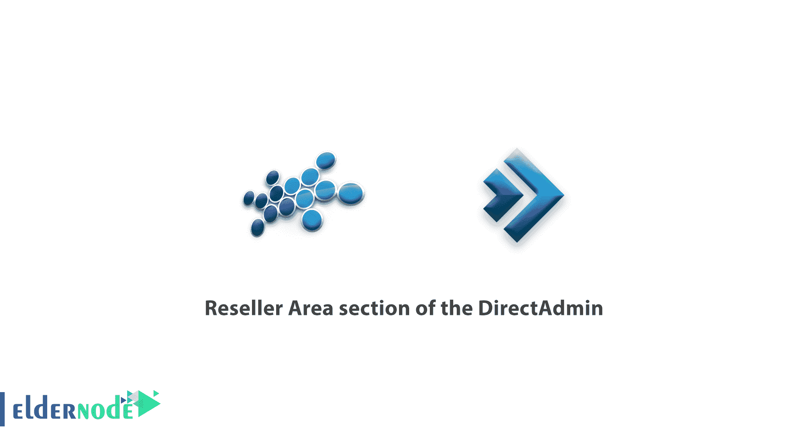
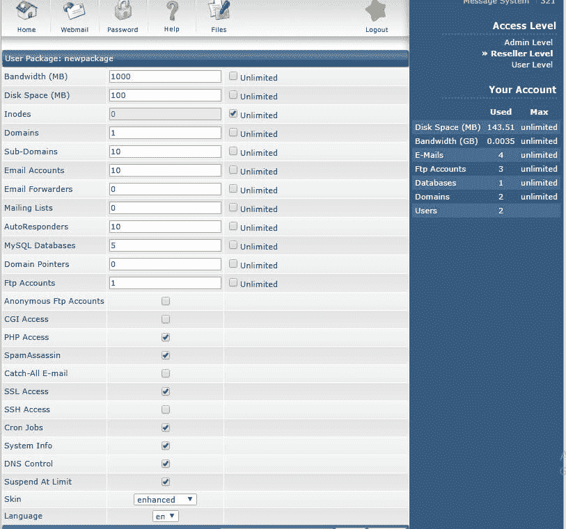
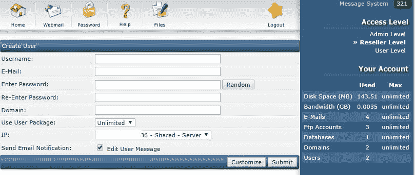

# DirectAdmin - Eldernode 的经销商区域部分

> 原文：<https://blog.eldernode.com/reseller-area-section-of-the-directadmin/>

DirectAdmin 的经销商区域部分；如果您计划在 DirectAdmin 服务器上创建新帐户，则必须首先为该服务器创建托管计划。登录 DirectAdmin 后选择经销商级别。

## **经销商区域部分的**direct admin

在 DirectAdmin 中创建新帐户和域:

在下一页，即经销商部分，您可以对用户进行操作。例如，创建一个新用户，查看用户列表。

第一步是从这个部分创建你自己的托管计划。使用本节中的“**添加** **套餐**选项添加您自己的计划。

点击上面的选项后，您将看到一个类似如下的页面:

在此图中，您需要输入适合您的包的值。

例如，在“**带宽**”框中，您指定该计划允许的带宽量，在“**磁盘** **空间**”框中，您指定该计划的用户允许使用的磁盘空间量。

其他选项也是可以的，你要根据具体的需求和计划来增减。此部分中有一些选项在共享主机上未启用。其中包括“ **CGI 访问**”、“**通吃 E**–**邮件**”、“ **SSH 访问**、 **DNS 控制**。在本页底部设置所需值后，在“**包名**”框中输入目标计划名，然后选择保存以创建您的计划。

### 查看和修改现有主机计划:

在“经销商”部分选择“**管理用户包**，查看和修改之前创建的包。选择此选项后，您将在下一步看到一个预先创建的包列表，您可以单击每个包来更改定义的值。

如果需要删除计划，可以选中该计划的选择复选框，然后在选择页面上选择删除。

### 在 [DirectAdmin](https://blog.eldernode.com/tag/direct-admin/) : 中为用户创建主机

如果您已经根据上一步创建了您的主机计划，您可以使用添加新用户选项创建新主机。选择此选项后，您将看到类似下图的页面:

在上面的页面中，首先输入所需的主机名、用户电子邮件、密码和重复密码，然后输入所需的域名。然后从“使用用户包”框中选择您在上一步中创建的包之一。如果您对主机使用共享服务器 IP，并且不需要自定义主机，请选择提交。

创建帐户后，帐户详细信息将发送到在创建帐户中注册的电子邮件中。如果您对发送详细信息不感兴趣，您可以禁用“**发送电子邮件通知**”。

如果要更改 DirectAdmin 发送的默认消息，请选择“编辑用户消息”。

### 管理在管理员 DirectAdmin: 中创建的主机

如果您已经在本教程中定义了前面的步骤并打算管理它，您可以搜索和管理**经销商**和**管理区**。要查看经销商创建的所有主机帐户列表，选择**列出用户**。在下一页，您将看到所有用户(主机)的列表。

您也可以在搜索框中输入目标域，以便更容易地找到目标用户。DirectAdmin 用户列表显示磁盘使用情况、带宽、主机状态、IP 和域名。

### 暂停或启用主机:

在用户的视图列表中，您可以检查暂停列的状态。如果此列为是，则意味着您的主机已挂起，您需要检查主机的状态，并在必要时重新启用它。

### 在 DirectAdmin 中删除主机:

如果您需要删除服务器上的某个主机，如“用户查看”部分的前面步骤中所述，请选择相应的主机，然后选择“删除”。请记住，在删除您的主机之前，请务必备份并完全放心地选择此选项。

如果没有备份，在 [DirectAdmin](https://www.directadmin.com/) 中删除主机将无法恢复。

### 更改密码:

要更改您的主机用户的密码，在“经销商区域”部分，您可以使用“更改密码”选项轻松完成。在用户名框中输入该部分后，输入主机的用户名，然后选择密码，并选择提交以更改所需用户的密码。

祝您好运