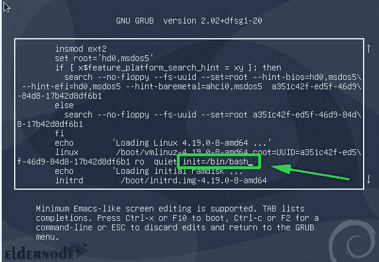

# 如何重置忘记的 Debian Linux 密码【顶途】- Linux 教程

> 原文：<https://blog.eldernode.com/reset-forgotten-debian-linux-password/>


【更新于:2020/12/24】在数字和信息的大千世界里，碰巧忘记密码是非常正常的事情。建议我们设置[强密码](https://blog.eldernode.com/how-to-create-strong-password/)，不要写在任何地方，不要使用我们的个人信息，只是尽量记忆。哎呀！这似乎是令人困惑的，你可能已经面临的时刻，你不知道你昨天选择了什么作为你的密码！不要担心，在这篇文章中，你将学习如何**重置忘记的 Debian Linux 密码**。安全地准备好你的 [Linux VPS](https://eldernode.com/linux-vps/) ，保存这个指南作为你忘记密码时的解决方案。

## **教程在 Debian 10 中重置忘记的 Root 密码**

在正常情况下，普通用户和超级用户都可以通过密码认证来访问服务。但是一旦普通用户忘记了他/她的密码，超级用户可以帮助他们从终端重置密码。第二个问题是当超级用户(或根用户)自己丢失密码时。接下来，你将学习当你无法登录到你的 Debian 系统时应该做什么。让我们通过这个指南的步骤来学习和完成它。

### **如何重置忘记的 Debian 密码**

当出现 **GRUB** 菜单时，在系统开始引导前继续按“e”键。


然后，你会看到下面的屏幕。正如您在下面的屏幕中看到的，向下滚动找到以“linux”开头的行，它也指定了 **UUID** 。



此时，将光标放在提到的行的末尾。追加参数:

```
init=/bin/bash
```

现在，您必须按下 **CTL + x** 来使它以单用户模式引导，根文件系统挂载有只读 **(ro)** 访问权限。

在这一步中，您已经准备好开始重置密码的主要过程。

因为您需要将访问权限从只读更改为读写，所以您应该使用下面的命令用 rw 属性重新挂载根文件系统。

```
:/# mount -n -o remount,rw /
```

最后，您可以运行传统的 **Passwd** 命令来重置 root 密码。

```
:/# passwd
```

再次，提供新密码的时刻。选择您喜欢的并重新输入以确认。如您所知，您写的两个密码应该匹配。如果您设置好了，您会在控制台的末端看到“**密码更新成功**”的通知。

最后一步，按 **Ctrl+Alt+Del** 退出，**重启**。此时，当您输入刚刚设置的新密码时，您可以再次以**根用户**的身份登录。

就是这样！当你不记得你的密码时，这就是你所需要做的。

结论

## 在本文中，您了解了如何重置忘记的 Debian Linux 密码。很容易做到这一点，所以它可能会通知您，任何人都可以访问您的计算机可以很容易地使用这种方法，并重置您的超级用户或根密码。解决方法是加密整个硬盘。如果你有兴趣阅读更多内容，可以找到我们的相关文章[如何在不输入密码](https://blog.eldernode.com/linux-login-without-entering-password/)的情况下登录 Linux。

In this article, you learned How To Reset forgotten Debian Linux password. It is very easy to do that, so it may notify you that anyone who has access to your computer can easily use this method and reset your superuser or root password. The solution is to encrypt the whole hard disk. In case you are interested to read more, find our related article on [How to Linux login without entering password](https://blog.eldernode.com/linux-login-without-entering-password/).