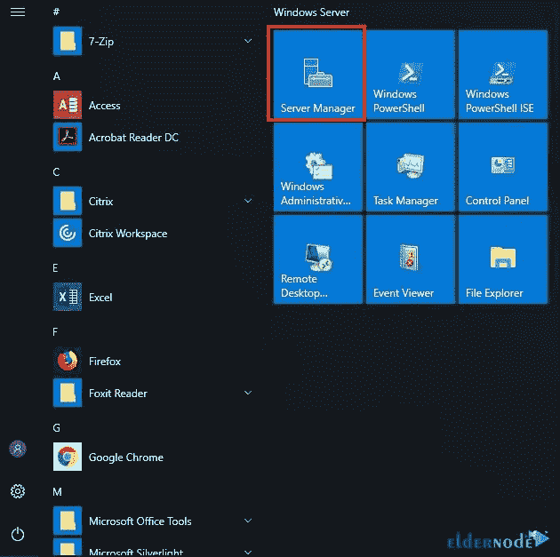

# Windows Server 2022 重置密码教程- Eldernode 博客

> 原文：<https://blog.eldernode.com/reset-password-on-windows-server-2022/>

Windows Server 是一种可以直接在服务器上安装和运行的操作系统。通过这种方式，可以存储和控制大型信息网络，并且可以使用共享程序和网络。Windows 服务器有不同的版本，最新版本是 Windows Server 2022。在这篇文章中，我们将教你如何在 Windows Server 2022 上重置密码。你可以从 [Eldernode](https://eldernode.com/) 网站上提供的套装中查看并购买 [**Windows VPS**](https://eldernode.com/windows-vps/) 。

## **如何在 Windows Server 2022 上重置密码**

### **Windows Server 2022 简介**

[Windows Server](https://blog.eldernode.com/tag/windows/) 2022 是微软最新的服务器操作系统操作系统，于 2021 年 9 月推出，被 Windows Server 2019 取代。这个操作系统比以前的 Windows 服务器更安全，并且与 Azure 兼容。Windows Server 2022 的核心不是基于 Windows 11，而是基于 Windows 10 版本 21H2。在这个版本的 Windows Server 中，您可以轻松地在 Windows Azure 和 Windows 2022 之间移动虚拟机。

该产品有三种不同的版本，分别是:

1)Windows Server 2022 标准版

2)Windows Server 2022 数据中心

3)Windows Server 2022 Azure 版

## **重置 Windows Server 2022 上的密码**

在本文的后续部分，我们打算教你如何使用两种方法在 Windows Server 2022 中重置密码。这两种方法是:

1)使用服务器管理器重置密码

2)使用 Windows 管理中心重置密码

### **如何使用服务器管理器在 Windows Server 2022 上重置密码**

首先，你应该去**开始**菜单，打开**服务器管理器**:

打开**服务器管理器**窗口后，您会收到一个请求，要求您下载 **Windows 管理中心**。您可以拒绝这一请求，并在 Google 上从微软找到该工具的下载链接。

现在点击右侧的**工具**选项，选择**电脑管理**工具:

然后你应该打开左边的**本地用户和组**选项。然后选择**用户**文件夹:

现在，您可以在右侧看到您的用户列表。请注意，根据您创建的用户号码和他们呼叫的内容，您的列表可能会有所不同。然后，我们将重置其中一个用户的密码。

**在需要重设密码的文件夹上右键单击**，选择**设置密码**选项:

通过这样做，您将收到一个通知，上面写着**“您确定要设置密码吗？”**。只需点击**继续**:

在这一步，你应该输入一个新的密码并确认。此外，你可以看到一个提示说，如果你这样做，你必须确定会发生什么。假设您重置了所有加密文件的密码。在这种情况下，您将丢失保存的密码和个人安全证书，并且您将无法访问该当前帐户下的用户用该当前密码保护的任何数据。确保所有数据都没有加密。输入您的新密码并点击**确定**:

最后，您将收到一条通知，说明**“密码已设置”**。之后，数据将无法恢复，除非您对其进行加密并确保其可用。

### **如何使用 Windows 管理中心**在 Windows Server 2022 上重置密码

如果你已经在你的设备上安装了 [Windows 管理中心](https://blog.eldernode.com/install-and-configure-windows-admin-center-on-windows-server/)，你也可以借助这个方法在 Windows Server 2022 中重置密码。Windows 管理中心是基于 web 的，您可以使用 web 浏览器打开并访问它。显然，您应该添加您想要管理的一个或多个 Windows 服务器。

首先，您应该从浏览器打开 **Windows 管理中心**。

***注:*** 你可以[从微软免费下载 Windows 管理中心](https://www.microsoft.com/en-us/evalcenter/download-windows-admin-center)。

点击链接打开它。一会儿你就能接通了。这里有各种各样的服务和工具。

接下来，您应该找到**本地用户&组**选项并选择它。在这种情况下，服务器会提供所有用户的列表。

一旦您选择并突出显示了您想要的用户，您就可以管理他们并向各种事物添加新用户。您需要点击**更改密码**，如下图所示:

然后，您将看到一个**更改密码**页面，并收到一个关于重置用户密码和失去信息访问权限的警告。输入您的新密码并点击**提交**:

就是这样！密码已成功更新和更改。

## 结论

本文介绍了如何在 Windows Server 2022 上重置密码，使用了两种方法:服务器管理器和 Windows 管理中心。这两种方法都相对简单和容易，由你选择哪一种。我希望这篇教程对你有用。有问题可以在评论区提问。