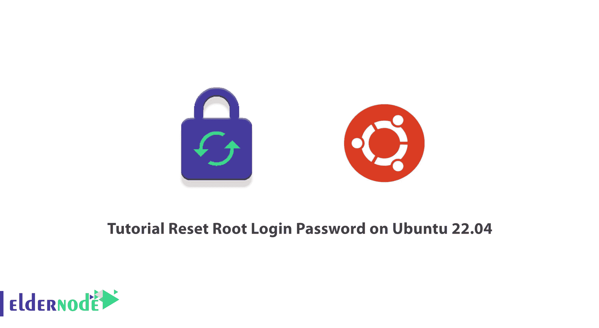
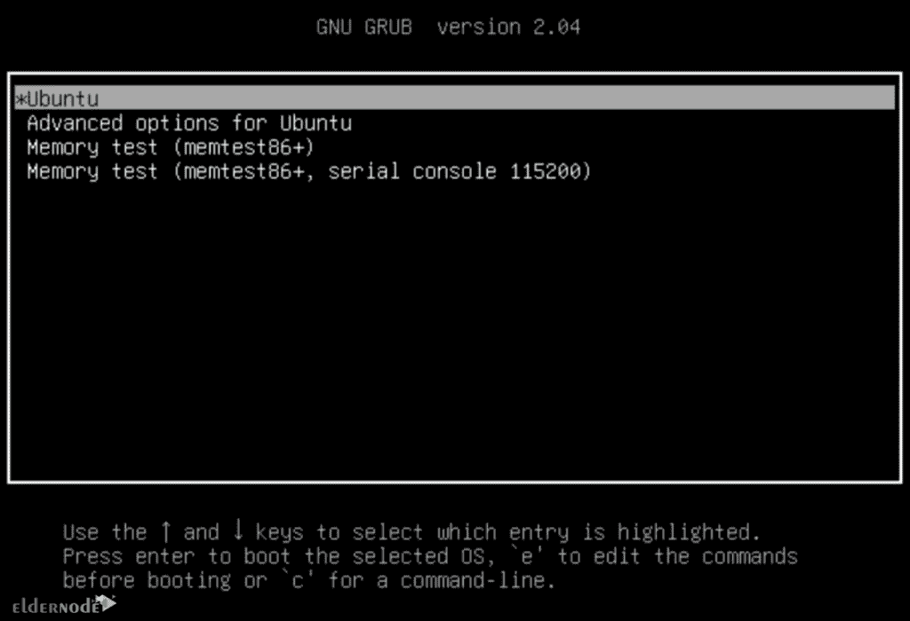
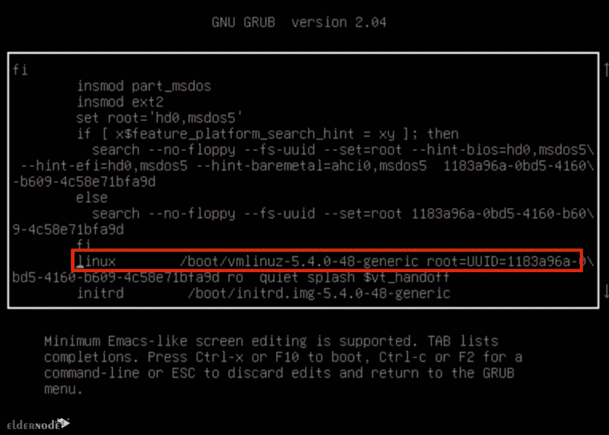
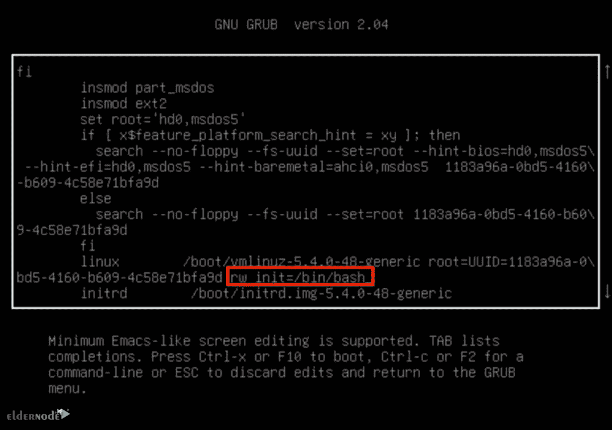

# 教程重置 Ubuntu 22.04 - Eldernode 博客上的 Root 登录密码

> 原文：<https://blog.eldernode.com/reset-root-login-password-on-ubuntu-22-04/>



大约 25%的人在运行他们的操作系统 14 天后会忘记他们的计算机密码。如果你是这些人中的一员，并且忘记了你的 Ubuntu [Linux VPS](https://eldernode.com/linux-vps/) 的根密码，不要担心。幸运的是，有一种方法可以重置您的 root 密码，并且可以在不知道密码的情况下这样做。在这篇文章中，我们将教你如何在 Ubuntu 22.04 上重置 root 登录密码。

在 Ubuntu 中，root 密码存储在 [Linux](https://blog.eldernode.com/tag/linux/) 文件系统的根文件夹文件中。登录时需要此密码，如果不知道密码，您将无法登录。因此，首先你必须以某种方式重置密码，并添加一个新的密码。

在 Ubuntu 系统中，root 帐户是第一个用户角色，root 用户可以更改和覆盖其他用户的权限。根用户对 Ubuntu 系统拥有最大的权力，用户需要根用户的许可才能进行修改。因此，如果您不知道系统的 root 密码，您应该禁用默认的 root 用户帐户。

## **如何在 Ubuntu 22.04 上重置 Root 登录密码**

### **第一步:打开 Ubuntu 22.04 Grub 菜单**

首先，你应该打开 Ubuntu 22.04 LTS Grub 菜单。要做到这一点，重新启动您的系统，并在闪屏出现时按住 **Shift** 键。这将让你进入 Ubuntu Grub 菜单。

### **第二步:编辑 Ubuntu 22.04 Grub 菜单**

这一步，选择 Ubuntu 选项，按**回车**。然后你需要编辑 Ubuntu Grub 菜单参数。要打开编辑器，只需按下键盘上的 **E** 键。



在这一步中，您必须使用箭头键向下滚动到以 Linux 开始的那一行的末尾。



然后在该行末尾输入以下命令:

```
rw init=/bin/bash
```



然后你应该通过使用 **F10** 或 **Ctrl+X** 来启动你的系统。

### **第三步:访问 Ubuntu 22.04 根壳**

现在你可以用 root 权限访问 Ubuntu shell，而不需要提供密码。请注意，在执行任何操作之前，您应该检查用户是否对安装了操作系统的文件系统具有读写权限。为此，请运行以下命令:

```
mount | grep -w /
```

如果您在输出中收到(rw，realtime ),则您可以对文件系统进行实时读写访问。

### **第四步:重置 root 用户密码**

现在是时候使用以下命令更改密码了:

```
passwd
```

然后会要求您输入两次新密码。

最后，您应该会收到**“密码更新成功”**消息。

请注意，如果您想更改非 root 用户的密码，您应该在命令中输入用户名:

```
passwd username
```

### **第五步:重启系统**

最后，您需要重新启动系统，使用更改后的密码登录。为此，输入以下命令并按下**键，输入**:

```
exec /sbin/init
```

就是这样！

## 结论

在本文中，我们教你如何在 Ubuntu 22.04 上重置 root 登录密码。重置 root 登录密码后，您可以使用新的 root 密码登录并访问您的系统。这篇文章对那些忘记密码的人很有用。我希望你喜欢它。