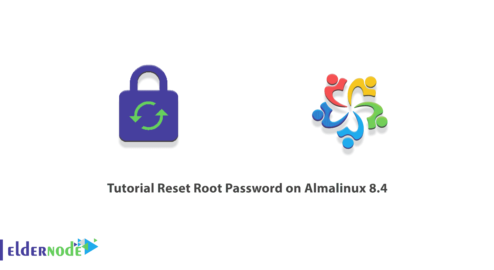
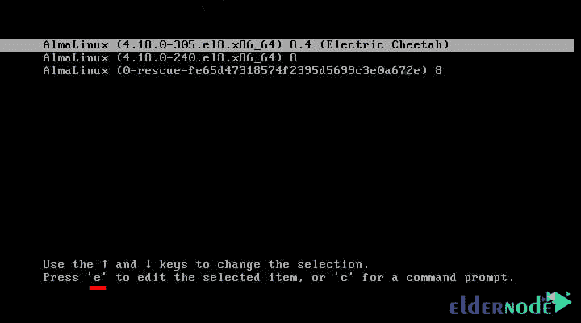
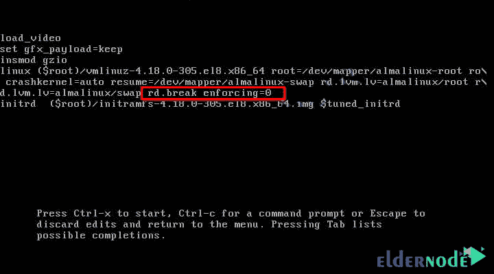
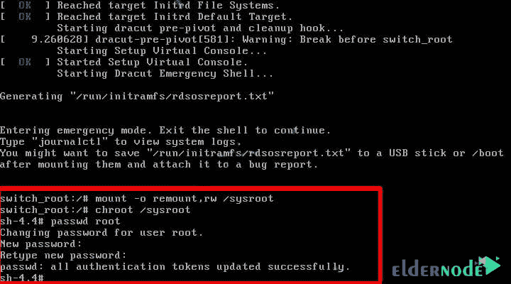
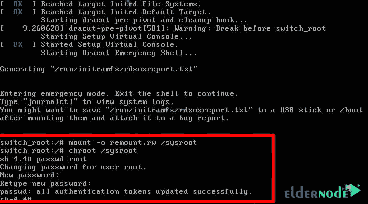

# 教程重置 Almalinux 8.4 - Eldernode 博客上的 Root 密码

> 原文：<https://blog.eldernode.com/reset-root-password-on-almalinux/>



AlmaLinux 是一个基于 RedHat 的 Linux 发行版，用于服务器和桌面。一些用户可能会在一段时间后忘记他们的 AlmaLinux root 用户密码。在这种情况下，恢复 root 密码的唯一方法是重置它。在这篇文章中，我们将教你如何在 Almalinux 8.4 上重置 Root 密码。如果你想购买一台 [**Linux VPS**](https://eldernode.com/linux-vps/) 服务器，你可以访问 [Eldernode](https://eldernode.com/) 中的软件包。

## 如何在 Almalinux 8.4 上重置 Root 密码

### **在 Almalinux 8.4 上重置 Root 密码的先决条件**

在本节中，我们将向您展示如何在 Almalinux 8.4 上重置 Root 密码。这样做的第一步是**重启[alma Linux](https://blog.eldernode.com/install-and-use-almalinux/)T3。当**启动菜单**出现时，你必须按下键盘上的 **e** 键。如下图所示，这将打开 **Grub 引导编辑界面**:**



在下一步中，您需要使用箭头键。然后，您必须在 initrd 的 **/swap** 和**之前添加下面一行。**要记住的一件事是，如果一个 **rhg 行**是安静的，就在 **/swap** 之后删除它。

```
- rd.break enforcing= 0
```



完成以上步骤后，现在可以按 **Ctrl+X** 开始启动过程。通过这样做，您可以启动紧急模式脚本 Shell。



接下来，您需要使用以下命令创建对 **sysroot 文件系统**的读写访问权限:

```
mount -o remount,rw /sysroot
```

现在，您应该能够使用以下命令在受限环境中访问 Sysroot 文件:

```
chroot /sysroot
```

## 在 Almalinux 8.4 上重置 Root 密码

在上一节中，我们做了更改 root 密码的必要先决条件。现在，您可以通过运行以下命令轻松重置密码:

```
passwd root
```

系统现在会要求您输入新的**密码**。需要注意的一点是，输入密码时，屏幕上没有显示任何内容。您必须指定一个**强密码**。该密码必须至少有**个 8 位数字**长，否则，它会警告密码不安全。最后，完成后按下 **Enter** 键。



使用以下命令退出 Sysroot :

```
exit
```

正如您刚才看到的，我们将访问权限从只读更改为读/写。现在，您需要在退出系统之前重置它:

```
mount -o remount,ro /sysroot
```

您可以使用以下命令退出当前交换机根会话并重新启动系统:

```
exit
```

### **如何用新密码登录 root**

查看 AlmaLinux 登录页面时，使用您的新用户名和**密码**登录。注意，重置密码后，最好使用以下命令清理以加密格式存储系统密码的 **/etc/shadow** 系统密码。这样做将删除任何剩余的输入:

```
restorecon /etc/shadow
```

## 结论

如果您被锁定在 AlmaLinux 实例中，并且失去了对 root 帐户的访问，您将需要引导到单用户模式并重置 root 密码。在本文中，我们试图教你如何在 Almalinux 8.4 上重置 Root 密码。