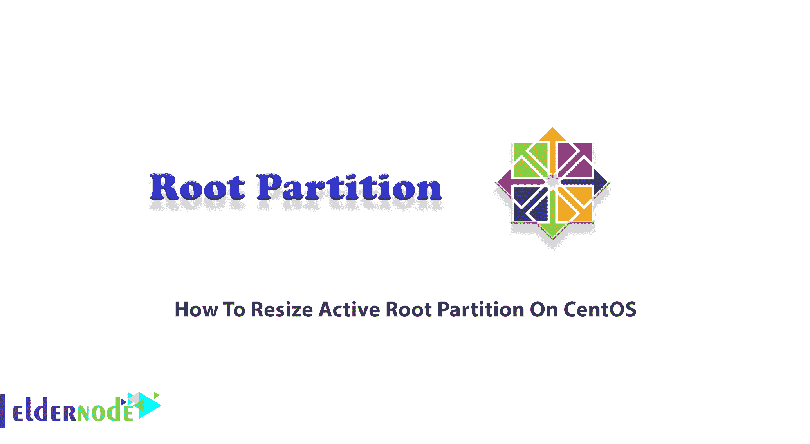

# 如何在 CentOS - Eldernode 博客上调整活动根分区的大小

> 原文：<https://blog.eldernode.com/resize-active-root-partition-on-centos/>



在 CentOS 安装过程中，您需要对磁盘空间进行分区和分配。因为“主分区”总是在你安装 Linux 发行版时创建的，很明显你会有一个主目录，它也可以创建在一个单独的分区上。/home 目录是存储您的个人数据(如下载的文件、设置和系统定制)的地方。但是，如果不创建单独的/home 分区，您的/home 目录将位于您的根分区上。过了一会儿，你可能会意识到你家的分区已经被占满了，你需要重新调整它的大小。在这种情况下，您需要收缩根分区，以便为主分区分配更多的可用空间。加入我们这篇文章，了解如何在 CentOS 上调整活动根分区的大小。在 [Eldernode](https://eldernode.com/) 上选择您深思熟虑的计划，购买您自己的 [CentOS VPS](https://eldernode.com/centos-vps/) 。

## **教程在 CentOS 上调整活动根分区大小**

根分区的大小将根据您安装或计划安装的内容而有所不同。然而，2GB 和 8GB 之间的根分区也可以。请注意，您为根目录创建的分区不同于作为系统管理员的“root”用户帐户。根文件系统由正斜杠(/)表示。它位于目录树的顶端，包含了 [Linux](https://blog.eldernode.com/tag/linux/) 和你随 Linux 安装的所有东西。这大致相当于你在 DOS 或 Windows 下的“C:”驱动器。在接下来的内容中，您将了解更多关于分区的内容，以及如何在 [CentOS](https://blog.eldernode.com/tag/centos/) 上调整活动根部分的大小。

### **在 CentOS 上调整活动根分区大小的先决条件**

要增加或减少分区的大小，你应该考虑一些基本要求。不能安装所需的分区。要调整根 LVM 分区的大小，您应该引导到救援模式，并且不能在线卸载根分区。

如果调整主分区(非 lvm)的大小，可能会很危险。所以，不要忘记备份你的内容，你试图改变分区的大小。但是如果您在系统上配置了 LVM，您就不需要担心文件系统的大小调整，因为 LVM 允许您在需要的时候调整文件系统的大小。

## **在 CentOS 上调整活动根分区的大小**

当您在计算机上安装 Linux 发行版时，您可以创建三个分区。**根**、**家**、**互换**。让我们通过本节的步骤来回顾调整根分区大小的必要步骤。首先，您需要在执行此操作之前备份重要数据。尽管所提供的解决方案是安全的，但您必须保留您的数据，以防出现故障，如停电或操作过程中系统重启。

*第一步:*

使用以下命令**备份/home** 的内容:

```
mkdir /temp
```

```
cp -a /home /temp/
```

*第二步:*

备份过程成功完成后，**通过运行以下命令卸载/home 目录**:

```
umount -fl /home
```

*第三步:*

因为您需要记录主 LVM 卷的大小，所以您可以运行 lvs 命令来显示 LVM 卷的属性:

```
lvs
```

***注意* :** 你可以在上面命令的输出中看到“无法创建临时存档名”这一行。这是因为根分区已满。在根中清除一些空间来解决它。

*第四步:*

现在，您可以**移除家庭 LVM 卷**。因此，键入:

```
lvremove /dev/cl/home
```

*第五步:*

根据步骤 3 中的输出，您将能够扩展根 LVM。在下面的命令中输入显示的 home centos 目录的数量。要**调整根 LVM 卷**的大小，运行:

```
lvextend -L+**G /dev/cl/root
```

*第六步:*

现在，您可以通过运行以下命令来调整根分区的大小:

```
xfs_growfs /dev/mapper/cl-root
```

*第七步:*

然后，使用下面的命令**将/home 内容**复制回/home 目录:

```
cp -a /temp/home /
```

*第八步:*

此时，您需要**移除临时位置**。因此，键入:

```
rm -rf /temp
```

*第九步:*

接下来，您应该**从/etc/fstab** 中删除该条目。所以打开你最喜欢的文本编辑器，打开 **/etc/fstab** ，去掉 **/dev/mapper/cl-home** 这一行。

*第十步:*

在最后一步中，使用下面的命令**将 systemd up** 与更改同步:

```
dracut --regenerate-all --force
```

## 结论

在本文中，您了解了如何在 CentOS 上调整活动根分区的大小。建议您卸载活动分区以调整其大小，否则，您将面临丢失数据的风险。这个解决方案不限于根分区，您可以调整系统中任何可用分区的大小。此外，您还可以参考采用 SSD 和 NVMe 存储的[分区 CentOS](https://blog.eldernode.com/partition-centos-8-with-ssd-and-nvme/)。如果收到意外错误，请在[老年节点社区](https://community.eldernode.com/)上通知我们和您的朋友，以帮助您解决问题。