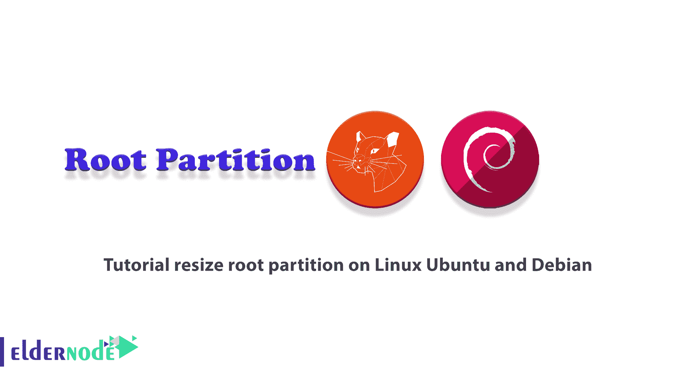
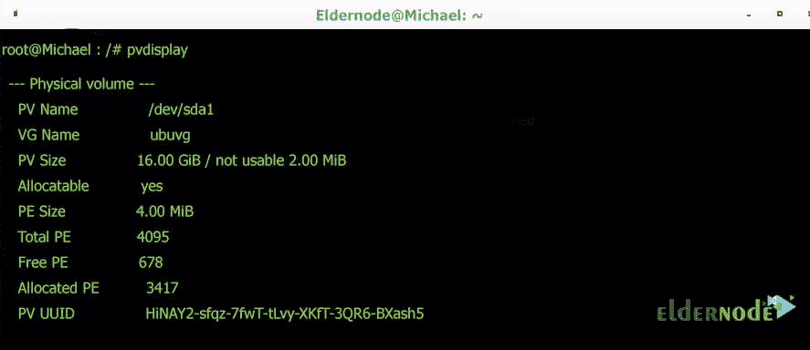
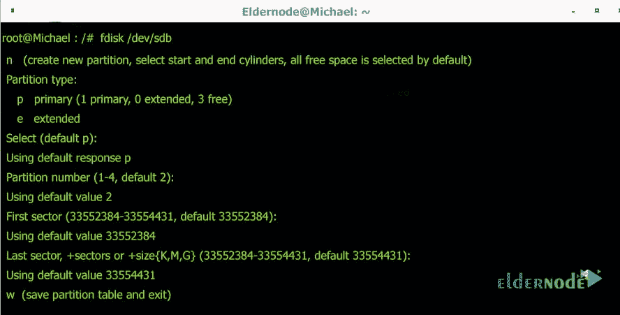
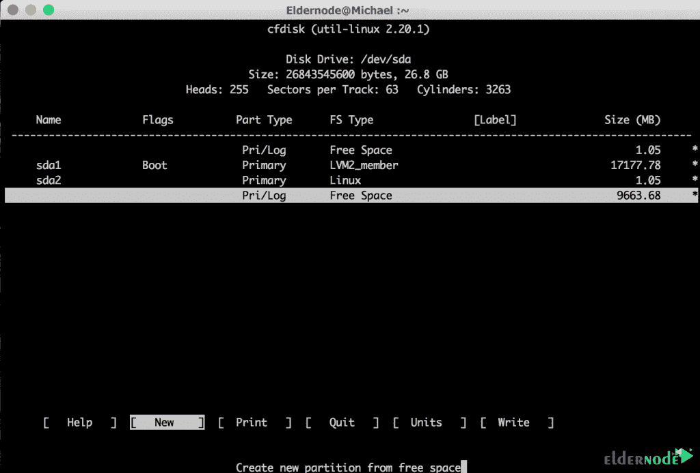
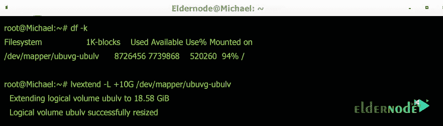
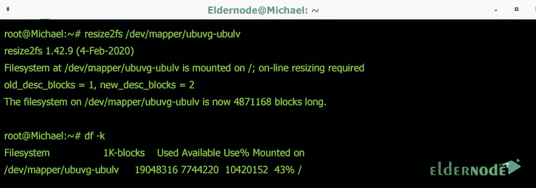

# 教程在 Linux Ubuntu 和 Debian 上调整根分区

> 原文：<https://blog.eldernode.com/resize-root-partition-on-linux/>



在 Linux 中，有时您可能想要增加磁盘空间和分区容量。例如，在 VMware 或 VirtualBox 甚至 ESXi 中，您为 Linux 提供了额外的容量，而 Linux 会将这些额外的空间视为未分配。您不想创建新的分区，但想增加空间有限的分区。在本文中，我们将一步一步地教你如何在 Linux Ubuntu 和 Debian 上调整根分区的大小。需要注意的是，如果你想购买一台 [Linux VPS](https://eldernode.com/linux-vps/) 服务器，可以访问 [Eldernode](https://eldernode.com/) 中提供的软件包。

## **如何在 Linux Ubuntu 和 Debian 上调整根分区大小**

本文中我们将要教你的方法适用于大多数 Linuxes，包括 [Ubuntu](https://blog.eldernode.com/tag/ubuntu/) 、 [Debian](https://blog.eldernode.com/tag/debian/) 等等。因此，在本教程的后续部分，请加入我们，向您介绍在 Linux Ubuntu 和 Debian 上调整根分区大小的教程。

### **什么是根分区？**

分区的最重要的原因是硬盘空间的最佳使用，以及更容易和更快地访问分类信息。您需要知道，您稍后将在系统上安装的所有程序和软件都将位于根分区中。事实上，与 Linux 文件系统相关的其他目录将作为子目录放在这个分区中。换句话说，它是整个操作系统的存储位置。像分区一样，您将 Windows 安装到。在下一节，我们将教你如何在 Linux Ubuntu 和 Debian 上调整根分区的大小。请加入我们。

## **在 Linux Ubuntu 和 Debian 上调整根分区大小**

在这一节，我们想教你如何在 Linux Ubuntu 上调整根分区的大小。为此，只需遵循以下步骤。第一步是扩展文件系统的组件。请注意，在本教程中，VMware 中的虚拟机磁盘大小将从 18 GB 增加到 28 GB。

物理卷>>卷组>>逻辑卷>>文件系统

第一步，需要查看物理卷的当前状态。因此，有必要执行以下命令:

```
pvdisplay
```

执行上述命令后，您将看到下图:



现在，您需要在下一步中使用以下命令操作磁盘分区表:

```
fdisk /dev/sdb
```

执行上述命令后，您将看到以下输出。此时，您必须**接受**提供的默认值以返回“ **n** 选项。



现在您需要使用 **reboot** 命令来应用更改:

```
reboot
```

在下一步中，您需要使用以下命令更新分区表:

```
cfdisk
```

然后你要在下一步选择**【NEW】**分区和**【PRIMARY】**来确定分区的类型。您还需要选择并输入所需的分区大小。最后，您需要选择**【写入】**来保存您所做的更改。然后必须保存**【退出】**。

***注意:*** 你新建的分区可能是 **/dev/sda1** 。



现在，您可以通过运行以下命令来启动新创建的分区:

```
pvcreate /dev/sda3
```

是时候将新创建的分区添加到根卷组中了。您需要首先再次运行 **pvdisplay** 来显示新的物理卷详细信息。您可以看到新的分区，如下所示:


成功完成上述步骤后，现在应该使用以下命令并获取卷组的名称:

```
vgs
```

您应该扩展卷组，然后在完成后使用以下命令再次验证卷组:

```
vgextend ubuvg /dev/sda3
```

```
vgs
```

应该注意，您必须使用 **lvextend** 命令来扩展逻辑卷:

```
df -k
```

```
lvextend -L +10G /dev/mapper/ubuvg-ubulv
```



最后，使用以下命令扩展文件系统，以填充逻辑卷:

```
resize2fs /dev/mapper/ubuvg-ubul
```

```
df -k
```



## 结论

在执行本教程中提到的方法之前，最好对您的数据或操作系统进行备份或快照。因为一个错误的举动可能会导致您丢失数据。在本文中，我们试图一步一步地教你如何在 Linux Ubuntu 和 Debian 上调整根分区的大小。