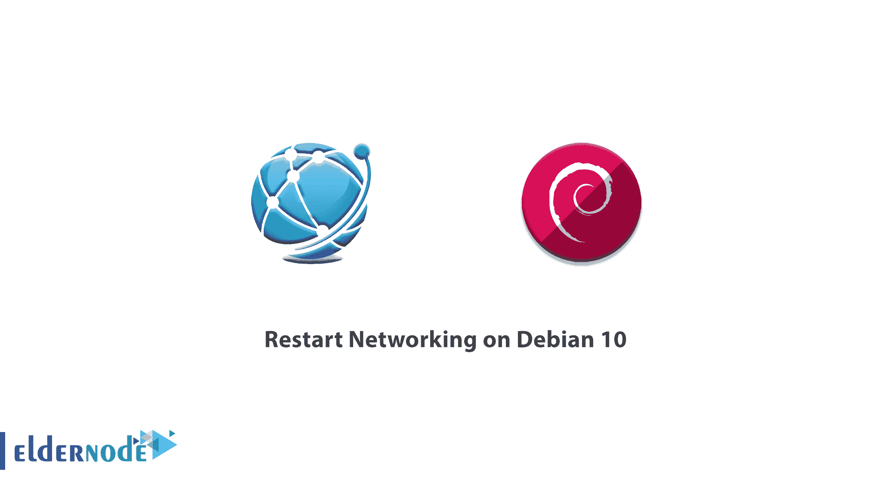

# 教程在 Debian 10 - Eldernode 博客上重启联网

> 原文：<https://blog.eldernode.com/restart-networking-on-debian/>



网络配置是 Linux 发行版中最基本和必需的任务之一。对配置文件进行必要的更改后，您需要重新启动网络服务。在本文中，我们想向您介绍**教程在 Debian 10** 上重启网络。你可以访问 [Eldernode](https://eldernode.com/) 提供的包来购买 [Linux VPS](https://eldernode.com/linux-vps/) 服务器。

## **如何在 Debian 10 上重启联网**

您可以使用不同的命令在 [Linux](https://blog.eldernode.com/tag/linux/) 上重启网络服务。要重新启动网络服务，您可以在您的 [Debian](https://blog.eldernode.com/tag/debian/) 发行版上使用以下章节中提到的命令。对服务器网络配置文件进行更改后，必须重新启动服务器网络服务以反映这些更改。本教程描述了在 Debian 服务器上重启网络的步骤。请和我们在一起。

### **在 Debian 10 | Debian 9 上重启联网**

在这一步中，我们打算重启网络。为此，您可以轻松地输入以下命令:

```
sudo /etc/init.d/networking restart
```

需要注意的是，在 Debian 10 Linux 发行版中，网络配置存储在 **/etc/network/interface** 文件中。运行以上命令后，您可以使用以下命令来检查服务器网络的状态:

```
sudo /etc/init.d/networking status
```

或者

```
sudo systemctl status networking
```

运行以上命令后，您可以使用以下命令停止和开始使用。重要的一点是，您不应该在远程 ssh 会话中运行它们，因为您将会断开连接。

```
sudo /etc/init.d/networking stop
```

```
sudo /etc/init.d/networking start
```

你也可以用 systemd 运行 Debian Linux:

```
sudo systemctl restart networking
```

### **如何从命令行重启网络**

在本节中，要从命令行重新启动网络，您可以使用以下 4 个选项。从命令行重启网络的第一个选项是使用 **netplan** 命令:

```
sudo netplan apply
```

重启网络管理员的第二种方法是使用 **systemctl** 命令:

```
sudo systemctl restart NetworkManager.service
```

下一个方法与上面的命令类似，通过执行**系统**命令来完成:

```
sudo service network-manager restart
```

在本节中，需要注意的是，使用 **nmcli** 命令的网络管理员控件会直接启动网络管理员:

```
sudo nmcli networking off
```

```
sudo nmcli networking on
```

## 结论

在几种情况下，你可能需要通过 Debian 重启你的网络。这可能是由于网络设置发生了变化。也可能是因为网络连接不正常。一般来说，每当系统出现问题，最合适的方法就是重启。在本文中，我们试图向您介绍 Debian 10 上的重启网络教程。