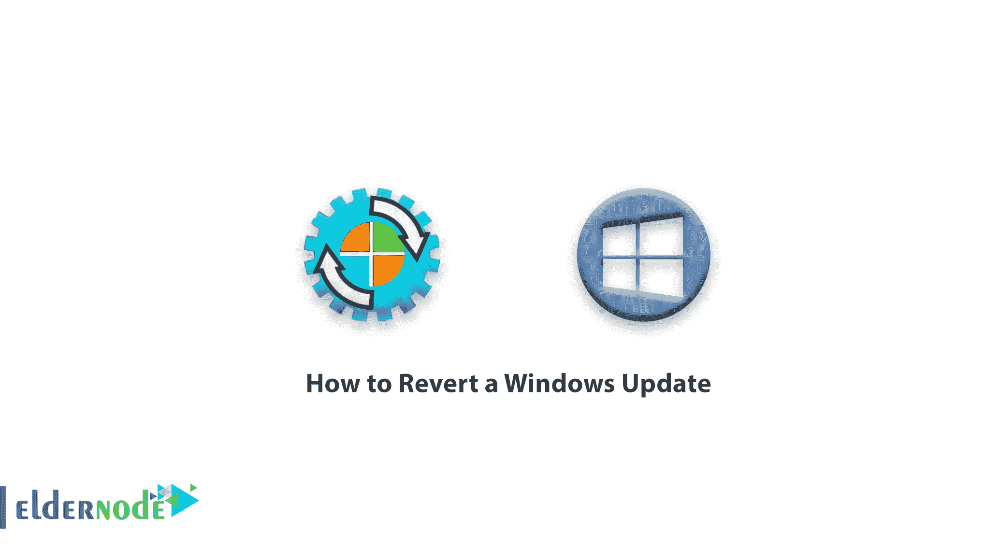
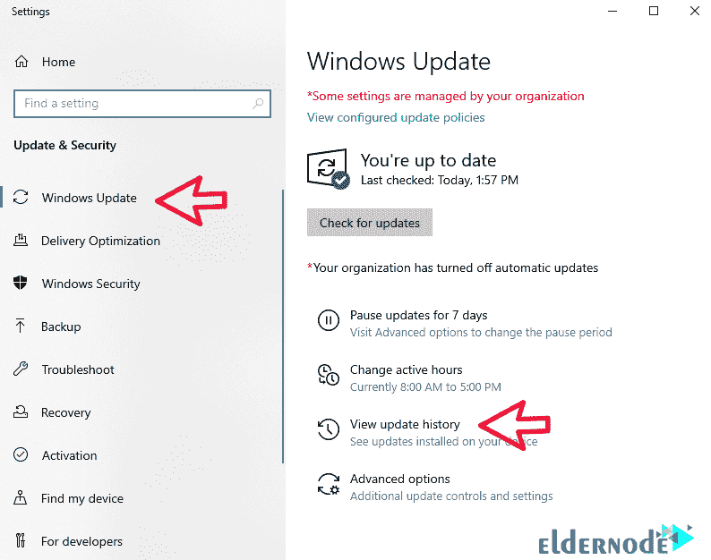
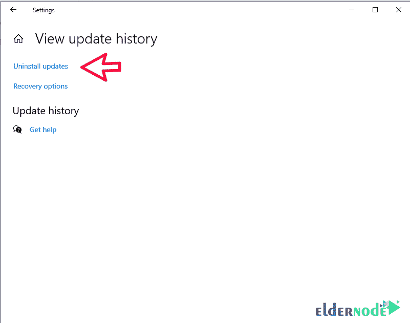
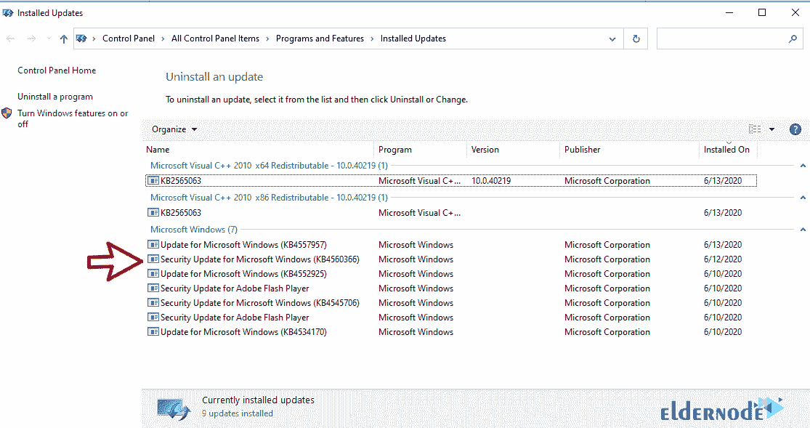
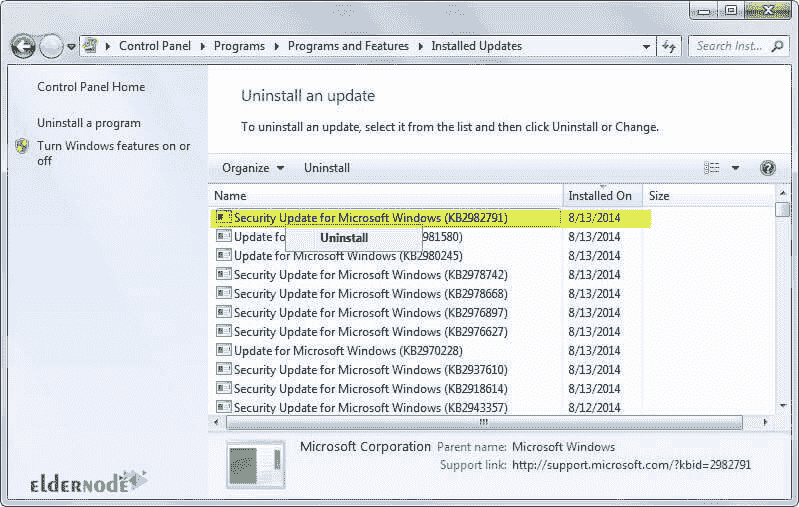

# 如何还原 Windows Update-elder 节点

> 原文：<https://blog.eldernode.com/revert-a-windows-update/>

如何还原 Windows Update。Windows 会不时查看您设备的最新更新和安全功能。 自动更新是为了安全地运行设备而实施的。您可能会发现，由于不可预见的服务器更改，您想要回滚更新。

在本教程中，我们将向您展示如何在 2016 、 2008R2 和 2012R2 服务器上撤销 Windows 更新。

[**购买虚拟私服**](https://eldernode.com/vps/)

采用 Windows 10 的 Server 2016

## **1。** 首先点击开始按钮，搜索 Windows 更新。然后按键进入。

**2。**T5 在打开的页面中，点击查看更新历史，选择卸载更新。查看最新更新列表后，点击您想要的更新**卸载/移除**。 

*

**3。** 当已安装更新窗口出现时，你可以通过名称、 [KB 号](https://en.wikipedia.org/wiki/Microsoft_Knowledge_Base#:~:text=It%20contains%20information%20on%20many,Knowledge%20Base%20(KB)%20ID.)、程序类型、版本，甚至安装日期看到更新。

**4。** 选择更新，选择卸载。

**5。** 根据更新情况，可能需要重启服务器才能完成移除。

**6。在 Windows Update 界面的** 中，选择违规更新，点击隐藏更新。

**7。** 重启服务器彻底移除更新。

使用 Windows 7/8 的服务器 2008R2 和 2012R2

## **1。** 第一步，从开始菜单中选择控制面板。

**2。**T5 然后选择从程序部分卸载一个程序。

**3。** 选择想要的程序，在**上点击右键**卸载。

**4。** 选择想要恢复的更新，选择是卸载选择的更新。

**5。**T3 选择现在重启按钮。

**6。在 Windows Update 界面的** 中，选择违规更新，点击隐藏更新。

**7。** 重启服务器彻底清除更新。

今天购买[专用服务器](https://eldernode.com/dedicated-server/)和 [VPS 服务器](https://eldernode.com/vps/)套餐，了解为什么我们在提供服务方面是最好的。

**尊敬的用户**，我们希望您能喜欢这个[教程](https://eldernode.com/category/tutorial/)，您可以在评论区提出关于本次培训的问题，或者解决[老年人节点培训](https://eldernode.com/blog/)领域的其他问题，请参考[提问页面](https://eldernode.com/ask)部分，并尽快提出您的问题。腾出时间给其他用户和专家来回答你的问题。

如何还原 Windows Update。

好运。

Goodluck.