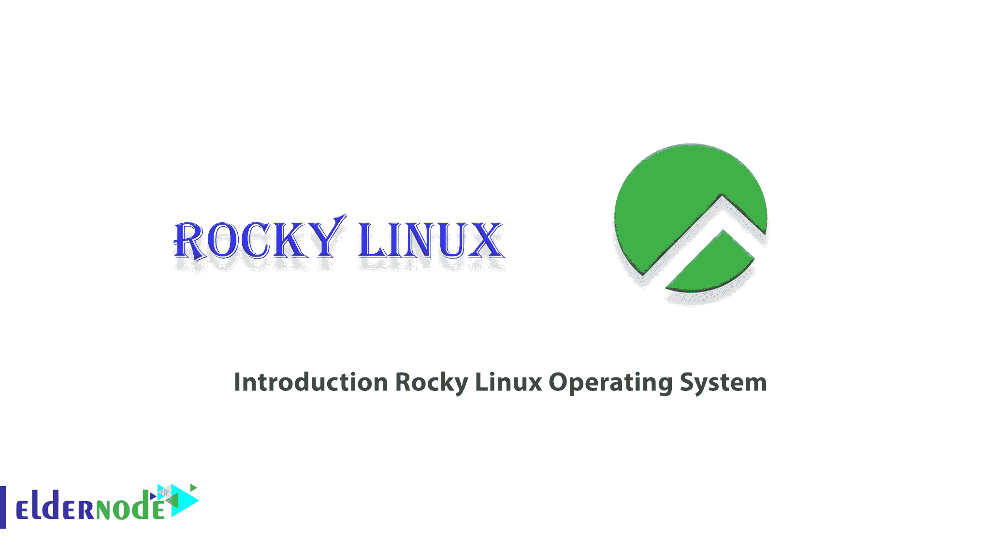
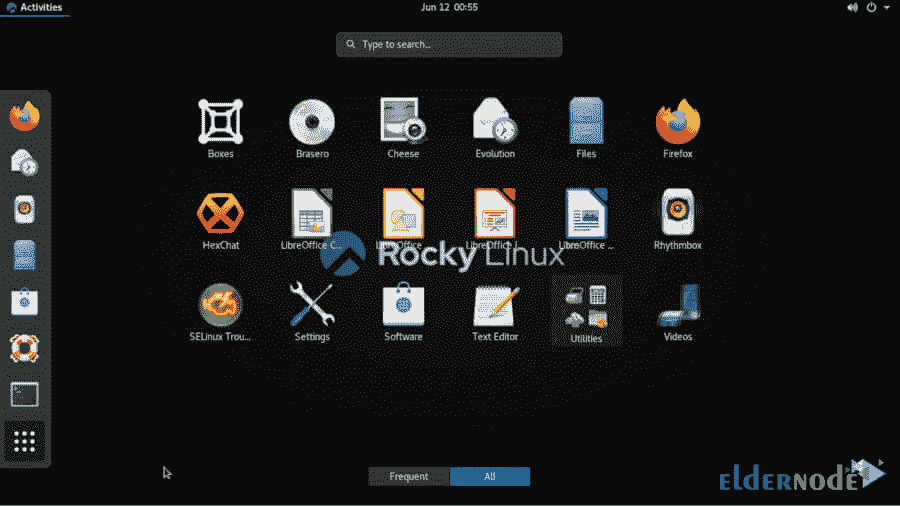

# 介绍 Rocky Linux 操作系统- Eldernode 博客

> 原文：<https://blog.eldernode.com/rocky-linux-operating-system/>

Rocky Linux 是一个社区企业操作系统，设计为 100% bug 对 bug 兼容美国顶级企业 Linux 发行版，现在它的下游合作伙伴已经改变了方向。它正由社区集中开发。这篇文章的主题是**介绍 Rocky Linux 操作系统**，我们将在下面详细讨论。如果你想买一个 [**Linux VPS**](https://eldernode.com/linux-vps/) 服务器，你可以在 [Eldernode](https://eldernode.com/) 看到可用的软件包。

## 洛基 Linux 操作系统简介

前段时间，RedHat 决定改变 CentOS 的发布方式。在工业、科学和实验室社区中非常流行的 CentOS 源自 RedHat RHEL Linux。由于源代码 RHEL 应用程序的可用性，CentOS Linux 基于 RHEL 源代码，并免费分发。

在 RedHat 决定 CentOS 不再等同于 RHEL，而是 RHEL 的未来版本后，在 Linux 和开源领域有很多讨论。这个决定无疑对那些将 CentOS 开发成带有企业包的 Linux 的企业有着深远的影响。因为 CentOS 不再像以前那样稳定了。

在会谈中，CentOS 的原始创始人 Gregory Kurtzer 宣布 Linux 将发布 Rocky。Rocky Linux 在概念上与 CentOS 相同，只是它是由一个社区支持和开发的。

### **洛基 Linux 的历史**

2020 年 12 月 8 日，RedHat 宣布停止 CentOS 的开发，CentOS 是 Red Hat Enterprise Linux 的下游版本。支持一个更高版本的流行操作系统“CentOS Stream”。

作为回应，CentOS 联合创始人 Gregory Kurtzer 宣布，他将重新启动一个项目，以实现 CentOS 的最初目标。它的名字是为了纪念 CentOS 的创始人 Rocky McGaugh。

到 12 月 12 日，Rocky Linux 代码库已经成为 GitHub 上的热门库。

2020 年 12 月 22 日，Rocky Linux 协会的主管 Jordan Pisaniello 宣布，最初发布的目标是在 2021 年 3 月到 5 月之间。

2021 年 1 月 20 日，宣布测试库将于 2 月底向公众开放，自由候选人计划于 2021 年 3 月底推出。然而，这个日期被稍微推迟了，在 2021 年 4 月 30 日，第一个自由候选人被正式释放。

发布的第二个版本，8.4 版，稳定版之前的最后一个，2021 年 6 月 4 日发布。

终于在 2021 年 6 月 21 日，发布了代号为“绿曜”的 Rocky Linux 8.4 稳定版。

### 洛基 Linux 功能

任何已经转换或考虑转换到 CentOS 8 并且不想处理转换到 CentOS Stream 8 的额外开销的人都应该考虑将 Rocky Linux 作为其基础架构的潜在候选。

Rocky Linux 本身的许可是 3 条款 BSD，但是，因为 Linux 发行版是包的集合，每个包可能有自己的许可。

Rocky Linux 是 RHEL 8 的下游重建，因此符合 RHEL 8 的生命周期，因此将积极维护到 2029 年。

下面是 Rocky Linux 桌面环境的图片:

### **迁移到 Rocky Linux 的技巧**

在这一节中，我们想要解决迁移到 Rocky Linux 时需要考虑的要点。如果您正在计划或迁移到 Rocky Linux，您应该考虑以下几点:

首先，您需要注意您已经定制了操作系统包。这是因为迁移脚本执行同步分发，用 Rocky Linux 存储中的版本替换每个数据包，而不管 repo 版本是比安装的版本新还是旧。

下一个需要注意的要点是 SecureBoot 在 Rocky Linux 上不可用。因为 RHEL 和 CentOS 支持 SecureBoot，所以在迁移系统之前，请确保您的基础架构依赖于 SecureBoot。

需要注意的是，原来的 x86_64 架构目前支持。还提供 ISO 和 aarch64 (ARM64)封装。将来，将提供 ppc64le 支持。

使用 migrate2rocky.sh 脚本可以非常容易地从其他类型的 EL8 进行迁移。

***注:*** 大多数基于 RHEL8 的操作系统都可以移植。但是如果这些系统是在 Katello、Uyuni 或 SUSE Manager 中注册的，就不能使用这个工具进行迁移。

### **安装洛基 Linux** 的先决条件

为了能够安装 Rocky Linux 操作系统，您必须注意以下事项并提供它们:

_ 2 GB 或更多内存

_ 20 GB 或更大的硬盘

_ 2 个 CPU/vcpu(1.1 GHz 处理器)

_ 互联网连接(可选)

_ 可引导介质(USB/DVD)

## 结论

Rocky Linux 正在考虑 CentOS Linux 的替代品。由于 CentOS 8 更新在 2021 年 12 月底之后才推出，如果你正在寻找一个生产级的操作系统，Rocky Linux 可以考虑。在本文中，我们试图向您介绍 Rocky Linux 操作系统。