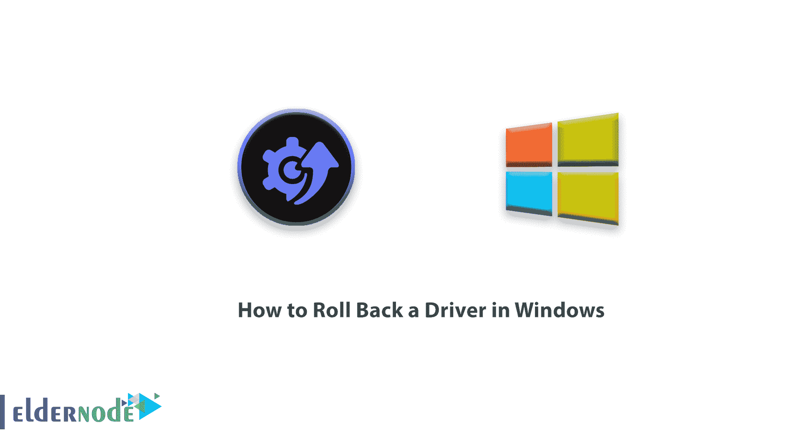
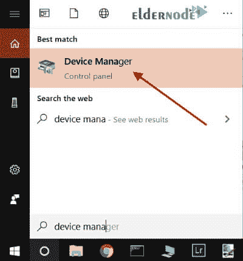
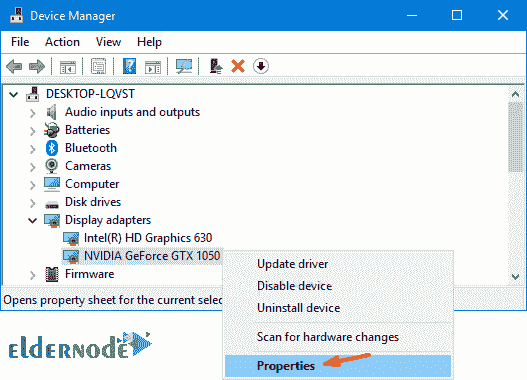
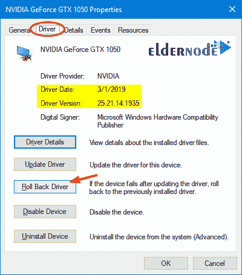
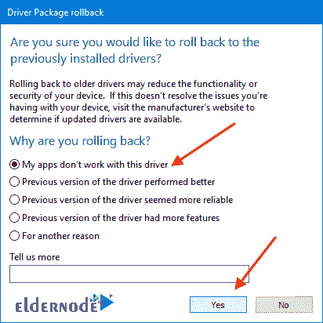
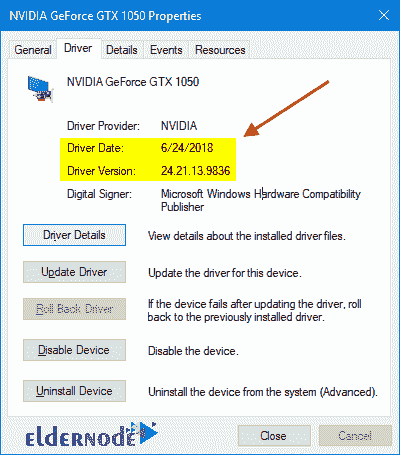

# 如何在 Windows - ElderNode 博客中回滚驱动程序

> 原文：<https://blog.eldernode.com/roll-back-a-driver-in-windows/>

如何在 Windows 中回滚驱动程序？在您的电脑上更新驱动程序并不总是很好。有时，它们会引入错误，或者只是运行得不如被它们取代的版本好。幸运的是，在 [Windows 10](https://eldernode.com/tag/windows-10/) 中，Windows 使得回滚到以前的驱动程序变得很容易。

虽然驱动程序更新通常进行得很顺利，但情况并非总是如此。

通常，更新的版本会引入新的功能或者修复错误，但是有时也会带来新的问题。这些问题可能从糟糕的性能到奇怪的行为到系统- [崩溃](https://en.wikipedia.org/wiki/Crash_(computing))错误。

**一般来说**，我们不建议更新驱动程序，除非你遇到特殊问题或者需要你知道更新修复或包含的特定功能。尽管如此，有时你还是想安装新的驱动程序，碰碰运气。

在本文中，我们将教你如何在 Windows 中回滚一个驱动程序。

[***在 Eldernode***](https://eldernode.com/windows-vps/) 选择您的完美 Windows 虚拟专用服务器包

教程回滚驱动程序

### 当你回滚一个驱动时，Windows 卸载当前驱动，然后**重新安装**之前的版本。

**注意**Windows 为此保留了以前版本的驱动程序，但只是以前的版本——它不会保留甚至更老的驱动程序的存档供您选择。

您需要登录到具有管理员权限的帐户来回滚驱动程序。此外，该功能是不可用于打印机驱动的。

**注意:** 与任何其他此类程序一样，我们建议在开始之前备份您的电脑。

**1。**T3 通过按下 Windows+X 打开**设备管理器**，然后点击超级用户菜单上的设备管理器选项。

**2。** 在**设备管理器**窗口中，找到导致问题的设备，**右键单击**设备设备，然后单击属性命令。

**3。** 点击窗口顶部的驱动选项卡，然后点击回滚驱动。

Windows 提示一个**警告**，**询问**你为什么要回滚到前一个驱动程序。

**4。** 点击一个响应然后点击是。

**注:** 如果您觉得有必要，可以在位于窗口底部的“告诉我们更多”栏中留下详细回复。

Windows 然后**自动** 将你的驱动恢复到之前的版本，这可能需要 **5-10 分钟**，取决于驱动的大小。

显卡驱动要比**大得多**并且花费**更长的时间**到回滚。

您的电脑可能会重启，之后您的电脑将运行以前版本的驱动程序。

**亦作，见:**

[如何在 Windows 10 中进入安全模式](https://eldernode.com/access-safe-mode-in-windows-10/)

[备份 NAS 上共享文件夹中的高容量驱动器](https://eldernode.com/backup-high-volume-drives-in-the-shared-folder-on-nas/)

**尊敬的用户**，我们希望您能喜欢这个[教程](https://eldernode.com/category/tutorial/)，您可以在评论区提出关于本次培训的问题，或者解决[老年人节点培训](https://eldernode.com/blog/)领域的其他问题，请参考[提问页面](https://eldernode.com/ask)部分，并尽快提出您的问题。腾出时间给其他用户和专家来回答你的问题。

好运。

Goodluck.