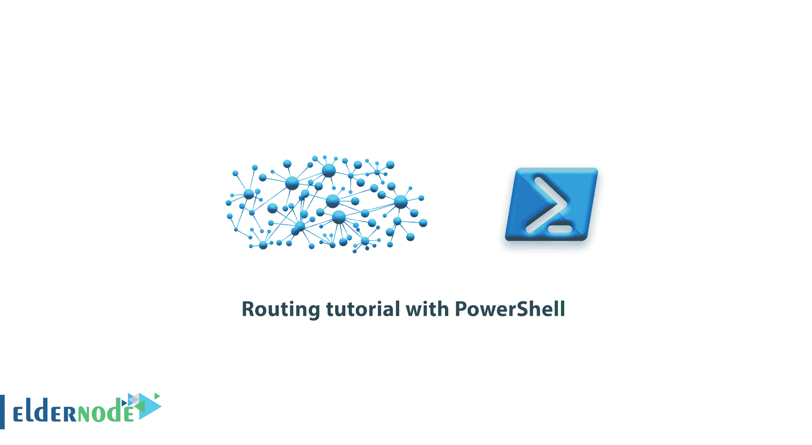

# PowerShell 路由教程- Eldernode

> 原文：<https://blog.eldernode.com/routing-tutorial-with-powershell/>



Windows PowerShell 的特性之一是路由管理，这是由 [Get-NetRoute](https://docs.microsoft.com/en-us/powershell/module/nettcpip/get-netroute?view=win10-ps) 和 [New-NetRoute](https://docs.microsoft.com/en-us/powershell/module/nettcpip/new-netroute) 命令执行的。CMD 环境中的路由管理使用 Route 命令。在这篇文章中，我们将教你用 PowerShell 路由教程，这样你就可以在 Windows 中使用 PowerShell 进行路由。

## 【PowerShell 路由教程

PowerShell 的路由应用程序有许多功能，它的许多参数将帮助您通过个性化搜索轻松获得全面的信息。

### 了解如何使用 Get-NetRoute 命令

这个应用程序是 PowerShell 中的一个路由命令，它允许你获得写在你的[窗口](https://eldernode.com/windows-vps/)中的关于路由器状态的完整信息。这里有一些例子教你如何做到这一点。

### 获取与网络接口相关的路由列表

```
Get-NetRoute -Protocol local -InterfaceAlias Ethernet 
```

### 获取指向网络地址 192.168.0.0 的路由

```
Get-NetRoute -DestinationPrefix 192.168* 
```

***注意:*** 网络地址必须如上输入。如果您使用 192.168.0.0 这样的地址，将会遇到错误。

### 添加了特定协议的路由列表

```
Get-NetRoute -Protocol Local -DestinationPrefix 192.168.* 
```

在这个命令中，可以使用 **Rip** 、 **bgp** 、 **Eigrp** 等协议。而不是本地的。

### 获取活动路线列表

```
Get-NetRoute -State Alive 
```

使用上面的命令，您可以从编写的例程中获得完整的信息。你可以使用**Get-Help****Get-net route**命令来获得更多关于其他参数的信息。

## 用 PowerShell 路由编写教程

您可以使用 **New-NetRoute** 命令手动写入一条路线。该命令与 **Get-NetRoute** 命令的结构相同。下面，我们将给出一个如何在 PowerShell 中编写 rout 的例子，并解释其中的参数类型。

***注:*** 写路线，需要用**管理员权限**打开 **PowerShell** 。

```
New-NetRoute -DestinationPrefix "10.0.0.0/24" -InterfaceAlias "Ethernet" -NextHop 192.168.1.1 -RouteMetric 1 -Protocol Local -Publish Yes 
```

在上面的例子中，用于路由网络 10.0.0.0 的路由连同一些参数一起被写入，我们将在下面解释。

***–destionprefix:***所需的网络地址及其路由前缀

***–interface alias:***要为其写路由的接口的名称

***–next hop:***访问导入网络的网关地址

***–route metric:***向目标网关发送数据包的优先级

***–协议:*** 路由协议的类型

***–发布:*** 路线运行激活

现在，您将能够编写所需路由器。

***注意:*** 在上面的命令中，你会需要 3 个主要参数 **DestinationPrefix** 、 **InterfaceAlias** 和 **NextHop** ，如果没有写其他参数，Windows 会默认设置。

## 结论

由于 PowerShell 是最强大的命令行工具，大多数 Windows 服务器管理命令都是通过这个可爱的蓝色环境完成的。在本文中，我们试图教您如何获得 Get-NetRoute 命令、获得与网络接口相关的路由列表、使用特定协议添加的路由列表等等。