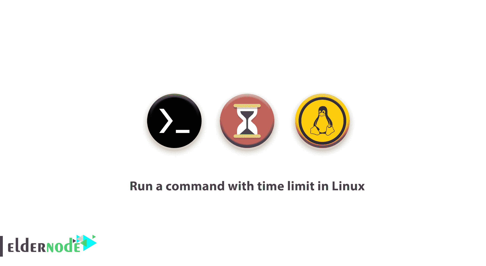

# 如何在 Linux 中运行有时间限制的命令——limit time Linux 命令

> 原文：<https://blog.eldernode.com/run-command-with-time-limit-linux/>



一个 Linux 系统管理员需要知道一些 Linux 技巧。在本文中，您将学习如何在 Linux 中运行有时间限制的命令。流行的 Linux 在特定情况下使用独特、快速和高效的命令。今天，您将看到一个名为时间限制的命令是如何工作的。您可以为任何命令设置时间限制。如果超时，命令将停止执行。

## 如何在 Linux 中运行有时间限制的命令

跟随本教程学习如何在命令中使用时间限制。

### 使用超时工具运行 Linux 命令

正如您到目前为止所猜测的，Linux 有一个名为 **timeout** 的命令行实用程序，它使您能够执行有时间限制的命令。

```
timeout [OPTION] DURATION COMMAND [ARG]... 
```

如果您用想要运行的命令指定了一个**超时**值(以秒为单位),那么您可以使用该命令。

```
timeout 5s ping google.com
```

没有必要在数字 **5 之后指定 **(s)** 。下面的命令是一样的，仍然有效。**

```
timeout 5 ping google.com    
```

**同样，参见**

[如何在 Linux 中使用 Fping](https://eldernode.com/work-with-fping-in-linux/)

[Linux A 到 Z 命令概述及示例](https://eldernode.com/linux-commands-with-examples/)

[ss 命令示例监控网络连接](https://eldernode.com/ss-command-monitor-network-connections/)

其他后缀包括:

代表分钟的 m

代表小时的 h

d 代表天数

为了防止命令在发送初始信号后继续运行，您可以使用以下命令。

但是，您应该指定一个持续时间，让 **timeout** 知道在多长时间后将发送终止信号。如你所见，显示的命令将在 **8** 秒后终止。

[购买 Linux 虚拟主机](https://eldernode.com/linux-hosting/)

```
-k, --kill-after=DURATION
```

```
timeout 8s tail -f /var/log/syslog     
```

使用限时程序运行 Linux 命令

**Timelimit** 程序的操作是运行一个给定的命令，然后在指定的时间后使用给定的信号终止进程。它最初传递一个警告信号，然后超时后，它发送 kill 信号。 **Timelimit** 比 **timeout** 有更多选项，如 **killsig、warnsig、killtime 和 warntime。**

### 可以在基于 **Debian** 的系统的仓库中找到并安装它。

如果你想为基于**拱门的**系统安装**时限**，你可以使用 **AUR** 助手程序来安装，例如**Pacaur**Pacman 和 **Packer** 。

如果您需要安装其他 Linux 发行版，可以下载 [timelimit source](http://devel.ringlet.net/sysutils/timelimit/#download) 并手动安装。

```
sudo apt install timelimit
```

安装后运行以下命令并指定时间。在这个例子中，你可以使用 **10** 秒。

```
Pacman -S timelimit  pacaur -S timelimit  packer -S timelimit 
```

**请注意** : **Timelimit** 如果不指定参数，则使用默认值。

值: **warntime=3600** 秒， **warnsig=15** ， **killtime=120** ，以及 **killsig=9** 。

```
timelimit -t10 tail -f /var/log/pacman.log
```

**总之；**

您看到了**超时**命令很容易使用，而**时间限制**实用程序有点复杂，但是有更多的选项。根据您的需求，您可以选择最合适的选项

亲爱的用户，我们希望你会喜欢如何在 Linux 中运行一个有时间限制的命令的教程，你可以在评论区提出关于这个培训的问题，或者解决 [Eldernode 培训](https://eldernode.com/blog/)领域的其他问题，参考[提问页面](https://eldernode.com/ask)部分并在里面提出你的问题。

**不要错过**

[教程 Nmap 命令](https://eldernode.com/tutorial-nmap-commands/)

[教程实时观察 TCP 和 UDP 端口](https://eldernode.com/watch-tcp-udp-ports/)

[Tutorial Nmap commands](https://eldernode.com/tutorial-nmap-commands/)

[Tutorial watch TCP and UDP ports in Real-time](https://eldernode.com/watch-tcp-udp-ports/)