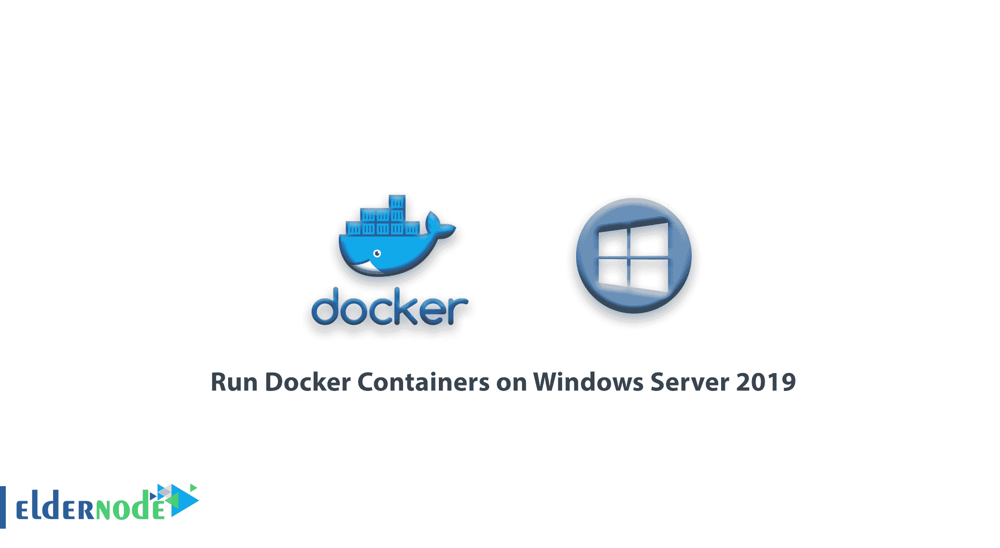

# 教程在 Windows Server 2019 上运行 Docker 容器- Eldernode

> 原文：<https://blog.eldernode.com/run-docker-containers-on-windows-server-2019/>



教程在 Windows Server 2019 上运行 Docker 容器。Docker 使得在 Linux 内核上完全隔离的环境中分别运行进程和软件成为可能，这种环境被称为容器。该容器允许应用程序开发人员将程序与所有模块和组件集成在一起。事实上，不用担心应用程序在其他平台上的设置和依赖性，可以在任何环境中运行。所以如果是编程的话，我们肯定推荐使用 Docker。

在本文中，我们将与您一起学习如何运行来自 [Windows Server 2019 培训系列](https://eldernode.com/tag/windows-server-2019/)的 Docker 容器。你可以从 eldernode 选择你最完美的 [Windows VPS 服务器](https://eldernode.com/windows-vps/)包。

## 如何在 Windows Server 2019 上运行 Docker 容器

1)第一步，需要以管理员权限打开 PowerShell。要从 [PowerShell Gallery](https://www.powershellgallery.com/packages/DockerMsftProvider) 安装 Docker-Microsoft package management Provider，请键入以下命令。

```
 Install-Module -Name DockerMsftProvider -Repository PSGallery -Force 
```

2)通过运行以下命令安装最新的 Docker 引擎和客户端:

```
 Install-Package -Name docker -ProviderName DockerMsftProvider 
```

3)在下一步中，使用 **Y** 或 **A** 同意全部安装。

4)安装完成后，使用以下命令重启计算机:

```
Restart-Computer -Force 
```

5)使用以下内容检查已安装的 docker 版本:

```
Administrator> **Get-Package -Name Docker -ProviderName DockerMsftProvider**   Name                           Version          Source                           ProviderName   ----                           -------          ------                           ------------   docker                         18.09.2          DockerDefault                    DockerMsftProvider 
```

> 您可以使用docker–version命令做同样的事情:

```
PS C:\Users\Administrator> **docker version**   Client:    Version:           18.09.2    API version:       1.39    Go version:        go1.10.6    Git commit:        1ac774dfdd    Built:             unknown-buildtime    OS/Arch:           windows/amd64    Experimental:      false   error during connect: Get http://%2F%2F.%2Fpipe%2Fdocker_engine/v1.39/version: open //./pipe/docker_engine: The system cannot find the file specified. In the default daemon configuration on Windows, the docker client must be run elevated to connect. This error may also indicate that the docker daemon is not running. 
```

6)您可以使用以下命令更新:

```
Install-Package -Name Docker -ProviderName DockerMsftProvider -Update -Force  Start-Service Docker 
```

7)运行码头集装箱

键入以下命令启动 Docker 守护程序:

```
Start-Service Docker 
```

8)现在下载预先创建的。Docker Hub 注册表中的净样本图像:

```
docker pull microsoft/dotnet-samples:dotnetapp-nanoserver-1809 
```

9)通过运行. Net Hello World 应用程序，部署一个简单的容器:

```
docker run microsoft/dotnet-samples:dotnetapp-nanoserver-1809 
```

**尊敬的用户**，我们希望您能喜欢这个[教程](https://eldernode.com/category/tutorial/)，您可以在评论区提出关于本次培训的问题，或者解决[老年人节点培训](https://eldernode.com/blog/)领域的其他问题，请参考[提问页面](https://eldernode.com/ask)部分，并尽快提出您的问题。腾出时间给其他用户和专家来回答你的问题。

好运。