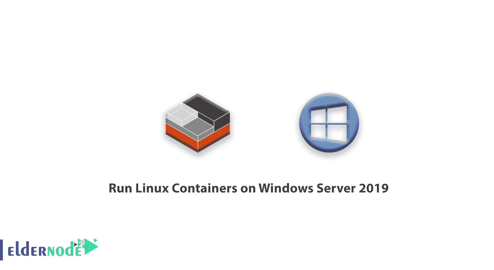
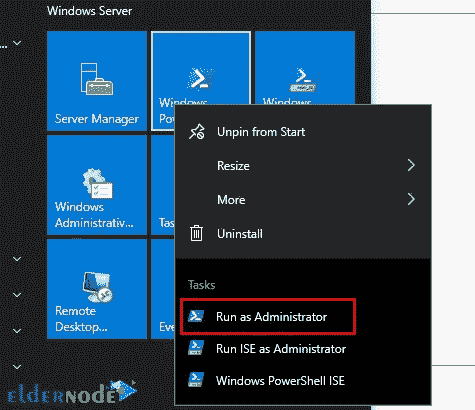

# 如何在 Windows Server 2019 上运行 Linux 容器

> 原文：<https://blog.eldernode.com/run-linux-containers-on-windows-server/>



【更新】Windows 上的 Docker 只运行 Windows 容器。要在 Windows Server 上使用 Linux 容器，您需要使用 Docker 企业版预览版，它包括一个完整的 LinuxKit 系统，用于运行 Docker Linux 容器。本文将教你如何在 Windows Server 2019 上运行 Linux 容器。你可以从 [Eldernode](https://eldernode.com/) 网站选择你最完美的 **[Windows VPS Server](https://eldernode.com/windows-vps/)** 套装。

## **为什么要在 Windows Server 2019 上使用 Linux 容器**

### **Docker EE 是什么？**

Docker EE 代表 Docker 企业版，是为企业开发而设计的。它使得构建、运输和运行具有依赖性的业务关键型应用程序变得容易，并且避免了使用虚拟机时常见的疯狂的依赖性问题。这项技术是一个集成的、受支持的、经过认证的容器平台，适用于 CentOS、Microsoft Windows 服务器和 Oracle Linux。此外，Docker EE 支持 AWS 和微软 Azure 云提供商。

## 在 Windows Server 2019 上安装 Docker

在本节中，我们将解释如何在 Windows Server 2019 上运行 [Linux](https://blog.eldernode.com/tag/linux/) 容器。为此，请遵循以下步骤并输入所需的命令。

首先，您应该启用 Windows Server 2019 容器功能。为此，请转到 **Windows 服务器> Windows Powershell** 并以管理员身份打开 Powershell:



并使用以下命令从 PowerShell Gallery 安装 Docker-Microsoft 包管理提供程序:

```
Install-Module -Name DockerMsftProvider -Repository PSGallery -Force
```

启用容器后，可以使用下面的命令安装 Docker 引擎和客户端:

```
Install-Package -Name docker -ProviderName DockerMsftProvider
```

安装完成后，使用以下命令重新启动计算机:

```
Restart-Computer -Force
```

您可以使用下面的命令检查 Docker 版本:

```
Get-Package -Name Docker -ProviderName DockerMsftProvider
```

或者

```
docker version
```

## **如何创建容器注册表**

安装后，您需要配置服务器以允许访问 Docker Hub。

现在按照下面的步骤创建一个容器注册表:

–>在导航栏上选择要创建注册表的项目。

–>在项目侧边栏菜单上选择**包>新存储库**。

–>指定存储库设置，如选择容器注册表、指定注册表名称和描述、选择访问类型以及选择不可变标记名和不可变图像。

–>单击“入门”查看命令行片段。

## **如何使用 PowerShell** 部署和管理容器

首先，通过输入以下命令启动 Docker 守护进程:

```
start-service docker
```

并下载预先创建的。使用以下命令从 Docker Hub 注册表中获取. NET 示例映像:

```
docker pull mcr.microsoft.com/dotnet/samples:dotnetapp-nanoserver-2009
```

最后，您需要通过运行以下命令来部署一个运行. NET Hello World 应用程序的简单容器:

```
docker run mcr.microsoft.com/dotnet/samples:dotnetapp-nanoserver-2009
```

恭喜，容器将启动并打印 hello world 消息。

## 在 Windows Server 2019 上安装 Docker

在执行任何操作之前，您应该使用以下命令卸载当前的 Docker CE:

```
Uninstall-Package -Name docker -ProviderName DockerMSFTProvider
```

如果您使用在 Hyper-V 上运行的 Linux 虚拟机，请输入以下命令来启用嵌套虚拟化:

```
Get-VM WinContainerHost | Set-VMProcessor -ExposeVirtualizationExtensions $true
```

现在是时候安装预览 Docker EE 版本了。为此，请运行以下命令:

```
Install-Module DockerProvider  Install-Package Docker -ProviderName DockerProvider -RequiredVersion preview
```

然后，您需要使用下面的命令启用 LinuxKit 来运行 Linux 容器:

```
[Environment]::SetEnvironmentVariable("LCOW_SUPPORTED", "1", "Machine")
```

最后，使用以下命令重新启动 Docker 服务:

```
Restart-Service docker
```

您可以使用以下命令提取测试 docker 映像:

```
docker run -it --rm ubuntu /bin/bash
```

如果您想切换回运行 Windows 容器，请输入以下命令:

```
[Environment]::SetEnvironmentVariable("LCOW_SUPPORTED", "$null", "Machine")
```

就是这样！

## 结论

用于 windows 服务器的 Docker EE 在 Windows 服务器上启用本机 Docker 容器。在这篇文章中，我们教你如何在 Windows Server 2019 上运行 Linux 容器。我们希望你喜欢这个教程，你可以在评论区提出关于这个培训的问题。