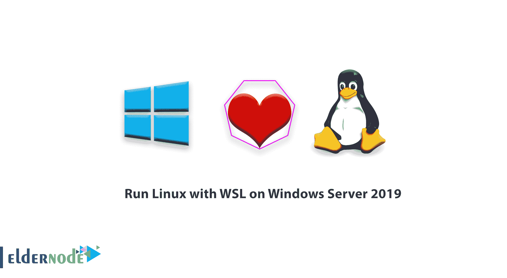
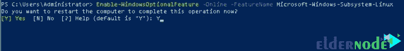
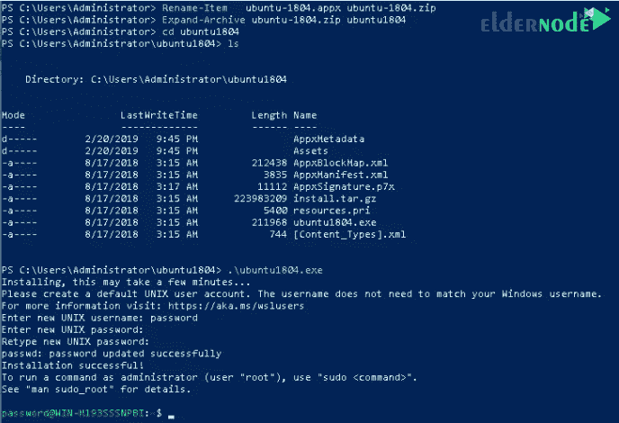
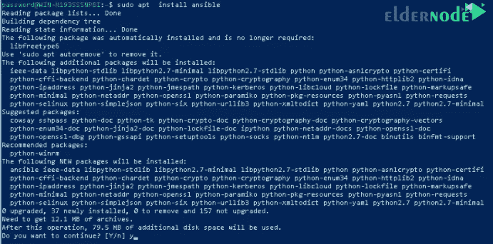
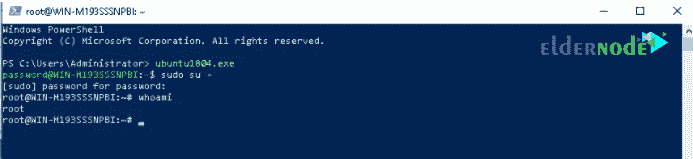

# 如何在 Windows Server 2019 上运行带有 WSL 的 Linux-elder node 博客

> 原文：<https://blog.eldernode.com/run-linux-with-wsl-on-windows-server/>



如何在 [Windows Server 2019](http://eldernode.com/tag/windows-server-2019/) 上用 [WSL](https://en.wikipedia.org/wiki/Windows_Subsystem_for_Linux) 运行 Linux？ ***Windows 子系统 for Linux*** 代表 WSL ，包含在 Windows Server 2019 中。使用 WSL，您可以直接在 Windows 上运行 Linux 发行版以及一些 Linux 程序，而无需创建和启动[虚拟机](https://en.wikipedia.org/wiki/Virtual_machine)。

在本教程中，我们将学习如何使用 WSL 在 [Windows Server 2019](https://eldernode.com/windows-server-2019-install-and-config/) 上运行 Linux，敬请关注。

[***在 Eldernode***](https://eldernode.com/windows-vps/) 选择您的完美 Windows 虚拟专用服务器包

先决条件:

## *安装 Windows Server 2019*

1) 如何启用 Windows Linux 子系统(WSL)功能

### 在您可以为 **WSL** 安装任何 Linux 发行版之前，您必须确保Windows Linux 子系统功能已启用:

**以管理员身份打开 PowerShell 。**

****B.** 运行以下命令启用 WSL:**

****C.** 同意到提示时重启你的电脑:**

```
`Enable-WindowsOptionalFeature -Online -FeatureName Microsoft-Windows-Subsystem-Linux`
```

****

****注意:** 你可以从服务器图形界面做同样的事情:**

**服务器管理器**>>**添加角色和功能 **> >** 选择功能**

**2) 如何安装你选择的 Linux 发行版**

### **你可以通过[微软商店](https://www.microsoft.com/en-us/store/apps/windows)以多种方式安装 WSL Linux 发行版。在本指南中，我们将从命令行下载并安装一个。**

**使用 Invoke-WebRequest cmdlet 或使用curl.exe启动 PowerShell 并下载发行版。下面是[下载 Ubuntu 18.04](https://releases.ubuntu.com/18.04/) 的示例说明:**

****b-** 下载完毕后，解压并安装 a **Linux 发行版**。**

```
`curl.exe -L -o ubuntu-1804.appx https://aka.ms/wsl-ubuntu-1804`
```

****c-** 把你的工作目录改成 ubuntu 1804 和运行安装程序到**完成**你的发行版安装:**

```
`Rename-Item ubuntu-1804.appx ubuntu-1804.zip  Expand-Archive ubuntu-1804.zip ubuntu1804`
```

****d-** 与下图类似，安装程序会提示您为要创建的 UNIX 用户提供一个**用户名**和**密码**:**

```
`cd ubuntu1804  .\ubuntu1804.exe`
```

****

****e-**sudo 命令可用于特权操作。**

****样本输出:****

```
`sudo apt update && sudo apt upgrade  sudo apt install ansible`
```

****

****f-** 使用 [Powershell](http://eldernode.com/tag/powershell-commands/) 将您的**发行版路径**添加到 Windows 环境路径:**

**这将使你能够通过键入从任何路径启动你的发行版。exe 启动器。例如，使用**ubuntu1804.exe**。注意，这将需要关闭和重新启动 **PowerShell** 。**

```
`$userenv = [System.Environment]::GetEnvironmentVariable("Path", "User")  [System.Environment]::SetEnvironmentVariable("PATH", $userenv + "C:\Users\Administrator\ubuntu1804", "User")`
```

**您将看到以下图像:**

```
`ubuntu1804.exe`
```

****

****注意:** 其他可以运行的 Linux 发行版有:**

****–**Ubuntu 18.04 ARM**

****–**Ubuntu 16.04**

****–**Debian GNU/Linux**

****–**卡莉 Linux**

****–**OpenSUSE**

****–**SLES**

****也可以，参见:****

**[教程在 Windows Server 2019 上运行 Docker 容器](https://eldernode.com/run-docker-containers-on-windows-server-2019/)**

**[如何在 Windows Server 2019 上运行 Linux 容器](https://eldernode.com/run-linux-containers-on-windows-server/)**

****尊敬的用户**，我们希望您能喜欢这个[教程](https://eldernode.com/category/tutorial/)，您可以在评论区提出关于本次培训的问题，或者想解决[老年人节点培训](https://eldernode.com/blog/)领域的其他问题，请参考[提问页面](https://eldernode.com/ask)部分，并尽快提出您的问题。腾出时间给其他用户和专家来回答你的问题。**

**好运。**

**Goodluck.**