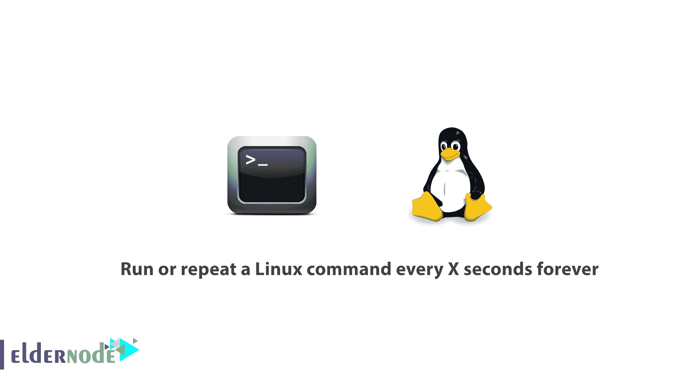

# 如何每隔 X 秒运行或重复一个 Linux 命令

> 原文：<https://blog.eldernode.com/run-repeat-linux-command/>



一个 Linux 系统管理员需要知道一些 Linux 技巧。在本文中，您将学习**如何永远每 X 秒运行或重复一个 Linux 命令**。

您可能需要在某段时间内重复运行一个命令。使用简单的 cron 命令，可以轻松完成这些任务。

按照本指南学习简单的脚本技术，在默认情况下，每 3 秒钟监视或关注一个类似于 top command 的连续运行状态的特定命令。

## 如何每隔 X 秒运行或重复一条 Linux 命令

让我们不要放弃，开始讨论为什么您需要如此频繁地运行命令的原因，并回答如何永远每隔 X 秒运行或重复一个 [Linux](https://www.linux.org/) 命令。

### 使用手表命令

为了使用监视命令，您将能够定期执行命令或程序，并在屏幕上显示您的输出。这样就可以及时看到程序输出。间隔可以很容易地改变，以满足您的要求，也看重新运行命令/程序每 2 秒钟。该间隔可以容易地改变。

#### 监控内存使用情况

因为使用“Watch”非常容易，所以您可以通过立即启动 Linux 终端并键入以下命令来测试它:

```
watch free -m
```

使用上述命令后，将检查您的系统空闲内存，并且每两秒钟更新一次 free 命令的结果。

如果您需要隐藏标题，显示有关更新间隔、正在执行的命令和当前时间的信息，请使用 -t 选项。

然后，使用 -n 选项更改执行间隔，让它指定命令执行的间隔。要每 10 秒运行一次你的 script.sh 文件，你可以这样做:

```
watch -n 10 script.sh
```

因此，在运行上面的命令之后，您将需要将 cd 到脚本所在的目录，或者指定该脚本的完整路径。

看看下面的选项，看看其他手表命令有用的选项。

1.  -b–如果命令的退出非零，则发出嘟嘟声。
2.  -c–解释 ANSI 颜色序列。
3.  -d–突出显示命令输出的变化。

[用比特币买 VP](https://eldernode.com/bitcoin-vps/)

#### 监控登录用户、正常运行时间和平均负载

要继续此步骤，请使用以下命令。

```
watch uptime
```

按下 CTRL+C 退出命令。

这里，默认情况下，' uptime '命令将每 2 秒运行并显示更新的结果。

#### 监控复制进度命令

正如您所猜测的，在 Linux 中，当使用 cp 命令将文件从一个位置复制到其他位置时，数据的进度不会显示出来。使用 watch 命令，查看数据复制的进度。

```
cp ubuntu-15.10-desktop-amd64.iso /home/noodi/ &  watch -n 0.1 du -s /home/tecmint/ubuntu-15.10-desktop-amd64.iso
```

或者，您可以转到高级复制命令，该命令在复制时显示数据的进度。

### 使用睡眠命令

Sleep 在许多有用的情况下使用，其中两个通常用于调试 shell 脚本，当与结合用于或而循环时，您可以获得非常棒的结果。

但是，如果这是你第一次听说“ sleep 命令，请不要担心，它是用来将某些事情延迟一段特定的时间。在脚本中，您可以使用它来告诉您的脚本运行命令 1，等待 10 秒钟，然后运行命令 2。

有了上面的循环，您可以告诉 bash 运行一个命令，休眠 **N** 秒，然后再次运行该命令。

让我们看看这两个循环的例子:

#### 为循环示例

```
for i in {1..10}; do echo -n "This is a test in loop $i "; date ; sleep 5; done
```

上面的一行程序将运行 echo 命令并显示当前日期，总共运行 10 次，两次执行之间有 5 秒钟的间隔。

输出

```
This is a test in loop 1 Wed Feb 17 20:49:47 EET 2016  This is a test in loop 2 Wed Feb 17 20:49:52 EET 2016  This is a test in loop 3 Wed Feb 17 20:49:57 EET 2016  This is a test in loop 4 Wed Feb 17 20:50:02 EET 2016  This is a test in loop 5 Wed Feb 17 20:50:07 EET 2016  This is a test in loop 6 Wed Feb 17 20:50:12 EET 2016  This is a test in loop 7 Wed Feb 17 20:50:17 EET 2016  This is a test in loop 8 Wed Feb 17 20:50:22 EET 2016  This is a test in loop 9 Wed Feb 17 20:50:27 EET 2016  This is a test in loop 10 Wed Feb 17 20:50:32 EET 2016
```

此外，请考虑您可以用自己的命令或脚本更改**回声**和**日期**命令，并根据您的需要更改睡眠间隔。

#### while 循环示例

```
while true; do echo -n "This is a test of while loop";date ; sleep 5; done
```

输出

```
This is a test of while loopWed Feb 17 20:52:32 EET 2016  This is a test of while loopWed Feb 17 20:52:37 EET 2016  This is a test of while loopWed Feb 17 20:52:42 EET 2016  This is a test of while loopWed Feb 17 20:52:47 EET 2016  This is a test of while loopWed Feb 17 20:52:52 EET 2016  This is a test of while loopWed Feb 17 20:52:57 EET 2016
```

在被用户终止或中断之前，上面的命令将一直运行。如果你想在后台运行一个命令，而又不想依赖于 **corn** 的话，这是非常有用的。

**请注意** :在使用上述方法时，强烈建议您设置一个足够长的时间间隔，以便在下一次执行之前，给命令足够的时间来完成运行。

**请考虑** :本教程中的示例很有用，但并不意味着完全取代 cron 实用程序。由你来决定哪一种更适合你，但是如果我们必须将两种技术的使用分开，我会这样说:

*   当您需要定期运行命令时，甚至在系统重新启动后，也可以使用 cron。
*   对于要在当前用户会话中运行的程序/脚本，使用本教程中介绍的方法。

**亲爱的用户**，我们希望本教程如何每隔 X 秒运行或重复一次 [Linux](https://eldernode.com/tag/linux-tricks/) 命令永远对你有所帮助，要问任何问题或查看我们用户关于本文的对话，请访问 [提问页面](https://eldernode.com/ask) 。也为了提高自己的知识，准备了这么多有用的教程 [Eldernode 培训](https://eldernode.com/blog/) 。

**不要错过一些相关文章:**

**[ss 命令示例监控网络连接](https://eldernode.com/ss-command-monitor-network-connections/)**

**[Linux A 到 Z 命令概述及示例](https://eldernode.com/linux-commands-with-examples/)**