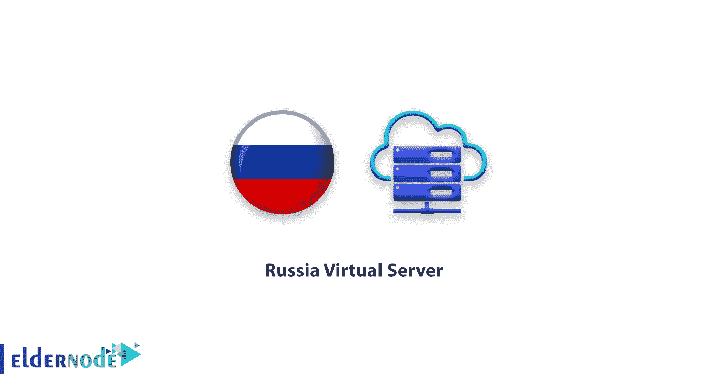

# 俄罗斯 VPS 服务器-用比特币购买俄罗斯| ElderNode 博客

> 原文：<https://blog.eldernode.com/russia-vps-server/>

开始提供 **[俄罗斯 VPS](https://eldernode.com/vps/russia/) 服务器**(莫斯科)服务。

通过购买俄罗斯虚拟服务器(莫斯科)，您的服务器将在 KVM 虚拟化平台上启动并拥有非常稳定的互联网。

这些服务是作为 100%专用资源提供的，并且具有非常高的运行速度。

位置和 IP:

俄罗斯 VPS 服务器，基于他们在俄罗斯数据中心的位置，给你 100%的俄罗斯的位置和 IP，你可以很容易地申请成为俄罗斯公民。

*   正常运行时间 99.99%
*   100%的资源专用于服务
*   1 GB 网络端口
*   更新和强大的硬件
*   安装 Windows 和 Linux 操作系统
*   即时交货

点击订购 **[VPS](https://eldernode.com/vps/)** 服务器。