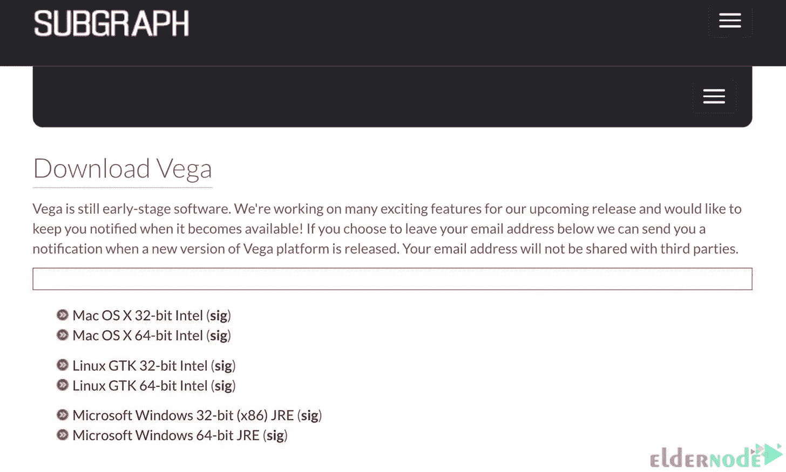
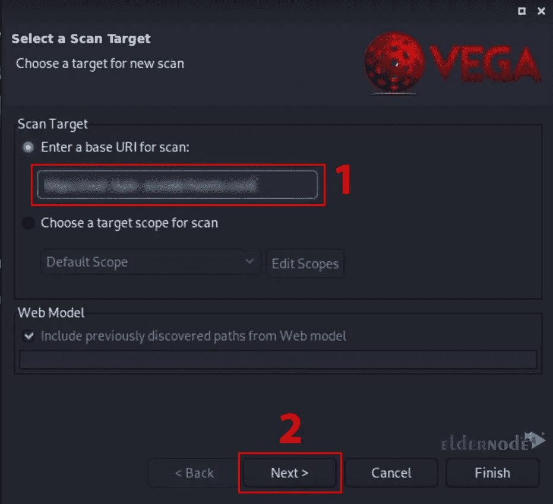
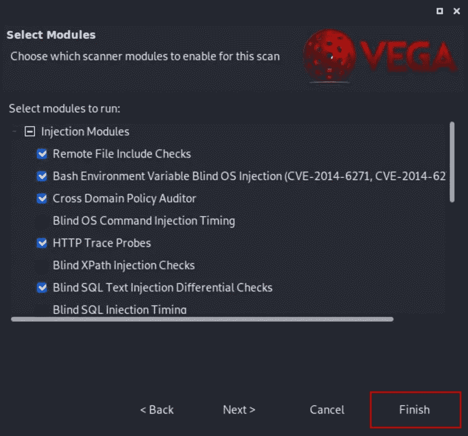
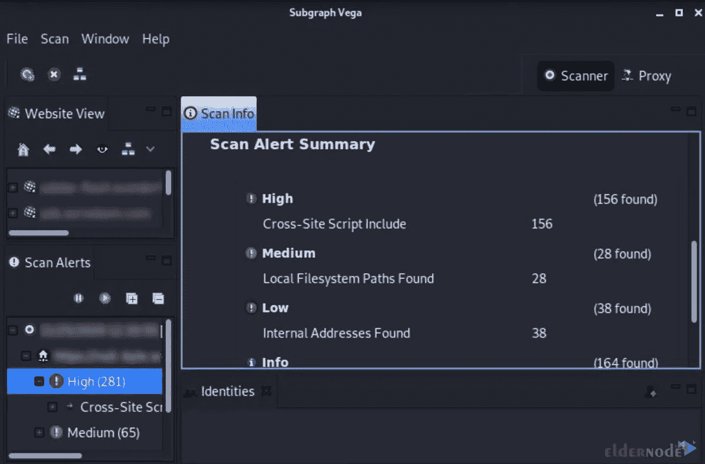

# 在 Kali Linux 上用 Vega 扫描网站的几个步骤

> 原文：<https://blog.eldernode.com/scan-a-website-with-vega-on-kali-linux/>


漏洞扫描器是一种软件，用于检测网络、操作系统和网站中的损坏和安全漏洞。它们包含所有已知漏洞的数据库，并扫描您的设备或网络，以查看您的网络或系统中是否存在这些漏洞。Vega 漏洞扫描器是流行的漏洞扫描器之一。本文将介绍在 Kali Linux 上使用 Vega 扫描网站的几个步骤。如果你想购买自己的 [Linux VPS](https://eldernode.com/linux-vps/) 服务器，你可以查看 [Eldernode](https://eldernode.com/) 网站上提供的软件包。

## **如何在 Kali Linux 上用 Vega 扫描网站**

Vega vulnerability scanner 是一款开源的免费 web 安全扫描器，用于测试 web 应用程序的安全性。它运行在 Windows、Linux 和 OS X 上，用 Java 编写。该扫描程序允许您查找和验证 SQL 注入、跨站点脚本、无意中泄露的敏感信息以及其他漏洞。Vega 扫描器有一个设计良好的图形用户界面，探测 TLS/SSL 安全设置，并识别提高 TLS 服务器安全性的机会。

首先，使用以下命令更新您的系统软件包:

```
sudo apt update
```

```
sudo apt upgrade
```

您可以通过运行以下命令来安装 Vega 扫描程序:

```
sudo apt install vega
```

现在输入以下命令来安装一些依赖项和工具:

```
sudo dpkg --configure -a
```

```
sudo apt install libwebkitgtk-1.0-0 default-jdk unzip
```

然后导航到[子图的网站](https://subgraph.com/vega/download/)并下载您想要的 Vega 版本:



现在用下面的命令安装 zip 文件:

```
wget https://support.subgraph.com/downloads/VegaBuild-linux.gtk.x86_64.zip
```

您可以使用以下命令对下载的文件进行解压缩:

```
unzip VegaBuild-linux.gtk.x86_64.zip
```

***注意:*** 较新版本的 Java 无法与 Vega 一起使用，您可能需要更改您正在使用的 Java 版本。要切换到 Java 8，只需运行以下命令:

```
sudo update-alternatives --config java
```

### **在 Kali Linux 上启动 Vega**

导航到**应用** > > **Web 应用分析** > > **织女星**路径。然后将 cd 放入 Vega 文件夹并输入 ls 命令:

```
cd vega
```

```
ls
```

您可以使用下面的命令启动 Vega:

```
sudo ./Vega
```

现在你会看到织女星的开始屏幕:


### **在 Kali Linux 上用 Vega 扫描网站**

要开始扫描网站，你只需点击 **Ctrl-N** 快捷键，点击菜单栏中的**扫描**，选择**开始新的扫描**。

您将看到**选择扫描目标**窗口。在**扫描目标**框中输入目标 URL，然后按下**下一步**:



您可以通过点击几次**下一个**来设置认证选项或参数。

点击**完成**开始扫描网站:



你必须等一会儿扫描才能完成。网站出现在**扫描**警报选项卡中并发布警报，表示扫描已经开始。扫描完成后，您将收到一份报告，详细说明发现的漏洞。

### **解读织女星的警报**

扫描完全完成后，您将看到警报摘要。

***注:*** Vega 模块很敏感，有时会对可能并不实际存在的漏洞产生误报警报。梳理报告并手动调查每个警报。



Vega 解释了每个警告的含义，它们如何影响您的网站，以及修复漏洞的方法。通过单击其中一个警报，您可以获得关于漏洞的大量信息。

就是这样！

## 结论

Vega 通过清楚地显示每次扫描的有用资源，简化了对 web 应用程序漏洞严重性的查找和理解。在本文中，我们解释了在 Kali Linux 上使用 Vega 扫描网站的几个步骤。我希望这篇教程能帮助你使用 Vega 漏洞扫描器扫描你的网站。如果你有任何疑问或问题，可以在评论区联系我们。