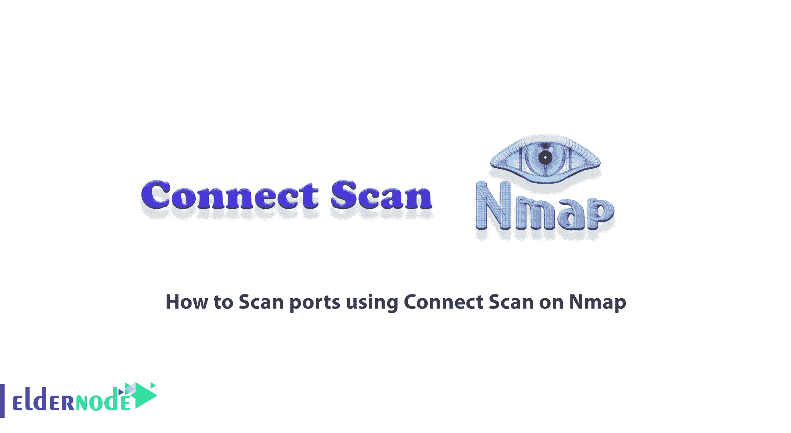
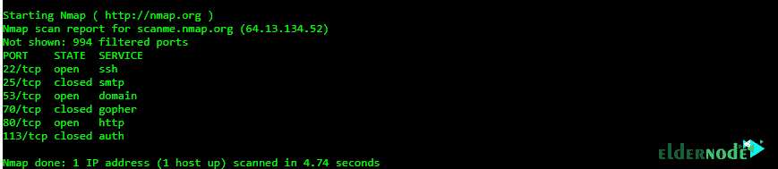

# 如何在 Nmap - Eldernode 博客上使用连接扫描来扫描端口

> 原文：<https://blog.eldernode.com/scan-ports-using-connect-scan-on-nmap/>



最可靠的端口扫描类型是 TCP、TCP 连接扫描或全开扫描，有时也称为普通扫描。在这种类型的端口扫描技术中，扫描器发送一个请求，以便在所需的端口上与目标服务器通信。此请求由 TCP 连接扫描仪系统发送。如果目标服务器处于监听模式下的请求端口中，TCP Connect 命令将会成功。这意味着端口是开放的，否则，端口不可用并且不提供服务。在本文中，我们将教您如何在 Nmap 上使用 Connect Scan 来扫描端口。如果你想购买一台 [VPS 服务器](https://eldernode.com/vps/)，你可以访问 [Eldernode](https://eldernode.com/) 中提供的软件包。

## **教程在 Nmap 上使用连接扫描扫描端口**

端口扫描是一种用于检查端口或打开网络端口的方法。端口扫描过程需要探索主机上的每个端口，并确定哪些端口是打开的。这种扫描端口的过程通常会从 ping 命令中提供有关主机和系统漏洞的更有价值的信息。

服务识别是扫描方法的下一步，通常使用相同的端口扫描工具。通过识别开放端口，黑客通常可以检测到与该端口号相关的服务。

在本文的后续部分，请加入我们，教您如何在 Nmap 上使用 Connect Scan 扫描端口。

### **Nmap 上端口的状态**

Nmap 是一个免费的开源工具，可以快速有效地执行 ping、端口扫描、服务检测、IP 检测和操作系统检测。Nmap 可以在一个会话中扫描大量机器，并且受到许多操作系统的支持，包括 Unix、 [Windows](https://blog.eldernode.com/tag/windows/) 和 [Linux](https://blog.eldernode.com/tag/linux/) 。Nmap 工具中的端口状态以三种模式确定。 **1。过滤，2。未过滤的，和 3。打开。**

一个**开放端口**意味着目标机器接受来自该端口的请求。

**过滤端口**是指防火墙或网络过滤器过滤端口，防止端口被 Nmap 等工具检测到。

**未过滤端口**表示端口被指定为关闭，没有防火墙或过滤器干扰 Nmap 请求。

### **什么是连接扫描？**

当 SYN 扫描不是选项时，连接扫描是默认的 TCP 扫描类型。当用户没有原始数据包权限或正在扫描 IPv6 网络时，就会出现这种情况。在连接扫描中，Nmap 不是像大多数其他扫描类型那样写入原始数据包，而是通过发出 Connect 系统调用，要求底层操作系统与目标计算机和端口建立连接。

***注意:*** 这是 web 浏览器、P2P 客户端和大多数支持网络的应用程序用来通信的同一高级系统调用。

Connect scan 是被称为 Berkeley Sockets API 的编程接口的一部分。Nmap 中这种类型的扫描的工作方式是，它不是通过线路读取原始数据包响应，而是使用它来获取每个连接的状态信息。

在 Nmap TCP 连接扫描中，Nmap 通过发出“Connect”系统调用，要求其主要操作网络与目标服务器通信。但是这种扫描的问题是它需要时间，并且需要更多的数据包来生成信息。另一方面，目标更有可能连接，因为它们尝试与 web 浏览器相同的支持网络的应用程序的目标通信。

## **在 Nmap 上使用连接扫描逐步扫描端口**

Nmap 是由 Gordon Lyon 开发的免费开源网络扫描仪。此扫描器通过发送数据包和分析响应来检测计算机网络上的主机和服务。Nmap 为探索计算机网络提供了许多功能，包括主机和服务发现以及操作系统检测。在这里，我们将教您如何一步一步地使用 Nmap 上的连接扫描来扫描端口。

使用连接扫描扫描端口非常简单。只需输入以下命令。

***注意:*** 在下面的命令中，你要键入你想要的 IP，而不是【scanme.nmap.org】**。**

```
Nmap -sT scanme.nmap.org
```

上述命令的输出如下所示:



正如您在上面的输出中看到的，端口 22、53 和 80 是打开的。但是端口 25、70 和 113 是关闭的。

## 结论

在本文中，我们试图教您如何在 Nmap 上使用连接扫描来扫描端口。这种类型的扫描的缺点包括易于检测和过滤。由于在这种类型的端口扫描中，TCP 握手过程被正式完成，会话被建立然后断开，所有会话都被记录在防火墙中并且可以被跟踪。这可以导致攻击者的识别和起诉。但另一方面，由于这种扫描的准确性非常高，因此可以在它上面开设一个特殊的帐户，用于合法的扫描过程。应该注意，这种类型的扫描可以在任何操作系统上使用。