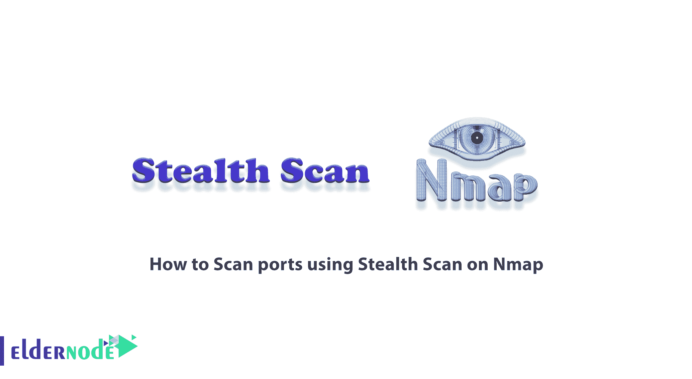
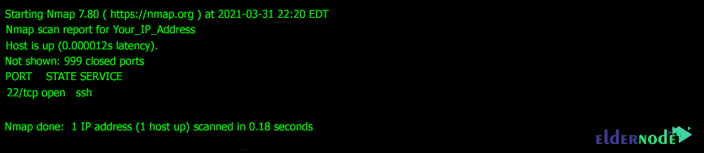

# 如何在 Nmap - Eldernode 博客上使用隐形扫描扫描端口

> 原文：<https://blog.eldernode.com/scan-ports-using-stealth-scan-on-nmap/>



隐形扫描或半开扫描是 Nmap 中的一种扫描方法，入侵者使用这种方法绕过防火墙和身份验证机制。此外，通过使用这种方法，他们将扫描操作视为正常的网络流量，因此扫描是隐藏的。由于 ACK 数据包不是由攻击者发送到目标系统的，因此连接没有完全建立。在某些记录完整通信的系统中，这种类型的扫描可用于防止通信被记录在目标系统中。在本文中，我们将教您如何在 Nmap 上使用隐形扫描来扫描端口。如果你想购买一台 [VPS 服务器](https://eldernode.com/vps/)，你可以访问 [Eldernode](https://eldernode.com/) 中提供的软件包。

## **教程在 Nmap 上使用隐形扫描扫描端口**

Stealth Scan 也称为 SYN Scan 或 TCP SYN Scan，因为它在 TCP 握手过程中只发送一个 SYN 数据包。这种运行速度和缺乏通信有利于扫描器阻止流量分析。因为没有任何人想分析的完整联系。

TCP 三次握手过程是在秘密扫描中实现的，但是在握手的最后一步，它不是确认连接，而是发送 RST 扫描器并重置连接以阻止进一步的步骤。

这种类型的扫描的一般过程是，首先，扫描器将单个数据包作为 SYN 发送到服务器，该数据包被发送到我们想要扫描的目标端口。

收到 SYN 数据包后，如果在端口上提供服务，服务器会向扫描器发送 SYN//ACK 数据包。也就是说，它已准备好进行通信，并且所需的端口已打开。

扫描器不是向服务器发送 ACK，而是向它发送 RST。然后，它关闭那里的连接。但是，如果服务器发送 RST 作为回应，这意味着服务器上所需的端口被关闭。这种类型的扫描可以在几乎所有操作系统上使用。

在本文的后续部分，请加入我们，让您了解如何在 [Nmap](https://blog.eldernode.com/introduction-nmap-tool-and-check-its-applications/) 上使用隐形扫描来扫描端口。

### **为什么要扫描端口？**

端口扫描是发现系统漏洞的有效方法。端口扫描可以告诉攻击者(黑客)系统中打开了哪些端口。这将帮助他找到攻击你的服务器的方法。例如，如果攻击者在监听您的端口 22 时注意到一个“安全外壳”服务器，它可以尝试获取您的弱密码。如果另一个服务器在另一个端口上运行，攻击者可以登录并寻找漏洞进行渗透。例如，它可能是运行软件的旧版本，具有已知的安全漏洞。

此外，这些扫描可以用来查找在默认端口之外的端口上运行的服务。例如，如果您在端口 65001 而不是端口 22 上运行 SSH 服务器，端口扫描可以检测到这一点。因此，知道这一点的攻击者试图在该端口上连接到您的 SSH 服务器。您不能仅仅更改默认端口就认为您的系统是完全安全的，尽管这使得找到您的服务器有点困难。

端口扫描不仅仅被黑客使用。这是一种非常实用的发现安全问题的方法。例如，组织可以扫描自己的系统，识别可见的服务，并找到保护它们的方法。

### **什么是隐身？**

在这种类型的扫描中，也称为秘密扫描，只有 TCP 帧被发送到端口。在这种类型的扫描中，不发送额外的 TCP 握手过程或额外的分组传输信息，并且仅向目标发送单个帧来分析给定的响应。

在这种类型的扫描中，发送一个帧时，只希望从目的地接收一个帧。这种扫描的另一个名字是半开扫描！这意味着在这种类型的扫描中，TCP 握手过程不完整。一旦检测到端口，尚未完成的会话将被终止。

## **对 Nmap 使用隐形扫描逐步扫描端口**

在本节中，我们将向您介绍如何在 Nmap 上使用隐形扫描来扫描端口。应该注意的是，Nmap 有一个选项可以简化执行 TCP 秘密扫描的过程。您可以轻松地使用 **-sS** 命令通过 [Nmap](https://blog.eldernode.com/tag/nmap/) 执行 TCP 隐形扫描。请注意，在以下命令中，您必须输入要扫描的主机的 IP 地址:

```
nmap -sS -P0 Your_IP_Address
```

上述命令的输出如下所示:



正如您在上面的框中看到的，扫描已经执行。输出是 999 端口关闭，但端口 22 打开。

## 结论

在秘密扫描中，消息用标志 syn 发送，如果端口打开，则用 syn/ack 响应。但如果港口关闭，RST 会做出回应。这种类型的扫描用于绕过防火墙和身份验证机制。在本文中，我们试图教你如何在 Nmap 上使用隐形扫描来扫描端口。