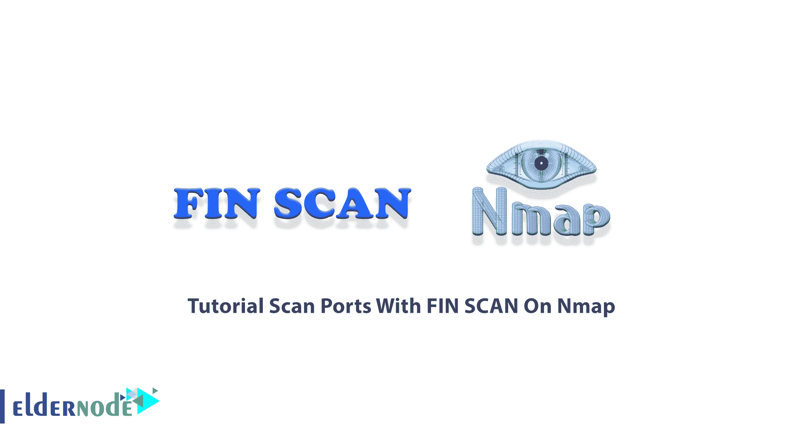
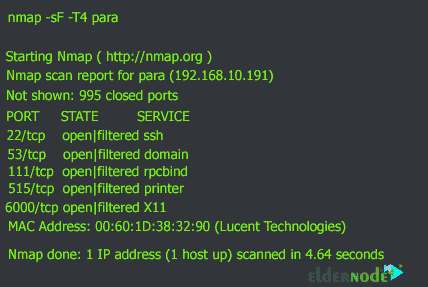
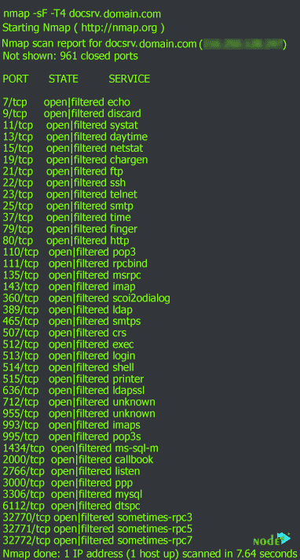

# Nmap - Eldernode 博客上的 FIN 扫描端口教程

> 原文：<https://blog.eldernode.com/scan-ports-with-fin-scan-on-nmap/>



**FIN SCAN** 是 Nmap 中的一种端口扫描方法，它利用了老式无状态防火墙的愚蠢之处。事实上，当涉及到 FIN 扫描时，我们的端口扫描器软件发送一个带有 FIN 形式的标志的数据包，表示会话结束到目的地防火墙或主机。如果没有收到响应，说明端口是开放的，如果返回的是 RST//ACK，说明服务器端口是关闭的。在本文中，我们试图教你一步一步**如何在 Nmap** 上用 FIN SCAN 扫描端口。如果你想购买一台 [VPS 服务器](https://eldernode.com/vps/)，你可以访问 [Eldernode](https://eldernode.com/) 中提供的软件包。

## **如何在 Nmap 上用 FIN SCAN 扫描端口**

如您所知，在端口扫描过程中，TCP 所做的三次握手过程非常有用。因此，当提到 FIN 扫描时，您自然会认为它意味着用于结束 TCP 会话的 TCP 完成标志。

这种扫描方法仍然负责扫描无状态防火墙后面的服务。当愚蠢的防火墙看到 FIN 标志时，它们会认为之前可能有一个会话，现在它想要结束。所以他们允许数据包通过！如今，这种类型的扫描不太适合我们的工作，已经被更高级的端口扫描所取代，但无论如何，这种类型的扫描也可以用于 DOS 攻击。

在这篇文章的后续部分，加入我们来教你如何在 [Nmap](https://blog.eldernode.com/tag/nmap/) 上用 FIN SCAN 扫描端口。

### **什么是鳍扫描？**

在这种情况下，Nmap 指纹扫描就派上了用场。FIN 数据包的标准用途是终止 TCP 连接，通常是在数据传输完成之后。Nmap 使用 FIN 数据包而不是 SYN 数据包来启动 FIN 扫描。因为在扫描主机和目标主机之间没有早期的通信，所以目标主机用 RST 数据包来响应以重置连接。然而，通过这样做，它揭示了它的存在。

FIN 扫描方法的工作原理是首先向现实世界中从未发生过的数据包发送 FIN 扫描。它发送设置了 FIN 标志的数据包，而不首先与目标建立连接。同样，如果没有收到数据包，端口被认为是开放的，如果收到 RST 数据包，端口被认为是关闭的。

在下一节中，我们将通过一个示例教您如何在 Nmap 上使用 FIN SCAN 扫描端口。

## **在 Nmap 上用 FIN 扫描扫描端口**

在本节中，我们将向您介绍如何在 Nmap 上使用 FIN SCAN 扫描端口。请注意，使用这种类型的扫描很简单。只需使用 **-sF** 选项。您可以使用以下命令扫描 Nmap 中的端口:

```
nmap -sF Your_IP_Address
```

考虑下面的例子:

```
nmap -sF -T4 para
```

上述命令的输出如下。如您所见，在执行 FIN Scan 命令后，很明显有 5 个端口是打开的。(打开时|已过滤)。这些开放的端口是端口 22、53、111、515 和 6000。



应该注意，对于现代状态防火墙，指纹扫描不应该产生任何额外信息。然而，它在某些情况下仍被广泛使用。考虑下面的例子:

```
nmap -sF -T4 docsrv.domain.com
```



正如您在上面的输出中看到的，961 个端口是关闭的，但是 39 个端口是打开的。

## 结论

在本文中，我们试图用一个例子来一步步教你如何在 Nmap 上用 FIN SCAN 扫描端口。如果你愿意，你可以参考我们关于如何在 Nmap 上使用连接扫描和[隐形扫描](https://blog.eldernode.com/scan-ports-using-stealth-scan-on-nmap/)扫描端口的文章。