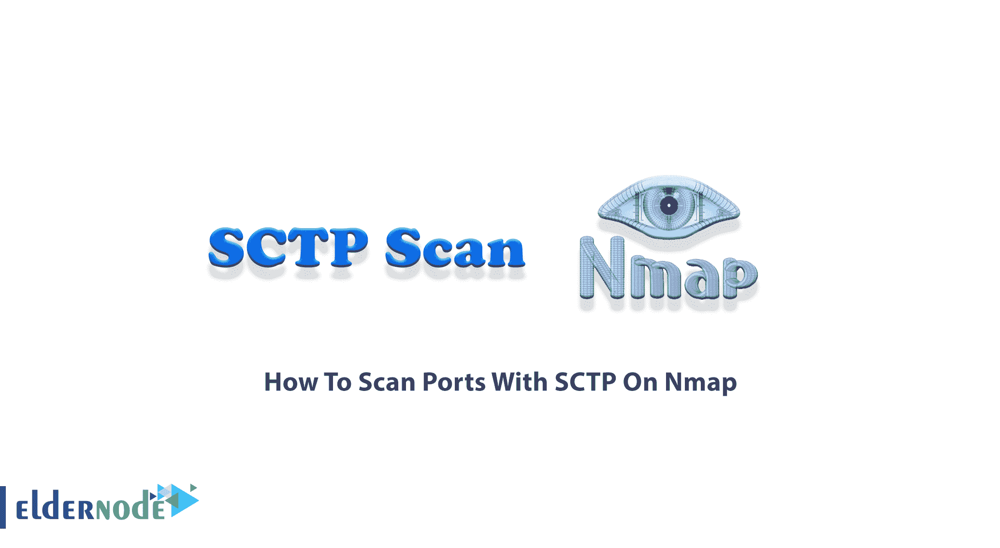
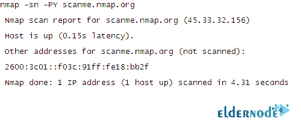

# 如何在 Nmap[完整] - ElderNode 博客上用 SCTP 扫描端口

> 原文：<https://blog.eldernode.com/scan-ports-with-sctp-on-nmap/>



**SCTP 扫描**是一款在高性能网络中使用的 EGPLv2 许可下，扫描支持 SCTP 的机器的工具。SCTP 是 SIGTRAN 协议族的一部分，该协议族用于在 TCP/IP 上传输 SS7 等。使用 SCTP 扫描可以让你找到电信网络的入口。在对电信核心网络基础设施进行测试时，您将需要它。在这篇文章中，你将学习**如何在 Nmap** 上用 SCTP 扫描端口。在 [Eldernode](https://eldernode.com/) 上订购您考虑的软件包，拥有自己的 **[Linux VPS](https://eldernode.com/linux-vps/)** 。

## **教程在 Nmap 上用 SCTP 一步步扫描端口**

你熟悉 Nmap。这是一款免费的开源网络扫描工具。SCTP 很快就被接受了，至少对于 SCTP 堆栈来说是这样。KAME 项目中有很多 SCTP 栈的开源实现，比如 Linux 和 BSD。扫描是一门艺术，专家试图理解扫描技术，并为给定的任务选择合适的技术。作为主机和端口扫描器的 SCTP 扫描所支持和测试的环境有 [Linux](https://blog.eldernode.com/tag/linux/) 和 Mac OS X。大多数扫描类型只对特权用户可用。这是因为它们发送和接收原始数据包，这需要 Unix 系统上的 root 访问权限。但是，使用 Nmap 上的 connect scan 和 Nmap 上的非特权用户的[扫描端口扫描端口是教给你的。当前的 Nmap 版本完全支持 SCTP。默认情况下，](https://blog.eldernode.com/scan-ports-with-unprivileged-user-on-nmap/) [Nmap](https://blog.eldernode.com/tag/nmap/) 会执行 SYN 扫描，但如果用户没有发送原始数据包的适当权限(在 Unix 上需要 root 访问权限)，它会替代连接扫描。在下文中，您将了解 Nmap 上的 SCTP 和扫描端口。

### **什么是 SCTP 初始化扫描？**

SCTP 是 TCP 和 UDP 协议的替代协议，结合了 TCP 和 UDP 的大部分特性，还增加了多宿主和多流等新功能。它相当于 SCTP 的 TCP SYN 扫描。它能够在不受限制性防火墙阻碍的快速网络上每秒扫描数千个端口。像 SYN 扫描一样，INIT 扫描相对不引人注目和隐蔽，因为它从不完成 SCTP 关联。它还允许清晰、可靠地区分打开、关闭和过滤状态。

由于你没有打开一个完整的 SCTP 协会，这种技术被称为半开扫描。您发送一个 INIT 块，就好像您要打开一个真正的关联，然后等待响应。

SCTP 扫描有很大的改进空间。让我们回顾其中的一些:

–使用 libpcap 完成实施

–扫描响应包的标识

–更好的参数检查

### **SCTP 扫描及其应用**

SCTP 由 TCP 或 UDP 端口组成，SCTP 端口的地址空间是 16 位和 65536 个端口(从 0 到 65535)。SCTP 扫描的主要目标是找到 SCTP 活机器和开放端口。SCTP 扫描嵌入了常见 SCTP 端口的列表，以便通过不扫描 65535 端口而不是更小的子集来找到它们。SCTP 扫描使您能够做许多事情，例如:

1-扫描机器上的单个端口

2-扫描整个 A、B、C 网络，查找具有 SCTP 堆栈的机器

3-扫描个别机器或整个网络上的常用端口

4-一台主机上的模糊 CTP 堆栈

5 端口扫描主机的全部 65535 个端口

6-启动一个绑定套接字 1000 的虚拟服务器，稍后可以对其进行扫描

此外，有一些方便的选项，使 SCTP 扫描自动端口扫描一台机器，只要它发现这个主机实际上支持 SCTP。

## **扫描 Nmap 上带有 SCTP 的端口**

您可以使用 SCTP 数据包来确定主机是否在线，方法是发送 SCTP INIT 数据包并寻找 ABORT 或 INIT ACK 响应。这种技术被称为 SCTP 初始化 ping 扫描，由 Nmap 实现。

然而，要用 SCTP 扫描端口，首先，打开您的终端并运行:

```
nmap -sn -PY <target>
```

然后，您可以查看与其他类型的 ping 扫描格式相同的输出:



您应该会看到如上图所示的输出。参数*-sn-PY scanme.nmap.org*告诉 Nmap 对主机*scanme.nmap.org*进行 SCTP 初始化扫描，以确定其是否在线。

## 结论

在本文中，您了解了如何在 Nmap 上使用 SCTP 扫描端口。SCTP 扫描允许您检查网络。默认情况下，扫描结果会发送到中央协作平台，以帮助您统计端口使用情况和版本使用情况。