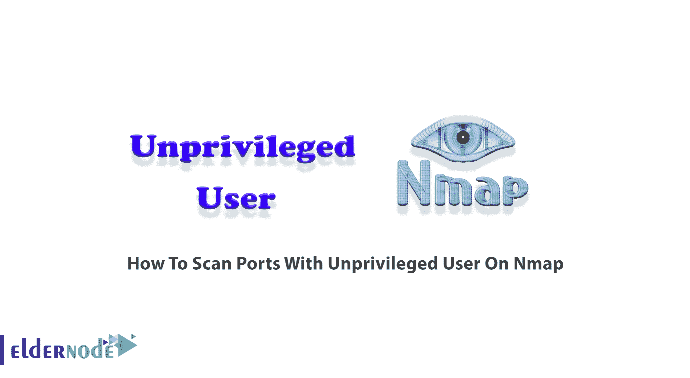

# 如何扫描 Nmap - Eldernode 博客上非特权用户的端口

> 原文：<https://blog.eldernode.com/scan-ports-with-unprivileged-user-on-nmap/>



Nmap 是最流行的在线端口扫描器，也是托管安全工具的一部分。使用 Nmap 允许您从外部角度(即防火墙之外)扫描外围网络设备和服务器。Nmap 将在 Windows 系统上运行，但是建议您使用 Linux，因为 Nmap 在 Linux 下运行得更好，速度更快。此外，基于 Linux 的系统是访问各种安全工具的好方法。在这篇文章中，你将学习**如何在 Nmap** 上扫描非特权用户的端口。另外，如果你打算购买自己的 [Linux VPS](https://eldernode.com/linux-vps/) ，可用的 [Eldernode](https://eldernode.com/) 包将会是你所需要的。

## **教程扫描 Nmap 上无权限用户的端口**

网络映射器是一个免费的开源网络扫描器。它旨在分析、保护和探索网络。您可以使用 Nmap 来发现计算机网络上的主机和服务，方法是以一种易于使用的方式发送数据包并分析响应。在下文中，您将了解端口、端口扫描器，以及在 Nmap 上使用非特权用户扫描端口的方式。

端口用于区分通信信道，旨在识别单台机器上使用的特定应用程序。虽然不同种类的服务默认使用不同的端口，但端口是网络流量的编号地址。在下一节中，和我们一起解释 [Nmap](https://blog.eldernode.com/tag/nmap/) 端口扫描器及其功能。

### **Nmap 端口扫描器**

Nmap 有多种扫描类型。让我们了解一下端口扫描。简单的[命令 nmap](https://blog.eldernode.com/tutorial-nmap-commands/) < target >扫描主机< target >上最常用的 1000 个 TCP 端口，将每个端口分类为打开、关闭、过滤、未过滤、打开|过滤或关闭|过滤状态。端口配置会导致[安全](https://blog.eldernode.com/tag/security/)风险，知道哪些端口是开放的，哪些端口被封锁是至关重要的。

**Nmap 端口扫描器**可以确定很多事情。看看下面的一些例子:

–网络上可用的主机

–主机上运行的操作系统

–主机上运行的应用程序的名称和版本

–主机上使用的防火墙类型

使用以下简单的命令扫描您的本地网络。

```
nmap -sV -p 1-65535 192.168.1.1/24
```

这样你就可以扫描你本地的 IP 范围并进行业务识别 **-sV** 最后扫描所有端口 **-p 1-65535** 。这将是基于 TCP 连接的扫描，因为您是作为普通用户而不是 root 用户运行的。因此，要将它作为 TCP SYN 扫描来运行，您需要运行前面带有 Sudo 的命令。

### **如何以无权限用户身份运行 Nmap**

当 Nmap 在 1997 年发布时，root 权限是一个严重的限制。但随着时间的推移，由于更便宜的计算机、大多数人的互联网接入、流行的桌面 Unix 系统以及可用的 Windows 版本用户不需要访问共享的 shell 帐户。由于特权用户可以发送和接收原始数据包(在 Unix 系统上需要 root 访问权限)，因此大多数扫描类型仅对他们可用。**非特权用户**告诉 Nmap 将该用户视为缺乏网络原始套接字和嗅探特权，无法进行测试、调试。当操作系统的原始网络功能由于某种原因中断时，也会用到它。由于 Nmap 像普通用户一样执行其大部分功能，因此它可以在退回到更安全的行为之前检查它是否有权限执行某些操作。通过使用功能，您可以在 Linux 系统上以非特权用户的身份进行 Nmap。

## **非特权用户 Nmap 端口扫描**

当我们谈论非特权用户时，这意味着用户缺乏原始套接字特权。作为管理员，您可以扫描端口以保证安全。但它也提供了更多的用途，如创建机器清单，它们提供的服务可用于资产跟踪、网络设计、策略合规性检查、软件许可证跟踪、可用性测试和网络调试。您将能够扫描您拥有/操作或有权扫描的系统。建议您使用特权用户扫描端口。但是，当 Nmap 使用非特权用户扫描端口时，您将面临以下特征:

1-无法创建新数据包

2- TCP 连接扫描

3-它使用 connect()系统调用

4- TCP 连接已完成

5-速度较慢

### **无权限用户开放端口扫描** **OS 检测**

您可以使用下面的命令来确定活动主机。因此，您可以从 IP 范围的 ping 扫描开始:

```
nmap -sP 192.168.0.0-100
```

此外，您可以使用以下命令在一台活动主机上启动带有操作系统检测的 T2 SYN 扫描:

```
nmap -sS [ip address]-O
```

要启动带有版本检测的开放端口扫描，请键入:

```
nmap -sV 192.168.0.1 -A
```

您还可以在命令中添加-v 来增加详细程度:

```
nmap -sV 192.168.0.13 -A -v
```

## 结论

在本文中，您了解了如何在 Nmap 上扫描非特权用户的端口。请注意，扫描很有趣，但也很麻烦。您只需要对 IP 地址和服务端口有一个基本的了解，就可以开始运行端口扫描器。