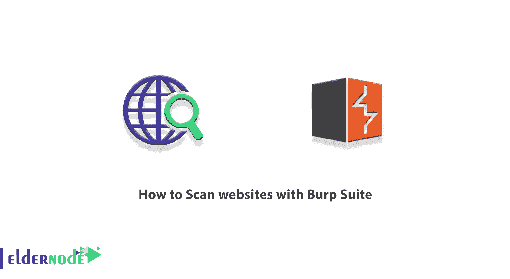
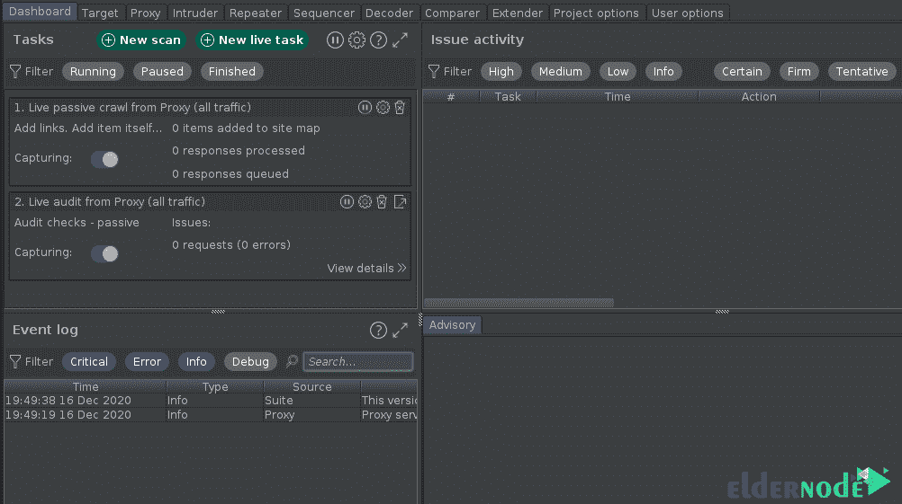
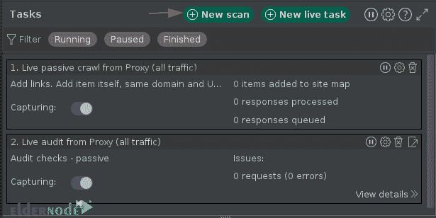
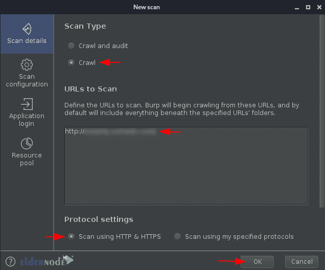
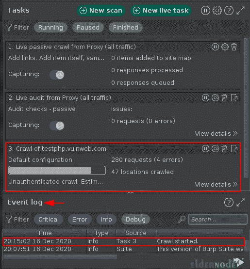
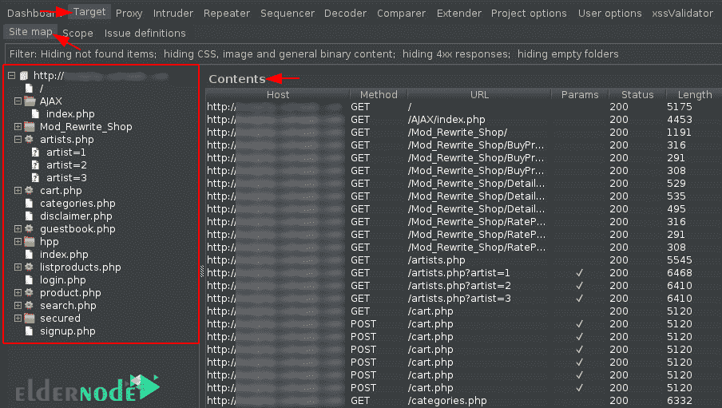
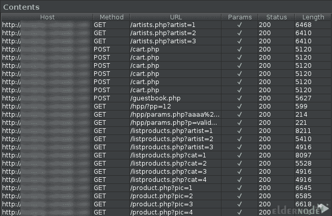
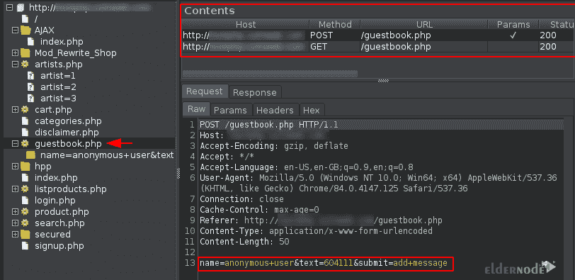
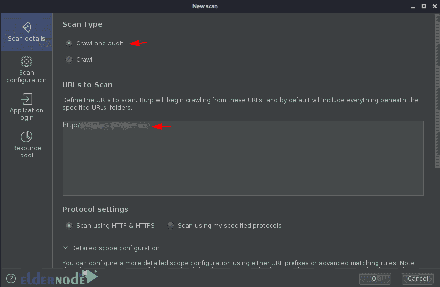
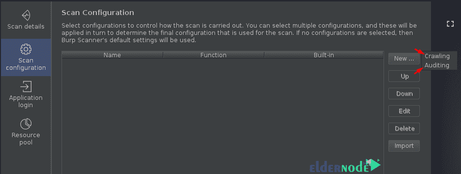

# 如何使用 Burp 套件扫描网站- Eldernode 博客

> 原文：<https://blog.eldernode.com/scan-websites-with-burp-suite/>

Burp Scanner 会自动扫描网站内容中的漏洞。还应注意，根据配置，扫描器可以使用程序来检测其内容和功能，并控制程序来检测漏洞。请注意，默认情况下，所有扫描都使用内置的 Burp 浏览器，以确保通过启用浏览器的扫描实现最大的覆盖范围。在这篇文章中，我们将教你如何使用 Burp Suite 扫描网站。如果你想购买一台 [**VPS**](https://eldernode.com/vps/) 托管服务器，你可以访问 [Eldernode](https://eldernode.com/) 中的软件包。

## 网站扫描方式

可以通过多种方式设置扫描:

**1。扫描特定网址的能力**

在这种方法中，扫描是通过抓取一个或多个 URL 中的内容并检查块菌的内容来提供的。为此，您可以转到 Burp 仪表板，然后单击“**新扫描**”按钮。这样，将打开扫描启动窗口，允许您配置扫描详细信息。

**2。扫描选定项目的能力**

通过这样做，您可以只扫描特定 HTTP 请求的审核(不进行爬网)。为此，在 Burp 中的任意位置选择一个或多个请求，并从上下文菜单中选择“ **Scan** ”。这样，将打开扫描启动窗口，允许您配置扫描详细信息。

**3。实时扫描**

此方法用于自动扫描由其他 Burp 工具(如代理或中继器工具)处理的请求。您可以准确配置哪些请求被处理，哪些请求应该被扫描以识别内容或检查漏洞。为此，您可以进入 Burp 仪表盘，点击“**新实时任务**”按钮。这将启动一个实时扫描，让您配置工作的详细信息。

**4。立即扫描**

您可以使用此方法从上下文菜单中执行立即或非活动扫描。换句话说，您可以快速扫描漏洞，而不必打开扫描启动器。您可以通过右键单击请求来访问这些选项。您也可以配置快捷方式来创建即时扫描。

## **用打嗝套件扫描网站**

在本文的其余部分，我们将教您如何在第一步使用默认配置进行爬行。然后我们将处理如何定制爬虫。最后，我们将向您全面介绍如何使用[打嗝套件](https://blog.eldernode.com/check-of-burp-suite-capabilities/)扫描网站。请加入我们。

### **如何使用默认配置进行抓取**

蜘蛛在 [Burpsuite](https://blog.eldernode.com/install-burp-suite-on-debian/) 屏幕上有一个特殊的标签。但是 burp crawler 已经在仪表板中定义了。这有助于您在一个位置控制 burp 的自动化活动。因此，要开始使用 crawler，您需要打开 Burpsuite 并导航到那里的仪表板。

一旦您到达仪表板，您就可以看到指定数量的子集。让我们来看看他们的详细情况:

**1。任务**

**2。事件日志**

**3。发布活动**

**4。咨询**

在此部分中，您必须单击任务部分顶部的“**新扫描**”按钮来扫描 web 应用程序。

这样做会将您带到一个名为“**新扫描**的弹出窗口，其中包括以下选项:

1_ 爬网和审计

2_ 爬网

正如你在下图中看到的，在这一部分你必须键入你想要的 URL，然后点击“ **OK** ”。

这样做后，窗口将消失，在仪表板上你的新任务对齐。然后，您将在事件日志中看到事件“**爬网已开始**”。

您现在可以从**目标**选项卡的**站点地图**部分看到结果:

应该注意的是，由于未初始化的输入字段，存在许多主要的漏洞。有了这些转储的数据，您可以简单地隔离包含输入值的 URL，这样就可以对其进行进一步的测试。为此，您只需双击“ **Params** ”字段。

如果您想检查页面或特定目录，您可以简单地导航到下面窗口的左侧，并在那里选择您想要的选项。

### **如何在 Burpsuite 上用高级场景扫描**

在这一节中，我们将教你如何用一个高级的场景来爬行和扫描。请注意，Burpsuite 为您提供了端到端扫描的机会，Burpsuite 会对应用程序进行爬网并发现其内容和功能。此外，它还会检查漏洞。因此，要做到这一切，每个人都需要一个“网址”。

请遵循以下步骤来了解如何做到这一点:

1_ 回到**仪表板**。

2_ 选择“**新扫描**，现在这次选择“**抓取&审核**”，进一步提到里面的网址。

3_ 现在你应该检查**扫描配置**选项，当你移动到那里并点击“**新建**按钮时。

它不是将您重定向到定制菜单，而是询问您去哪里进行爬网优化或审核配置。应该注意，所有内部选项都是相同的。

## 结论

默认情况下，所有扫描都将使用 Burp 的嵌入式浏览器，以确保通过浏览器支持的扫描实现最大覆盖范围。您还可以提供多组用户凭据，以便 Burp Scanner 可以发现和审核只有经过身份验证的用户才能访问的内容。在本文中，我们首先试图让您完全熟悉 BurpSuite 中的扫描方法。然后我们教你如何用 Burp Suite 扫描网站。