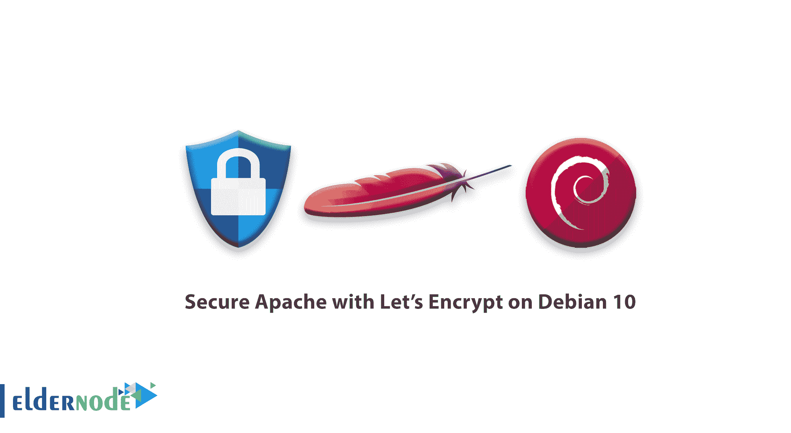

# 如何用让我们在 Debian 10 - Eldernode 上加密来保护 Apache

> 原文：<https://blog.eldernode.com/secure-apache-debian-10/>



Let's Encrypt 是一个证书颁发机构(CA ),它提供了一种简单的方法来获取和安装免费的 [TLS/SSL 证书](https://eldernode.com/how-to-install-and-activate-the-ssl-certificate/),从而在 web 服务器上启用加密 HTTPS。它通过提供一个软件客户端 [Certbot](https://certbot.eff.org/) 来简化流程，该客户端试图自动执行大多数(如果不是全部)所需的步骤。目前，获得和安装证书的整个过程在 Apache 和 [Nginx](https://eldernode.com/install-nginx-debian-10/) 上都是完全自动化的。

在本指南中，我们将使用一个单独的 Apache [虚拟主机](https://eldernode.com/linux-vps/)文件，而不是默认配置文件。[我们建议](https://eldernode.com/install-apache-web-server-debian/)为每个域创建新的 Apache 虚拟主机文件，因为这有助于避免常见错误，并保留默认文件作为后备配置。

为了让本教程更好地工作，请考虑下面的**先决条件:**

*   完全注册的域名。本教程将始终使用 **your_domain** 作为例子。你可以在 **Namecheap** 上购买一个域名，在 **Freenom** 上免费获得一个，或者使用你选择的域名注册商。
*   为您的服务器设置了以下两个 DNS 记录。要设置这些，你可以按照这些说明添加域名，然后按照这些说明创建 **DNS 记录**。
    *   一个 A 记录，其中 **your_domain** 指向你的服务器的公共 IP 地址。
    *   一个带有 **www.your_domain** 的 A 记录指向你的服务器的公共 IP 地址。
*   Apache 安装遵循[如何在 Debian 10 上安装 Apache](https://eldernode.com/install-apache-web-server-debian/)。确保为您的域设置了虚拟主机文件。本教程将以/etc/Apache 2/sites-available/your _ domain . conf 为例。

## 如何在 Debian 10 上用 Let's Encrypt 保护 Apache

在本教程中，您将使用 Certbot 为 Debian 10 上的 Apache 获取一个免费的 SSL 证书，并设置您的证书自动更新。所以加入我们，开始学习如何用 Debian 10 上的 Let ' s Encrypt**来保护 Apache** 。

### 1-如何安装 Certbot

首先，使用 Let's Encrypt 获得 SSL 证书就是在你的服务器上安装 Certbot 软件。

在撰写本文时，默认情况下，Debian 软件仓库中没有 Certbot。为了使用 apt 下载软件，您需要将 backports 存储库添加到 sources.list 文件中，apt 在该文件中查找软件包源代码。Backports 是来自 Debian 的测试和不稳定发行版的包，它们被重新编译，所以它们可以在稳定的 Debian 发行版上运行，而不需要新的库。

要添加 backports 存储库，请打开(或创建)您的/etc/apt/目录中的 sources.list 文件:

```
sudo nano /etc/apt/sources.list
```

在文件的底部，添加下面一行:

/etc/apt/sources . list . d/sources . list

```
. . .  deb http://mirrors.digitalocean.com/debian buster-backports main  deb-src http://mirrors.digitalocean.com/debian buster-backports main  deb http://ftp.debian.org/debian buster-backports main
```

这包括符合 Debian 自由软件指南(DFSG)的主软件包，以及非自由和 contrib 组件，这些组件或者本身不符合 DFSG 标准，或者包含这一类别中的依赖项。

通过按 CTRL+X，Y 保存并关闭文件，然后输入，然后更新您的包列表:

```
sudo apt update
```

接下来，使用以下命令安装 Certbot。注意-t 选项告诉 apt 通过在刚刚添加的 backports 存储库中查找来搜索包:

```
sudo apt install python-certbot-apache -t buster-backports
```

Certbot 现在**准备好**使用，但是为了让它为 **Apache** 配置 SSL，我们需要验证 Apache 已经被正确配置。

### `2-如何设置 SSL 证书`

`为了自动配置 SSL，Certbot 需要能够在 Apache 配置中为它找到正确的虚拟主机。具体来说，它通过查找与您请求证书的域相匹配的 ServerName 指令来实现这一点。`

`如果您遵循了[如何在 Debian 10](https://eldernode.com/install-apache-web-server-debian/) 上安装 Apache，您应该在/etc/Apache 2/sites available/your _ domain . conf 中有一个虚拟主机块，并且已经适当地设置了 ServerName 指令。`

`当然，你可以通过使用 **nano** 或者你喜欢的文本编辑器:打开你的域的虚拟主机文件来检查`

```
`sudo nano /etc/apache2/sites-available/your_domain.conf`
```

`之后，尝试找到现有的 **S** erverName 线路。应该是这样的，用你自己的域名代替你的 _domain:`

`/etc/Apache 2/sites-available/your _ domain . conf`

```
`...  ServerName your_domain;  ...`
```

`首先，检查一下，如果还没有，更新 ServerName 指令指向你的域名。然后保存文件，退出编辑器，并验证配置编辑的语法:`

```
`sudo apache2ctl configtest`
```

`输出`

```
`Syntax OK`
```

`面对任何错误，重新打开虚拟主机文件，并检查是否有任何打字错误或丢失的字符。一旦配置文件的语法正确，重新加载 Apache 来加载新的配置:`

```
`sudo systemctl reload apache2`
```

### ``3-如何允许 HTTPS 通过防火墙``

``根据必备指南，如果您启用了 ufw 防火墙，您需要调整设置以允许 HTTPS 流量。幸运的是，当安装在 Debian 上时，ufw 附带了一些配置文件，有助于简化为 HTTP 和 HTTPS 流量更改防火墙规则的过程。``

``并查看当前设置:``

```
``sudo ufw status``
```

``下面的输出显示只允许 HTTP 流量进入 web 服务器:``

``输出``

```
``Status: active    To                         Action      From  --                         ------      ----  OpenSSH                    ALLOW       Anywhere                    WWW                        ALLOW       Anywhere                    OpenSSH (v6)               ALLOW       Anywhere (v6)               WWW (v6)                   ALLOW       Anywhere (v6)``
```

``接下来，为了额外引入 HTTPS 流量，允许“WWW 满”配置文件并删除多余的“WWW”配置文件允许量:``

```
``sudo ufw allow 'WWW Full'  sudo ufw delete allow 'WWW'``
```

``然后，您将收到以下状态。``

```
``sudo ufw status``
```

``输出``

```
``Status: active    To                         Action      From  --                         ------      ----  OpenSSH                    ALLOW       Anywhere                    WWW Full                   ALLOW       Anywhere                    OpenSSH (v6)               ALLOW       Anywhere (v6)               WWW Full (v6)              ALLOW       Anywhere (v6)``
```

``4-如何获得 SSL 证书``

``由于 Apache 插件会负责重新配置 Apache 并在必要时重新加载配置，您可以使用下面的命令来使用这个插件。另外，Certbot 提供了多种通过插件获得 SSL 证书的方法。``

### ``这会运行 **certbot** 和**–Apache**插件，使用 **-d** 来指定您希望证书有效的名称。``

``这是你第一次运行 **certbot？所以**你会被提示输入一个电子邮件地址并同意服务条款。此外，它还会询问你是否愿意与电子前沿基金会(T4)分享你的电子邮件地址，这是一个倡导数字权利的非营利组织，也是 Certbot 的制造商。请随意输入 **Y** 分享您的电子邮件地址或 **N** 拒绝。``

```
``sudo certbot --apache -d your_domain -d www.your_domain``
```

``这样做之后， **certbot** 将与 Let's Encrypt 服务器通信，然后运行一个挑战来验证您是否控制了您正在申请证书的域。``

``如果成功，certbot 将询问您希望如何配置您的 HTTPS 设置:``

``输出``

``现在，选择你的选择，然后点击**进入**。配置将自动更新，Apache 将重新加载以获取新的设置。 **certbot** 将会以一条消息结束，告诉你这个过程已经成功，你的证书存放在哪里:``

``输出``

```
``Please choose whether or not to redirect HTTP traffic to HTTPS, removing HTTP access.  -------------------------------------------------------------------------------  1: No redirect - Make no further changes to the webserver configuration.  2: Redirect - Make all requests redirect to secure HTTPS access. Choose this for  new sites, or if you're confident your site works on HTTPS. You can undo this  change by editing your web server's configuration.  -------------------------------------------------------------------------------  Select the appropriate number [1-2] then [enter] (press 'c' to cancel):``
```

``在下载、安装和加载您的证书时，您可以使用 **https://** 重新加载您的网站，并注意浏览器的安全指示器。它应该表明该网站是适当的安全，通常有一个绿色的锁图标。如果你使用 **SSL 实验室服务器测试**来测试你的服务器，它会得到 **A** 等级。``

``Output``

```
``IMPORTANT NOTES:   - Congratulations! Your certificate and chain have been saved at:     /etc/letsencrypt/live/your_domain/fullchain.pem     Your key file has been saved at:     /etc/letsencrypt/live/your_domain/privkey.pem     Your cert will expire on 2019-10-20\. To obtain a new or tweaked     version of this certificate in the future, simply run certbot again     with the "certonly" option. To non-interactively renew *all* of     your certificates, run "certbot renew"   - Your account credentials have been saved in your Certbot     configuration directory at /etc/letsencrypt. You should make a     secure backup of this folder now. This configuration directory will     also contain certificates and private keys obtained by Certbot so     making regular backups of this folder is ideal.   - If you like Certbot, please consider supporting our work by:       Donating to ISRG / Let's Encrypt:   https://letsencrypt.org/donate     Donating to EFF:                    https://eff.org/donate-le``
```

``5-如何验证证书自动更新``

## ``咱们加密的证书有效期只有九十天。这是为了鼓励用户自动化他们的证书续订过程。我们安装的 **certbo** t 包通过向/etc/cron.d 添加一个更新脚本来为我们解决这个问题。这个脚本每天运行两次，并将自动更新任何 30 天内到期的证书。``

``使用 certbot 进行试运行，以测试更新过程。``

### ``为了不出现错误，你已经准备好了。此外，Certbot 将更新您的证书，并在必要时重新加载 Apache 以获取更改。如果自动续订过程失败，Let's Encrypt 会向您指定的电子邮件地址发送一封邮件，在您的证书即将过期时发出警告。``

```
``sudo certbot renew --dry-run``
```

``结论``

``在本文中，您了解了如何安装 Let's Encrypt 客户端 **certbot** ，为您的域下载 SSL 证书，配置 Apache 使用这些证书，以及设置自动证书更新。如果您对使用 Certbot 有进一步的疑问，他们的文档是一个很好的起点。如果你有兴趣[阅读更多关于这个主题的](https://blog.eldernode.com/secure-nginx-encrypt-ubuntu/)，看看其他相关的[文章](https://blog.eldernode.com/secure-apache-lets-encrypt-ubuntu-20/)。``

## ``Conclusion``

``In this article, you learned how to install the Let’s Encrypt client **certbot**, downloaded SSL certificates for your domain, configured Apache to use these certificates, and set up automatic certificate renewal. If you have further questions about using Certbot, their documentation is a good place to start. In case you are interested in [reading more](https://blog.eldernode.com/secure-nginx-encrypt-ubuntu/) about this subject, have a look at other related [articles](https://blog.eldernode.com/secure-apache-lets-encrypt-ubuntu-20/).``