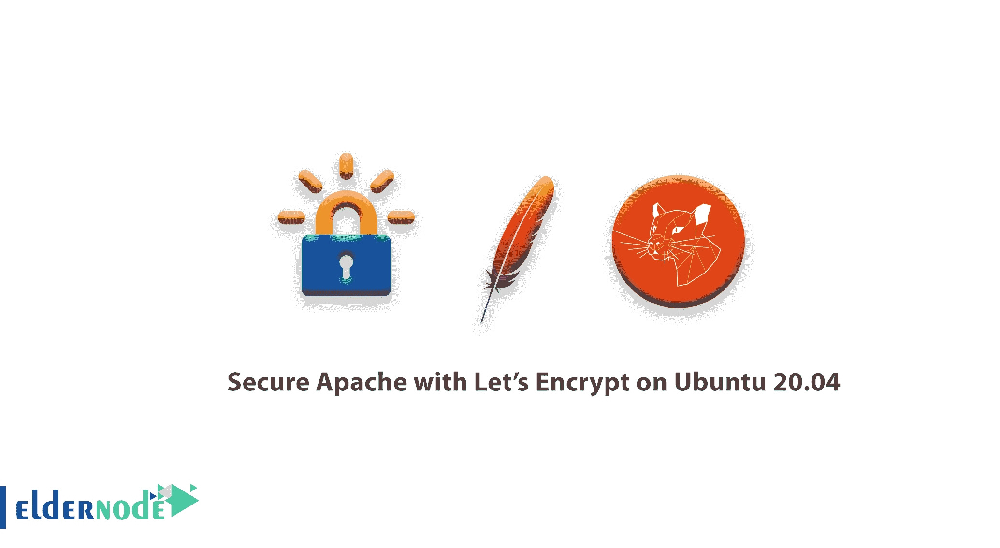

# 如何使用让我们在 Ubuntu 20.04 上加密来保护 Apache-Ubuntu 提示

> 原文：<https://blog.eldernode.com/secure-apache-lets-encrypt-ubuntu-20/>



教程**如何在 Ubuntu 20.04 上用 Let's Encrypt 保护 Apache**。首先，你需要购买带有即时设置的 [Ubuntu VPS](https://eldernode.com/ubuntu-vps/) 来更好地学习本指南。

Let's Encrypt 是一个证书颁发机构(CA ),它有助于获取和安装免费的 [TLS/SSL 证书](https://eldernode.com/how-to-install-and-activate-the-ssl-certificate/) ，从而在 web 服务器上启用加密的 HTTPS 。它通过提供一个软件客户端 Certbot 来简化这个过程，该客户端试图自动执行大多数必需的步骤。目前，获得和安装证书的整个过程在 [Apache](https://eldernode.com/install-wordpress-apache-ubuntu-20/) 和 [Nginx](https://eldernode.com/secure-nginx-encrypt-ubuntu/) 上都是完全自动化的。

在本教程中，您将使用 Certbot 为 Ubuntu 20.04 上的 Apache 获取一个免费的 SSL 证书。并确保此证书设置为自动续订。

为了让本教程更好地发挥作用，请考虑以下**先决条件**:

**1-** 拥有 **sudo** 权限的非根用户

**2-** 要进行设置，请遵循我们在 Ubuntu 20.04 上的[初始服务器设置](https://eldernode.com/initial-server-setup-on-ubuntu-20/)

**3-** 一个完全注册的域名。本教程将始终使用 **your_domain** 作为示例。你可以在 Namecheap 上购买一个域名，在 Freenom 上免费获得一个，或者使用你选择的域名注册商。

**4-** 为您的服务器设置的以下两个 [DNS](https://eldernode.com/connect-domain-to-dns-in-windows-server/) 记录。

**5-** 一个带有 your_domain 的 A 记录指向你的服务器的公共 IP 地址。

**6-** 一个 www.your_domain 指向你的服务器的公有 IP 地址的 A 记录。

确保你有一个[虚拟主机](https://eldernode.com/vps/)文件。本教程将以**/etc/Apache 2/sites-available/your _ domain . conf**为例。

Recommended Article: [Russia VPS Server](https://blog.eldernode.com/russia-vps-server/)

## 如何在 Ubuntu 20.04 上用 Let's Encrypt 保护 Apache

本教程使用一个单独的虚拟主机文件，而不是 Apache 的默认配置文件来设置网站，该网站将由 Let's Encrypt 保护。建议您为服务器中托管的每个域创建新的 [Apache](https://eldernode.com/install-apache-web-server-debian/) 虚拟主机文件，因为这有助于避免常见错误，并保留默认配置文件作为后备设置。因此，请和我们一起回顾本指南的步骤，看看如何在 Ubuntu 20.04 上使用 Let's Encrypt 来保护 Apache。

### 1-如何安装 Certbot

首先，您需要在您的服务器上安装 Certbot 软件，以便用 Let's Encrypt 获得 SSL 证书。并使用默认的 Ubuntu 软件包库。

同样，你需要两个包: **certbot** ，和 **python3-certbot-apache** 。后者是一个集成了 Certbot 和 Apache 的插件，使得在您的 web 服务器中用一个命令自动获取证书和配置 HTTPS 成为可能。

```
sudo apt install certbot python3-certbot-apache
```

按 **Y** ，出现提示时**输入** 确认安装。

Certbot 现已安装在您的服务器上。在下一步中，您将验证 Apache 的配置，以确保您的虚拟主机设置正确。这将确保 **certbot** 客户端脚本能够检测您的域，并重新配置您的 web 服务器以自动使用您新生成的 SSL 证书。

### 2-如何检查您的 Apache 虚拟主机配置

为了能够自动获取和配置 web 服务器的 SSL，Certbot 需要在 Apache 配置文件中找到正确的虚拟主机。您的服务器域名将从您的**虚拟主机**配置块中定义的**服务器名称**和**服务器别名**指令中检索。

要检查这一点，使用 nano 或您喜欢的文本编辑器打开您的域的虚拟主机文件:

```
sudo nano /etc/apache2/sites-available/your_domain.conf
```

找到现有的**服务器名**和**服务器别名**行。它们应该是这样的:

/etc/Apache 2/sites-available/your _ domain . conf

```
...  ServerName your_domain  ServerAlias www.your_domain  ...
```

如果你已经有了像这样设置的**服务器名**和**服务器别名**，你可以退出你的文本编辑器并进入下一步。如果你正在使用 **nano** ，你可以通过键入 **CTRL+X** 退出，然后 **Y** 和**回车**确认。

如果您当前的虚拟主机配置与示例不符，请相应地进行更新。完成后，保存文件并退出编辑器。然后，运行以下命令来验证您的更改:

```
sudo apache2ctl configtest
```

**请注意**您应该得到一个**语法 OK** 作为响应。如果出现错误，请重新打开虚拟主机文件，并检查是否有任何拼写错误或缺少字符。一旦您的配置文件的语法正确，重新加载 Apache 以使更改生效。

```
sudo systemctl reload apache2
```

当您进行这些更改时，Certbot 将能够找到正确的 VirtualHost 块并更新它。

### 3-如何允许 HTTPS 通过防火墙

如果您按照必备指南的建议启用了 UFW 防火墙，则需要调整设置以允许 HTTPS 流量。安装时，Apache 注册了几个不同的 UFW 应用程序概要文件。我们可以利用 **Apache Full** 配置文件来允许您的服务器上的 HTTP 和 HTTPS 流量。

运行以下命令验证您的服务器当前允许哪种流量。

```
sudo ufw status
```

输出

```
Status: active    To                         Action      From  --                         ------      ----  OpenSSH                    ALLOW       Anywhere                    Apache                     ALLOW       Anywhere               OpenSSH (v6)               ALLOW       Anywhere (v6)               Apache (v6)                ALLOW       Anywhere (v6)
```

要额外允许 HTTPS 流量，请允许“Apache Full”配置文件并删除冗余的“Apache”配置文件:

```
sudo ufw allow 'Apache Full'  sudo ufw delete allow 'Apache'
```

您会看到如下状态:

```
sudo ufw status
```

输出

```
Status: active    To                         Action      From  --                         ------      ----  OpenSSH                    ALLOW       Anywhere                    Apache Full                ALLOW       Anywhere                    OpenSSH (v6)               ALLOW       Anywhere (v6)               Apache Full (v6)           ALLOW       Anywhere (v6)
```

4-如何获得 SSL 证书

### 由于 Certbot 提供了多种通过插件获得 SSL 证书的方法，Apache 插件将负责重新配置 Apache，并在必要时重新加载配置。要使用此插件，请键入以下内容:

该脚本将提示您回答一系列问题，以便配置您的 SSL 证书。首先，它会要求您输入有效的电子邮件地址。此电子邮件将用于续订通知和安全通知:

```
sudo certbot --apache
```

输出

提供有效的电子邮件地址后，点击**输入**进入下一步。然后会提示您确认是否同意让我们加密服务条款。按下 **A** ，然后**进入**确认。

```
Saving debug log to /var/log/letsencrypt/letsencrypt.log  Plugins selected: Authenticator apache, Installer apache  Enter email address (used for urgent renewal and security notices) (Enter 'c' to  cancel): [[email protected]](/cdn-cgi/l/email-protection)_domain
```

毕竟，在此之前，你会被问及是否愿意与电子前沿基金会分享你的电子邮件来接收新闻和其他信息。如果您不想订阅他们的内容，请键入 **N** 。否则，键入 **Y** 。然后，点击**进入**进入下一步。

```
- - - - - - - - - - - - - - - - - - - - - - - - - - - - - - - - - - - - - - - -  Please read the Terms of Service at  https://letsencrypt.org/documents/LE-SA-v1.2-November-15-2017.pdf. You must  agree in order to register with the ACME server at  https://acme-v02.api.letsencrypt.org/directory  - - - - - - - - - - - - - - - - - - - - - - - - - - - - - - - - - - - - - - - -  (A)gree/(C)ancel: A
```

下一步将提示您通知 Certbot 您想要为哪些域激活 HTTPS。列出的域名是从您的 Apache 虚拟主机配置中自动获得的，这就是为什么确保您在虚拟主机中配置了正确的**服务器名**和**服务器别名**设置非常重要。如果您想为所有列出的域名启用 HTTPS(推荐)，您可以将提示留空并点击**回车**继续。否则，通过列出每个适当的数字，用逗号和/或空格分隔，选择您想要启用 HTTPS 的域，然后点击**回车**。

```
- - - - - - - - - - - - - - - - - - - - - - - - - - - - - - - - - - - - - - - -  Would you be willing to share your email address with the Electronic Frontier  Foundation, a founding partner of the Let's Encrypt project and the non-profit  organization that develops Certbot? We'd like to send you email about our work  encrypting the web, EFF news, campaigns, and ways to support digital freedom.  - - - - - - - - - - - - - - - - - - - - - - - - - - - - - - - - - - - - - - - -  (Y)es/(N)o: N
```

输出

```
Which names would you like to activate HTTPS for?  - - - - - - - - - - - - - - - - - - - - - - - - - - - - - - - - - - - - - - - -  1: your_domain  2: www.your_domain  - - - - - - - - - - - - - - - - - - - - - - - - - - - - - - - - - - - - - - - -  Select the appropriate numbers separated by commas and/or spaces, or leave input  blank to select all options shown (Enter 'c' to cancel):
```

现在，系统会提示您选择是否要将 HTTP 流量重定向到 HTTPS。实际上，这意味着当有人通过未加密的渠道(HTTP)访问您的网站时，他们将被自动重定向到您网站的 HTTPS 地址。选择 **2** 启用重定向，或者选择 1 如果您想保持 HTTP 和 HTTPS 作为访问您网站的单独方法。

```
Obtaining a new certificate  Performing the following challenges:  http-01 challenge for your_domain  http-01 challenge for www.your_domain  Enabled Apache rewrite module  Waiting for verification...  Cleaning up challenges  Created an SSL vhost at /etc/apache2/sites-available/your_domain-le-ssl.conf  Enabled Apache socache_shmcb module  Enabled Apache ssl module  Deploying Certificate to VirtualHost /etc/apache2/sites-available/your_domain-le-ssl.conf  Enabling available site: /etc/apache2/sites-available/your_domain-le-ssl.conf  Deploying Certificate to VirtualHost /etc/apache2/sites-available/your_domain-le-ssl.conf
```

在这一步之后，Certbot 的配置就完成了，您将看到关于新证书的最后说明，在哪里可以找到生成的文件，以及如何使用分析证书真实性的外部工具来测试您的配置:

```
Please choose whether or not to redirect HTTP traffic to HTTPS, removing HTTP access.  - - - - - - - - - - - - - - - - - - - - - - - - - - - - - - - - - - - - - - - -  1: No redirect - Make no further changes to the webserver configuration.  2: Redirect - Make all requests redirect to secure HTTPS access. Choose this for  new sites, or if you're confident your site works on HTTPS. You can undo this  change by editing your web server's configuration.  - - - - - - - - - - - - - - - - - - - - - - - - - - - - - - - - - - - - - - - -  Select the appropriate number [1-2] then [enter] (press 'c' to cancel): 
```

现在，您可以看到您的证书已经安装并加载到 Apache 的配置中。尝试使用 https:// 重新加载您的网站，并注意您浏览器的安全指示器。应该指出的是，你的网站是安全的，典型的做法是在地址栏中包含一个锁图标。

```
- - - - - - - - - - - - - - - - - - - - - - - - - - - - - - - - - - - - - - - -  Congratulations! You have successfully enabled https://your_domain and  https://www.your_domain    You should test your configuration at:  https://www.ssllabs.com/ssltest/analyze.html?d=your_domain  https://www.ssllabs.com/ssltest/analyze.html?d=www.your_domain  - - - - - - - - - - - - - - - - - - - - - - - - - - - - - - - - - - - - - - - -    IMPORTANT NOTES:   - Congratulations! Your certificate and chain have been saved at:     /etc/letsencrypt/live/your_domain/fullchain.pem     Your key file has been saved at:     /etc/letsencrypt/live/your_domain/privkey.pem     Your cert will expire on 2020-07-27\. To obtain a new or tweaked     version of this certificate in the future, simply run certbot again     with the "certonly" option. To non-interactively renew *all* of     your certificates, run "certbot renew"   - Your account credentials have been saved in your Certbot     configuration directory at /etc/letsencrypt. You should make a     secure backup of this folder now. This configuration directory will     also contain certificates and private keys obtained by Certbot so     making regular backups of this folder is ideal.   - If you like Certbot, please consider supporting our work by:       Donating to ISRG / Let's Encrypt:   https://letsencrypt.org/donate     Donating to EFF:                    https://eff.org/donate-le 
```

从外部服务的角度来看，您可以使用 **SSL Labs 服务器测试**来验证您的证书等级，并获得关于它的详细信息。

在下一步也是最后一步，我们将测试 Certbot 的自动续订功能，它可以保证您的证书在到期日期之前自动续订。

5-如何验证证书自动更新

### Let's Encrypt 的证书有效期只有九十天。这是为了鼓励用户自动化他们的证书更新过程，并确保被滥用的证书或被盗的密钥将尽快过期。

我们安装的 **certbot** 包通过在 **/etc/cron.d** 中包含一个续订脚本来处理续订事宜，该脚本由一个名为 **certbot.timer.** 的 **systemctl** 服务来管理。该脚本每天运行两次，将自动续订任何三十天内到期的证书。

要检查此服务的状态并确保它处于活动状态且正在运行，您可以使用:

输出

```
sudo systemctl status certbot.timer
```

为了测试更新过程，您可以使用 **certbot** 进行一次试运行:

```
● certbot.timer - Run certbot twice daily       Loaded: loaded (/lib/systemd/system/certbot.timer; enabled; vendor preset: enabled)       Active: active (waiting) since Tue 2020-04-28 17:57:48 UTC; 17h ago      Trigger: Wed 2020-04-29 23:50:31 UTC; 12h left     Triggers: ● certbot.service    Apr 28 17:57:48 fine-turtle systemd[1]: Started Run certbot twice daily.
```

当你看到没有错误，这意味着你都设置好了。必要时，Certbot 将更新您的证书并重新加载 Apache 以获取更改。如果自动续订过程失败，Let's Encrypt 会向您指定的电子邮件地址发送一封邮件，在您的证书即将过期时发出警告。

```
sudo certbot renew --dry-run
```

结论

在本文中，您成功安装了 Let ' s Encrypt client**certbot**，为您的域配置并安装了 SSL 证书，并确认 cert bot 的自动更新服务在 **systemctl** 中处于活动状态。如果您对使用 Certbot 有进一步的疑问，他们的文档是一个很好的起点。你也可以阅读更多关于[如何用 Debian 10](https://blog.eldernode.com/secure-apache-debian-10/) 上的 Let's Encrypt 来保护 Apache。

Conclusion

In this article, you succeeded to install the Let’s Encrypt client **certbot**, configured and installed an SSL certificate for your domain, and confirmed that Certbot’s automatic renewal service is active within **systemctl**. If you have further questions about using Certbot, their documentation is a good place to start. You can also read more on [How to Secure Apache with Let’s Encrypt on Debian 10](https://blog.eldernode.com/secure-apache-debian-10/).