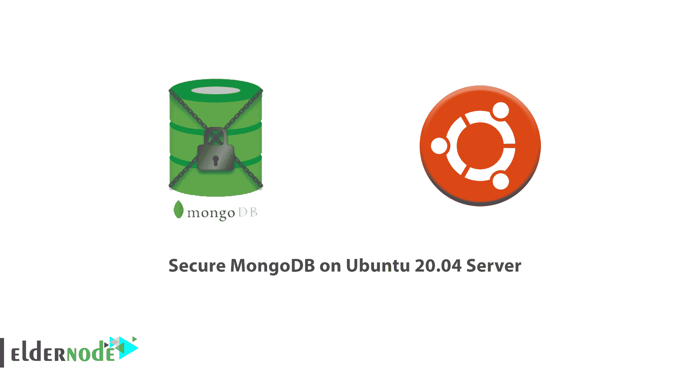

# 如何在 Ubuntu 20.04 服务器上保护 MongoDB-elder node

> 原文：<https://blog.eldernode.com/secure-mongodb-ubuntu-20/>



MongoDB，也称为 Mongo，是许多现代 web 应用程序中使用的开源文档数据库。它被归类为 [NoS](https://en.wikipedia.org/wiki/NoSQL) [QL](https://en.wikipedia.org/wiki/NoSQL) [数据库](https://en.wikipedia.org/wiki/NoSQL)，因为它不依赖于传统的基于表的关系数据库结构。相反，它使用带有动态模式的类似 JSON 的文档。

默认情况下，MongoDB 没有启用身份验证，这意味着任何有权访问安装数据库的服务器的用户都可以不受限制地添加和删除数据。为了保护这个漏洞，本教程将引导您创建一个管理用户并启用身份验证。然后，您将进行测试，以确认只有这个管理用户可以访问数据库。要获得安全快速的 Linux 主机，请联系 Eldernode 团队。

为了让本教程更好地发挥作用，请考虑以下**先决条件**:

一个拥有 sudo 权限
的非 root 用户来设置，按照我们在 Ubuntu 20.04 LTS 上设置的 [初始服务器。](https://eldernode.com/initial-server-set-up-on-ubuntu-20-04-lts/)

MongoDB 安装在您的服务器上。要在你的服务器上安装 Mongo，跟随我们的教程 [如何在 Ubuntu 20.04](https://eldernode.com/install-mongodb-ubuntu-20/) 上安装 MongoDB。

## 如何在 Ubuntu 20.04 服务器上保护 MongoDB

和我们一起看看这个指南，回顾一下如何在 Ubuntu 20.04 上保护 MongoDB 的步骤。

### 第一步:如何添加管理用户

自从版本 3.0 发布以来， **MongoDB** 守护进程被配置为只接受来自本地 Unix 套接字的连接，并且它不会自动向更广泛的互联网开放。但是，默认情况下，身份验证仍然是禁用的。这意味着任何可以访问安装 MongoDB 的服务器的用户也可以完全访问数据库。

作为保护此漏洞的第一步，您将创建一个管理用户。稍后，您将启用身份验证，并作为该管理用户连接以访问数据库。

要添加管理用户，您必须首先连接到 Mongo shell。因为身份验证被禁用，所以您可以使用 **mongo** 命令进行身份验证，而无需任何其他选项:

```
mongo
```

Mongo shell 提示符上方会有一些输出。因为您尚未启用身份验证，所以这将包括一个警告，说明没有为数据库启用访问控制，并且对数据和数据库配置的读写访问是不受限制的:

输出

```
MongoDB shell version v4.4.0     . . .     2020-06-09T13:26:51.391+0000 I  CONTROL  [initandlisten] ** WARNING: Access control is not enabled for the database.  2020-06-09T13:26:51.391+0000 I  CONTROL  [initandlisten] **          Read and write access to data and configuration is unrestricted.     . . .    >
```

这些警告会在你启用认证后消失，但是现在，它们意味着任何可以访问你的 Ubuntu 服务器的人也可以控制你的数据库。

举例来说，运行 Mongo 的 show dbs 命令:

```
> show dbs
```

该命令返回服务器上每个数据库的列表。但是，当启用了身份验证时，列表会根据 Mongo 用户的角色或其对特定数据库的访问级别而变化。因为身份验证被禁用，所以它将无限制地返回系统中当前的每个数据库:

输出

```
admin   0.000GB  config  0.000GB  local   0.000GB
```

在此示例输出中，仅显示默认数据库。但是，如果您的系统中有任何保存敏感数据的数据库，任何用户都可以使用该命令找到它们。

作为缓解此漏洞的一部分，此步骤侧重于添加一个管理用户。为此，您必须首先连接到 **admin** 数据库。这是存储用户信息(如用户名、密码和角色)的地方:

```
> use admin
```

输出

```
switched to db admin
```

MongoDB 安装了许多基于 JavaScript 的 shell 方法，可以用来管理数据库。其中之一是 db.createUser 方法，用于在运行该方法的数据库上创建新用户。

启动 db.createUser 方法:

```
> db.createUser(
```

此方法要求您为用户指定用户名和密码，以及您希望用户拥有的任何角色。回想一下，MongoDB 将其数据存储在类似 JSON 的文档中。因此，当您创建一个新用户时，您所做的就是创建一个文档，将适当的用户数据保存为单独的字段。

与 JSON 中的对象一样，MongoDB 中的文档以花括号( { 和 } )开始和结束。要开始添加用户，请输入左花括号:

**注意** :在您输入右括号之前，Mongo 不会将 db.createUser 方法注册为完整的。直到您这样做，提示才会从大于号( **>** )变为省略号( **…** )。 

```
... {
```

接下来，输入一个 **用户:** 字段，将您想要的用户名作为双引号中的值，后跟一个逗号。以下示例指定用户名 AdminNoodi，但是您可以输入您喜欢的任何用户名:

```
... user: "AdminNoodi",
```

接下来，输入一个 **pwd** 字段，用 passwordPrompt() 方法作为它的值。当您执行 **db.createUser** 方法时， passwordPrompt() 方法会提示您输入密码。这比另一种方法更安全，那就是像输入用户名一样明文输入密码。

**注意**:password prompt()方法只兼容 MongoDB 版本 4.2 及更新版本。如果您使用的是旧版本的 Mongo，那么您必须用明文写出您的密码，类似于您写出用户名的方式:

```
... pwd: "password",
```

请务必在该字段后面加上逗号:

```
... pwd: passwordPrompt(),
```

然后输入您希望管理用户拥有的角色。因为您正在创建一个管理用户，所以您至少应该授予他们对 **admin** 数据库的**useradminany database**角色。这将允许管理用户创建和修改新的用户和角色。因为管理用户在 **admin** 数据库中拥有该角色，这也将授予其对整个集群的**超级用户访问权限。**

此外，以下示例还授予管理用户**readWriteAnyDatabase**角色。这使管理用户能够读取和修改集群中任何数据库上的数据，除了主要供内部使用的 **配置** 和 **本地** 数据库:

```
... roles: [ { role: "userAdminAnyDatabase", db: "admin" }, "readWriteAnyDatabase" ]
```

接下来，输入右大括号以表示文档结束:

```
... }
```

然后输入右括号关闭并执行 **db.createUser** 方法:

```
... )
```

总之，您的 **db.createUser** 方法应该是这样的:

```
> db.createUser(  ... {  ... user: "AdminNoodi",  ... pwd: passwordPrompt(),  ... roles: [ { role: "userAdminAnyDatabase", db: "admin" }, "readWriteAnyDatabase" ]  ... }  ... ) 
```

如果每一行的语法正确，该方法将正确执行，并提示您输入密码:

输出

```
Enter password:
```

输入您选择的强密码。然后，您将收到一条确认消息，表明用户已被添加:

输出

```
Successfully added user: {      "user" : "AdminNoodi",      "roles" : [          {              "role" : "userAdminAnyDatabase",              "db" : "admin"          },          "readWriteAnyDatabase"      ]  } 
```

接下来，您可以退出 MongoDB 客户端:

```
> exit
```

此时，您的用户将被允许输入凭据。但是，在您启用身份验证并重新启动 MongoDB 守护进程之前，不会要求它们这样做。

### 步骤二:如何启用认证

要启用认证，您必须编辑 MongoDB 的配置文件**。一旦您启用它并重新启动 Mongo 服务，用户仍然可以连接到数据库，而无需进行身份验证。但是，在他们提供正确的用户名和密码之前，他们无法读取或修改任何数据。**

**用您喜欢的文本编辑器打开配置文件。在这里，我们将使用 **纳米** :**

```
`sudo nano /etc/mongod.conf`
```

**向下滚动找到被注释掉的 **安全** 部分:**

**/etc/monod . conf 文件**

```
`. . .  #security:    #operationProfiling:    . . .` 
```

**通过删除井号( # )取消对该行的注释:**

**/etc/monod . conf 文件**

```
`. . .  security:    #operationProfiling:    . . .` 
```

**然后添加 **授权** 参数，设置为 **【使能】** 。完成后，这些行应该是这样的:**

**/etc/monod . conf 文件**

```
`. . .  security:    authorization: "enabled"  . . .` 
```

**注意 **安全:** 行开头没有空格，而 **授权:** 行缩进两个空格。**

**添加这些行之后，保存并关闭文件。如果您使用 **nano** 打开文件，请按下 **CTRL + X** ， **Y** ，然后 **回车** 。**

**然后重新启动守护程序，使这些新的更改生效:**

```
`sudo systemctl restart mongod`
```

**接下来，检查服务的状态以确保它正确重启:**

```
`sudo systemctl status mongod`
```

**如果 **重新启动** 命令成功，您将收到输出，表明 mongod 服务是活动的，并且是最近启动的:**

**输出**

```
`● mongod.service - MongoDB Database Server       Loaded: loaded (/lib/systemd/system/mongod.service; enabled; vendor preset: enabled)       Active: active (running) since Tue 2020-06-09 22:06:20 UTC; 7s ago         Docs: https://docs.mongodb.org/manual     Main PID: 15370 (mongod)       Memory: 170.1M       CGroup: /system.slice/mongod.service               └─15370 /usr/bin/mongod --config /etc/mongod.conf    Jun 09 22:06:20 your_host systemd[1]: Started MongoDB Database Server.`
```

**验证守护程序已备份并正在运行后，您可以测试您添加的身份验证设置是否按预期工作。**

### **第三步:如何测试认证设置**

**要开始测试您在上一步中添加的身份验证要求是否正常工作，请在不指定任何凭据的情况下进行连接，以验证您的操作确实受到了限制:**

```
`mongo`
```

**现在您已经启用了身份验证，以前遇到的警告都不会出现:**

**输出**

```
`MongoDB shell version v4.4.0  connecting to: mongodb://127.0.0.1:27017/?compressors=disabled&gssapiServiceName=mongodb  Implicit session: session { "id" : UUID("5d50ed96-f7e1-493a-b4da-076067b2d898") }  MongoDB server version: 4.4.0  >`
```

**再次运行 **show dbs** 命令，确认您的访问是否受到限制:**

```
`> show dbs`
```

**回想一下第 1 步，您的服务器上至少有几个默认数据库。但是，在这种情况下，该命令不会有任何输出，因为您还没有被认证为特权用户。**

**因为这个命令不返回任何信息，所以可以肯定地说身份验证设置正在按预期工作。如果不先进行鉴定，您也不能创建用户或执行其他特权任务。**

**继续并退出 MongoDB shell:**

****注意** :与之前在步骤 1 中运行下面的 **exit** 命令不同，关闭 shell 的另一种方法是只按**CTRL+c .**** 

```
`> exit`
```

**接下来，通过运行下面的 **mongo** 命令以这个用户的身份进行连接，确保您的管理用户能够正确地进行身份验证。该命令包括--u标志，它位于您想要连接的用户名之前。确保用您自己的管理用户的用户名替换 **AdminNoodi** 。它还包括 **-p** 标志，该标志将提示您输入用户密码，并将 **admin** 指定为创建指定用户名的认证数据库:**

```
`mongo -u AdminNoodi -p --authenticationDatabase admin`
```

**出现提示时输入用户密码，然后准备好进入 shell。在那里，再次尝试发出 show dbs 命令:**

```
`> show dbs`
```

**这一次，因为您已经正确地进行了身份验证，所以该命令将成功地返回服务器上当前所有数据库的列表:**

**输出**

```
`admin   0.000GB  config  0.000GB  local   0.000GB`
```

**现在，您可以确保已经成功启用了身份验证。**

## **结论**

**在本文中 **，** 您已经设置了一个管理 MongoDB 用户，您可以使用它来创建和修改新的用户和角色，或者管理您的 MongoDB 实例。您还配置了 MongoDB 实例，要求用户在与任何数据交互之前使用有效的用户名和密码进行身份验证。如果你有兴趣了解其他操作系统的更多信息，请阅读我们的文章[如何在 CentOS 8 中安装 MongoDB 4](https://blog.eldernode.com/install-mongodb-4-centos-8/)和[如何在 Debian 10 上安装 MongoDB 4](https://blog.eldernode.com/install-mongodb-debian/)。**