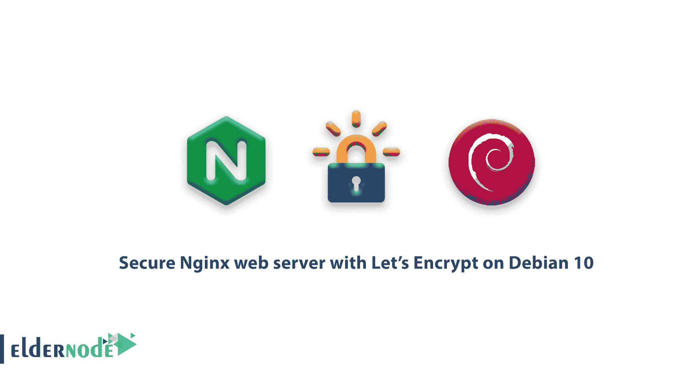

# 如何在 Debian 10 - Eldernode 上使用 Let's Encrypt 保护 Nginx web 服务器

> 原文：<https://blog.eldernode.com/secure-nginx-encrypt-debian-10/>



Let's Encrypt 是一个证书颁发机构(CA ),它提供了一种简单的方法来获取和安装免费的 [TLS/SSL 证书](https://eldernode.com/how-to-install-and-activate-the-ssl-certificate/),从而在 web 服务器上实现加密的 HTTPS。它通过提供一个软件客户端 [Certbot](https://certbot.eff.org/) 来简化这个过程，这个客户端试图自动化大部分(如果不是全部)所需的步骤。目前，获得和安装证书的整个过程在 Apache 和 Nginx 上都是完全自动化的。在接下来的内容中，您将使用 Certbot 为 Debian 10 上的 Nginx 获取一个免费的 SSL 证书，并将您的证书设置为自动更新。

为了让你的学习更好地进行，选择你自己的 [Ubuntu VPS 服务器](https://eldernode.com/ubuntu-vps/)并立即激活。

为了让本教程更好地发挥作用，请考虑以下**先决条件**:

**1-** 一个拥有 **sudo** 权限和防火墙的非 root 用户。

**2-** 一台 Debian 10 服务器，按照我们 [与 Debian 10](https://eldernode.com/initial-setup-with-debian-10/) 的初始设置进行设置。

**3-** 一个完全注册的域名。你可以在 **Namecheap** 上购买一个域名，在 **Freenom** 上免费获得一个，或者使用你选择的域名注册商。

**4-** 为您的服务器设置的以下两个 DNS 记录。

**5-** 一个带有 your_domain 的记录，指向你的服务器的公共 IP 地址。

**6-** 一条 www.your_domain 指向你的服务器公共 IP 地址的记录。

**7-** 按照如何在 Debian 10 上 [安装 Nginx 来安装 Nginx。确保您的域有一个**服务器块**。本教程将以**/etc/nginx/sites-available/your _ domain**为例。](https://eldernode.com/install-nginx-debian-10/)

## 如何在 Debian 10 上用 Let's Encrypt 保护网络服务器 Nginx】

在本指南中，您将使用一个单独的 Nginx 服务器块文件，而不是默认文件。 [我们建议](https://eldernode.com/install-nginx-debian-10/) 为每个域创建新的 Nginx 服务器块文件，因为这有助于避免常见错误，并保留默认文件作为后备配置。所以，我们来回顾一下这个教程的步骤，来完整的学习一下。

### 步骤 1–如何安装 Certbot

要开始使用 Let's Encrypt 来获取 SSL 证书，需要在您的服务器上安装 Certbot 软件。当然，你必须从 Debian 仓库安装**python 3-cert bot-nginx**包，这样你就可以安装和使用 **Cerbot 的 nginx 插件**。

在安装**python 3-cert bot-nginx**包之前，更新你的包列表:

```
sudo apt update
```

接下来，安装**python 3-cert bot-nginx**包的依赖项，其中包括 **python3-acme** ，**python 3-cert bot**， **python3-mock** ，**python 3-OpenSSL**， **python3-pkg-resources**

```
sudo apt install python3-acme python3-certbot python3-mock python3-openssl python3-pkg-resources python3-pyparsing python3-zope.interface
```

接下来，安装**python 3-cert bot-nginx**包:

```
sudo apt install python3-certbot-nginx
```

### 步骤 2–如何确认 Nginx 的配置

在这一步中，您看到 Certbot 现在已经可以使用了，但是为了让它为 Nginx 配置 SSL，我们需要验证 Nginx 的一些配置。因此，Certbot 需要能够在 Nginx 配置中找到正确的 **服务器** 块，以便能够自动配置 SSL。具体来说，它通过查找与您请求的域相匹配的 **server_name** 指令来做到这一点。

如果您遵循了 Nginx 安装教程 中的 [服务器块设置步骤，您应该在**/etc/Nginx/sites-available/your _ domain**中为您的域设置一个服务器块，并且已经适当地设置了 **server_name** 指令。](https://eldernode.com/install-nginx-debian-10/)

要进行检查，请使用 **nano** 或您喜欢的文本编辑器打开您的域的服务器块文件:

```
sudo nano /etc/nginx/sites-available/your_domain
```

然后，找到已有的 **server_name** 行。它应该是这样的:

/etc/nginx/sites-available/your _ domain

**如果**出现了，**退出**你的编辑器，继续下一步。

**如果**不匹配，**更新**使其匹配。然后保存文件，退出编辑器，并验证配置编辑的语法:

```
sudo nginx -t
```

但是，如果您得到一个错误，重新打开服务器块文件，并检查任何打字错误或丢失的字符。一旦您的配置文件语法正确，重新加载 Nginx 以加载新的配置:

```
sudo systemctl reload nginx
```

Certbot 现在可以找到正确的 **服务器** 块并更新它。

### `步骤 3–如何允许 HTTPS 通过防火墙`

`如果您启用了 **ufw** 防火墙，如先决条件指南中所建议的，您需要调整设置以允许 HTTPS 流量。`

`使用下面的命令查看当前设置。`

```
`sudo ufw status`
```

`输出`

```
`Status: active    To                         Action      From  --                         ------      ----  OpenSSH                    ALLOW       Anywhere                    Nginx HTTP                 ALLOW       Anywhere                    OpenSSH (v6)               ALLOW       Anywhere (v6)               Nginx HTTP (v6)            ALLOW       Anywhere (v6)`
```

`接收上述输出意味着，只有 HTTP 流量被允许到 web 服务器。`

`并且要让 HTTPS 流量进入，允许 **Nginx 完全** 配置文件并删除多余的 **Nginx HTTP** 配置文件余量:`

```
`sudo ufw allow 'Nginx Full'  sudo ufw delete allow 'Nginx HTTP'`
```

`您的状态现在应该是这样的:`

```
`sudo ufw status`
```

`输出`

```
`Status: active    To                         Action      From  --                         ------      ----  OpenSSH                    ALLOW       Anywhere  Nginx Full                 ALLOW       Anywhere  OpenSSH (v6)               ALLOW       Anywhere (v6)  Nginx Full (v6)            ALLOW       Anywhere (v6)`
```

## `步骤 4–如何获得 SSL 证书`

## `Certbot 提供了多种通过插件获取 SSL 证书的方式。Nginx 插件将负责重新配置 Nginx，并在必要时重新加载配置。要使用此插件，请键入以下内容:`

### `这个运行 **certbot** 与**–nginx**插件，使用 **-d** 来指定我们希望证书有效的名称。`

`如果这是您第一次运行 **certbot** ，系统会提示您输入电子邮件地址并同意服务条款。这样做之后， **certbot** 将与 Let's Encrypt 服务器通信，然后运行一个挑战来验证您是否控制了您正在请求证书的域。`

```
`sudo certbot --nginx -d your_domain -d www.your_domain`
```

`如果成功，certbot 将询问您希望如何配置您的 HTTPS 设置。`

`输出`

`选择你的选择，然后点击输入。配置将被更新，Nginx 将重新加载以获取新的设置。 certbot 将会显示一条消息，告诉您该过程已成功完成，并且您的证书存储在哪里:`

`输出`

```
`Please choose whether or not to redirect HTTP traffic to HTTPS, removing HTTP access.  -------------------------------------------------------------------------------  1: No redirect - Make no further changes to the webserver configuration.  2: Redirect - Make all requests redirect to secure HTTPS access. Choose this for  new sites, or if you're confident your site works on HTTPS. You can undo this  change by editing your web server's configuration.  -------------------------------------------------------------------------------  Select the appropriate number [1-2] then [enter] (press 'c' to cancel):`
```

`您的证书已被下载、安装和加载。尝试使用 **https://** 重新加载你的网站，并注意你的浏览器的安全指示器。它应该表明该网站是适当的安全，通常有一个绿色的锁图标。如果你用 **SSL 实验室服务器测试**来测试你的服务器，它会得到 **A** 等级。`

```
`IMPORTANT NOTES:   - Congratulations! Your certificate and chain have been saved at:     /etc/letsencrypt/live/your_domain/fullchain.pem     Your key file has been saved at:     /etc/letsencrypt/live/your_domain/privkey.pem     Your cert will expire on 2019-10-08\. To obtain a new or tweaked     version of this certificate in the future, simply run certbot again     with the "certonly" option. To non-interactively renew *all* of     your certificates, run "certbot renew"   - Your account credentials have been saved in your Certbot     configuration directory at /etc/letsencrypt. You should make a     secure backup of this folder now. This configuration directory will     also contain certificates and private keys obtained by Certbot so     making regular backups of this folder is ideal.   - If you like Certbot, please consider supporting our work by:       Donating to ISRG / Let's Encrypt:   https://letsencrypt.org/donate     Donating to EFF:                    https://eff.org/donate-le`
```

``步骤 5–如何验证证书自动更新``

``Let's Encrypt 的证书有效期只有**九十天**。这是为了鼓励用户自动化他们的证书续订过程。我们安装的 **certbot** 包通过向 **/etc/cron.d** 添加一个更新脚本来为我们处理这个问题。该脚本每天运行两次，并将自动更新任何过期三十天以内的证书。``

### ``为了测试更新过程，您可以使用 **certbot** 进行一次试运行:``

``如果您没有看到**错误**，您就一切就绪了。必要时，Certbot 将更新您的证书并重新加载 Nginx 以获取更改。如果自动续订过程失败，Let's Encrypt 会向您指定的电子邮件地址发送一封邮件，在您的证书即将过期时发出警告。``

```
``sudo certbot renew --dry-run``
```

``结论``

``在本文中，通过完成以上 5 个步骤，你已经成功地学会了如何在 **Debian 10** 上用 Let's Encrypt 来**保护 Nginx** web 服务器。此外，您还安装了 Let's Encrypt 客户端 certbot ，为您的域下载了 SSL 证书，配置 Nginx 使用这些证书，并设置了自动证书更新。如果你有兴趣了解更多关于这个主题的内容，可以找到我们的相关文章[如何在 Ubuntu 20.04 上用 Let's Encrypt 保护 Nginx】。](https://blog.eldernode.com/secure-nginx-encrypt-ubuntu/)``

## ``Conclusion``

``In this article, By finishing the above 5 steps, you have successfully learned how to **secure Nginx** web server with Let’s Encrypt on **Debian 10**. Also, you installed the Let’s Encrypt client certbot, downloaded SSL certificates for your domain, configured Nginx to use these certificates, and set up automatic certificate renewal. If you are interested in learning more about this subject, find our related article on [How to secure Nginx with Let’s Encrypt on Ubuntu 20.04](https://blog.eldernode.com/secure-nginx-encrypt-ubuntu/).``