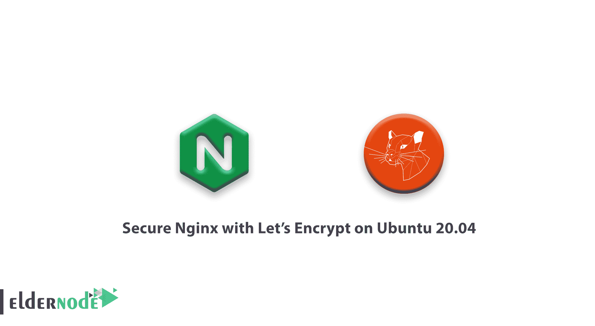

# 如何在 Ubuntu 20.04 上使用 Let's Encrypt 保护 Nginx-elder node

> 原文：<https://blog.eldernode.com/secure-nginx-encrypt-ubuntu/>



由于之前在 [Nginx](https://eldernode.com/install-nginx-on-ubuntu-20-04-lts/) 的教程，在这篇文章中，你将学习**如何在 Ubuntu 20.04** 上用 Let's Encrypt 保护 Nginx。它是一个证书颁发机构(CA ),提供了一种获取和安装免费 TLS/SSL 证书的简单方法。

它通过提供一个软件客户端 Certbot 来简化这个过程，该客户端试图自动执行大多数必需的步骤。目前，获得和安装证书的整个过程在 Apache 和 Nginx 上都是完全自动化的。

**先决条件**

如果您知道以下内容，本教程可能会更有用:

## 如何在 Ubuntu 20.04 上用 Let's Encrypt 保护 Nginx

为了完成本教程，我们使用 Certbot 为 Ubuntu 20.04 上的 Nginx 获取一个免费的 SSL 证书，并设置您的证书自动更新。此外，使用单独的 Nginx 服务器配置文件，而不是默认文件。您建议为每个域创建一个新的 Nginx 服务器块文件，因为这有助于避免常见错误，并保留默认文件作为后备配置。让我们通过本指南的步骤来达到本文的目的。

**不要错过相关文章:**

**[如何用让我们在 Debian 上加密 10](https://eldernode.com/secure-nginx-encrypt-debian-10/)** 保护 Nginx web 服务器

### 1-安装证书机器人

首先，您必须在服务器上安装 Certbot 软件。

```
sudo apt install certbot python3-certbot-nginx 
```

### 2-确认 Nginx 的配置

要自动配置 SSL，Certbot 需要能够在您的 Nginx 配置中找到正确的 **服务器** 块。其方法是寻找一个 **server_name** 指令，该指令与您请求证书的域相匹配。

使用 nano 或您喜欢的文本编辑器打开您的域的配置文件:

```
sudo nano /etc/nginx/sites-available/example.com 
```

当您找到现有的 server_name 行时，您将在下面查看它。

/etc/nginx/sites-available/example . com

```
...  server_name example.com www.example.com;  ...
```

然后，退出编辑器，并在成功完成后继续下一步。但是，如果不匹配，请更新它以匹配。然后保存文件，退出编辑器，并验证配置编辑的语法:

```
sudo nginx -t
```

如果遇到错误，请重新打开服务器块文件，检查是否有任何打字错误或丢失的字符。一旦配置文件的语法正确，重新加载 Nginx 以加载新的配置:

```
sudo systemctl reload nginx
```

你让 Certbot 找到正确的 **服务器** 屏蔽并自动更新。

### 3-允许 HTTPS 通过防火墙

我们建议您启用 **ufw** 防火墙，当您这样做时，您需要调整设置以允许 HTTPS 流量。幸运的是，Nginx 在安装时用**ufw** 注册了几个概要文件。

检查当前设置:

```
sudo ufw status 
```

输出

```
Status: active    To                         Action      From  --                         ------      ----  OpenSSH                    ALLOW       Anywhere                    Nginx HTTP                 ALLOW       Anywhere                    OpenSSH (v6)               ALLOW       Anywhere (v6)               Nginx HTTP (v6)            ALLOW       Anywhere (v6)
```

接下来，您可以允许 Nginx 完全配置文件，并删除多余的 Nginx HTTP 配置文件，以额外允许 HTTPS 流量。

您的状态应该如下所示。

```
sudo ufw allow 'Nginx Full'  sudo ufw delete allow 'Nginx HTTP'
```

输出

```
sudo ufw status 
```

然后，运行 Certbot 并获取我们的证书。

```
Status: active    To                         Action      From  --                         ------      ----  OpenSSH                    ALLOW       Anywhere  Nginx Full                 ALLOW       Anywhere  OpenSSH (v6)               ALLOW       Anywhere (v6)  Nginx Full (v6)            ALLOW       Anywhere (v6)
```

**[购买 Linux 虚拟主机](https://eldernode.com/linux-hosting/)**

4-获得 SSL 证书

### Certbot 将为您带来几种通过插件获得 SSL 证书的方法。Nginx 插件将负责重新配置 Nginx，并在必要时重新加载配置。

您可以通过使用以下命令来使用该插件:

如果这是您第一次运行 certbot ，系统会提示您输入电子邮件地址并同意服务条款。然后， **certbot** 将与 b Encrypt 服务器通信，然后运行一个挑战来验证你控制了你正在请求证书的域。

```
sudo certbot --nginx -d example.com -d www.example.com 
```

最后，如果成功的话，certbot 会询问你想如何配置你的 HTTPS 设置。

输出

`通过提示 **选择您的选择后，输入** ，配置将被更新，Nginx 将重新加载以选取新的设置。certbot 将显示一条消息，告诉您该过程已成功完成，并且您的证书存储在哪里:`

```
`Please choose whether or not to redirect HTTP traffic to HTTPS, removing HTTP access.  - - - - - - - - - - - - - - - - - - - - - - - - - - - - - - - - - - - - - - - -  1: No redirect - Make no further changes to the webserver configuration.  2: Redirect - Make all requests redirect to secure HTTPS access. Choose this for  new sites, or if you're confident your site works on HTTPS. You can undo this  change by editing your web server's configuration.  - - - - - - - - - - - - - - - - - - - - - - - - - - - - - - - - - - - - - - - -  Select the appropriate number [1-2] then [enter] (press 'c' to cancel):`
```

`输出`

`随着证书的下载、安装和加载，现在使用 **https://** 重新加载您的网站，并注意您浏览器的安全指示器。`

``一般来说，它应该表明该网站已被妥善保护，通常带有一个**锁图标**。``

```
``IMPORTANT NOTES:   - Congratulations! Your certificate and chain have been saved at:     /etc/letsencrypt/live/example.com/fullchain.pem     Your key file has been saved at:     /etc/letsencrypt/live/example.com/privkey.pem     Your cert will expire on 2020-08-18\. To obtain a new or tweaked     version of this certificate in the future, simply run certbot again     with the "certonly" option. To non-interactively renew *all* of     your certificates, run "certbot renew"   - If you like Certbot, please consider supporting our work by:       Donating to ISRG / Let's Encrypt:   https://letsencrypt.org/donate     Donating to EFF:                    https://eff.org/donate-le``
```

``5-验证证书自动更新``

``Encrypt 的证书有效期只有 90 天，这迫使用户自动更新证书。 **certbot** 软件包通过添加一个每天运行两次的 systemd 计时器来为您处理此事，并自动更新任何过期三十天内的证书。``

``用 **systemctl** 查询定时器的状态:``

### ``输出``

``此外，您可以通过运行下面的命令来测试续订过程。``

``**好样的** ！您已经达到了本指南的目的，并学习了如何在 Ubuntu 20.04 上使用 Let's Encrypt 来保护 Nginx。``

```
``sudo systemctl status certbot.timer``
```

``如果您在此之前没有看到任何错误，这意味着您已经准备好了。请注意，Certbot 将更新您的证书，并在必要时重新加载 Nginx 以获取更改。如果自动续订过程失败，Encrypt 会向您指定的电子邮件地址发送一封邮件，在您的证书即将过期时发出警告。``

```
``● certbot.timer - Run certbot twice daily       Loaded: loaded (/lib/systemd/system/certbot.timer; enabled; vendor preset: enabled)       Active: active (waiting) since Mon 2020-05-04 20:04:36 UTC; 2 weeks 1 days ago      Trigger: Thu 2020-05-21 05:22:32 UTC; 9h left     Triggers: ● certbot.service``
```

``亲爱的用户，我们希望本教程能对你有所帮助，如有任何问题或想查看我们的用户关于本文的对话，请访问 [提问页面](https://eldernode.com/ask) 。也是为了提高自己的见识，准备了这么多有用的教程给 [Eldernode 培训](https://eldernode.com/blog/) 。``

```
``sudo certbot renew --dry-run`` 
```

```同样，参见```

```[教程 Ubuntu 20.04 中用 Nginx 安装 WordPress](https://eldernode.com/wordpress-installation-nginx-ubuntu20/)```

```[教程 CentOS 8 上安装 Nginx](https://eldernode.com/installation-nginx-on-centos-8/)```

```Also, see ```

```[Tutorial WordPress installation with Nginx in Ubuntu 20.04](https://eldernode.com/wordpress-installation-nginx-ubuntu20/)```

```[Tutorial installation Nginx on CentOS 8](https://eldernode.com/installation-nginx-on-centos-8/)```