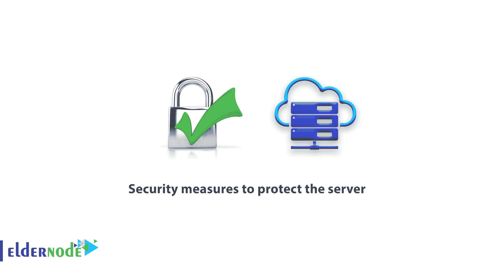

# 保护服务器- ElderNode 博客的安全措施

> 原文：<https://blog.eldernode.com/security-measures-to-protect-the-server/>

保护[服务器](https://eldernode.com/)的安全措施，通常你主要关心的是在准备你的基础设施时安装和运行你的程序。如果你试图在没有你的基础设施的[安全](https://blog.eldernode.com/tag/security/)需求的情况下正确地设置你的软件，那将会带来灾难性的后果。

### 保护服务器的安全措施

一些基本的安全提示:

通过监控保护您的站点和服务器:

1)删除不需要的服务:不需要的服务除了消耗您的资源之外，还需要维护。在减少资源消耗的同时删除这些服务会降低您的风险。

2)设置防火墙:正确配置防火墙以适应您的软件有助于减少资源消耗，并通过阻止不必要的访问者来提高服务的安全性。

3)应对 DoS 攻击

4)开发访问级别:创建您的组织成员对您的网站和服务器的访问级别结构是防止他们的帐户被黑客攻击时信息泄露的最重要方法之一。

5)安装安全更新:安全和运营服务是最重要的安全解决方案之一。由我们的专家安装这些项目将确保您的服务器始终是最新的，不会受到损害。

6)监控和审计

7)两步认证:两步验证是防止数据窃取进入您的员工的终极解决方案。

8)黑名单:在尝试连接之前，利用现有的黑名单可以消除它们给电子邮件和网络服务带来的风险和问题。

9)安全证书:为您的主动服务安装安全证书是防止信息窃取的主要方式。

我们希望您喜欢对[服务器安全](https://blog.eldernode.com/tag/security/)的简要描述。