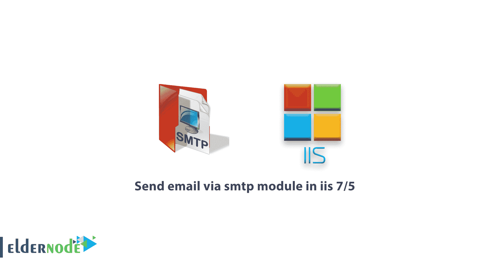
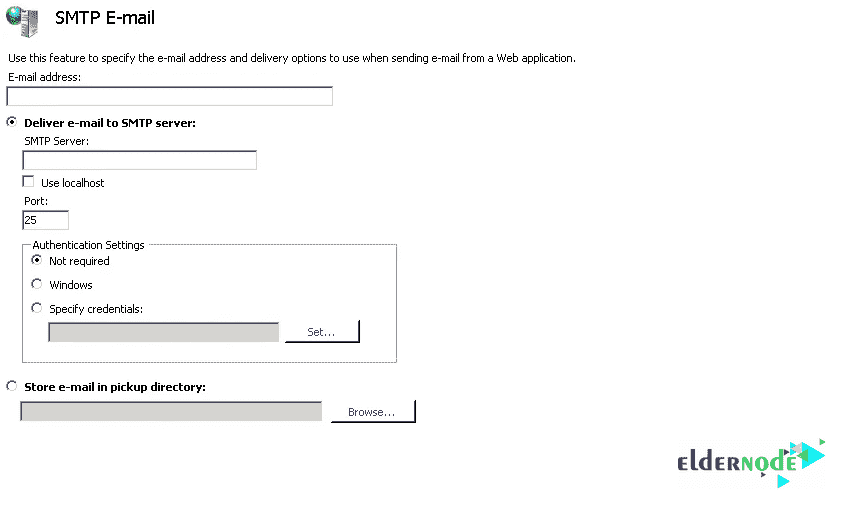

# 通过 iis 7.5 中的 smtp 模块发送电子邮件-教程| Eldernode

> 原文：<https://blog.eldernode.com/send-email-via-smtp/>

如何在 iis 7.5 中通过 smtp 模块发送邮件，

IIS 中的 SMTP 模块是什么？

从站点浏览者那里获得电子邮件和评论的最好方法是使用 IIS 中的 SMTP 模块。该模块将 web 应用程序发送的电子邮件上传到 SMTP 服务器。SMTP 或简单邮件传输协议是一种处理发送电子邮件的协议。启动该服务的步骤如下。

### 安装 SMTP

默认情况下，不安装 SMTP 服务器。安装过程如下:

*   1.打开服务器管理器。
*   2.在功能部分下，单击添加功能。
*   3.选择 SMTP 服务器。
*   4.单击添加所需的角色服务。如果有必备卷，它会由 [Windows 服务器](https://eldernode.com/windows-vps/)自动安装。单击下一步。
*   5.必须安装 IIS 6 管理兼容性和 [IIS](https://www.iis.net/) 6 管理控制台，SMTP 才能工作。
*   6.安装完成后，单击关闭。

如何进行 SMTP 设置

### 要访问 IIS 页面的 SMTP 设置部分，请在应用程序开发人员部分中，单击 SMTP 电子邮件模块。

在这个页面上，你的 SMTP-email 的所有设置都被观察到:

在电子邮件地址字段中，在框中输入 SMTP 服务器的电子邮件发件人地址。

从网站或 web 应用程序获取电子邮件有两种方式:

1)在第一种方法中，电子邮件被传输到 SMTP 服务器。

*   2)第二种方法存储在您定义的目录中。
*   单击选择将电子邮件发送到 SMTP 服务器的第一个选项。在下面的框中输入 SMTP 服务器域名。如果服务器在本地系统上，请选中使用本地主机。

SMTP 通常使用端口 25 发送电子邮件。默认情况下，端口部分设置为 25。要更改它，请在端口框中输入所需的号码。

在“身份验证设置”部分，您可以配置 SMTP 服务器的身份验证方法。如果服务器不要求身份验证，请单击不要求。选择 Windows 选项的 Windows 身份验证，要使用特殊帐户进行身份验证，请单击指定凭据。选择“设定”，然后在新窗口中输入帐户和密码。单击确定。

要在目录中存储和维护电子邮件并在将来将其发送到服务器，请选择将电子邮件存储在 pickupdirectory 选项。在框中，输入所需的路线地址。

从操作菜单中，单击应用。

如有疑问或问题，可向[提问系统](https://eldernode.com/ask/)咨询，提供指导。

祝你好运。

Good luck.