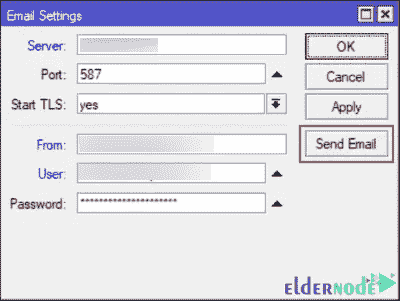

# 教程从 MikroTik 路由器发送电子邮件

> 原文：<https://blog.eldernode.com/send-emails-from-a-mikrotik-router/>

MikroTik RouterOS 操作系统有非常有趣的功能，发送邮件就是其中之一。通过路由器发送电子邮件可以有广泛而有用的用途。从路由器发送电子邮件非常容易，而且设置简单。这篇文章将教你如何从 MikroTik 路由器发送电子邮件。如果你想购买一台 [Mikrotik VPS](https://eldernode.com/mikrotik-vps-server/) 服务器，你可以查看 [Eldernode](https://eldernode.com/) 网站上提供的套装。

## **如何从 MikroTik 路由器发送电子邮件**

Mikrotik 是一家开发路由器和无线 ISP 系统的拉脱维亚公司。它制造网络硬件和软件，在世界上所有国家都被使用。Mikrotik RouterOS 拥有包括电子邮件在内的各种附加功能。Mikrotik 能够发送带有附件的电子邮件。您可以使用它来定期发送 Mikrotik 设置的备份，并监控网络状况。

在 [Mikrotik 培训](https://blog.eldernode.com/tag/mikrotik/)系列的本教程中，我们将教你如何从 Mikrotik 路由器发送电子邮件。

### **从 MikroTik 路由器发送电子邮件**

在本节中，您将学习如何从 MikroTik 路由器发送电子邮件。要做到这一点，只需按照下面的步骤，并执行提到的功能。

首先，导航到 **Winbox** 并转到**工具>电子邮件**路径:

现在，您将看到以下屏幕。填写您的电子邮件设置，点击**应用**，然后**确定**:

你应该回到**工具**菜单，再次点击**电子邮件**。打开**邮件设置**页面后，选择发送邮件:

并在打开的页面中，输入你的**地址**、**端口**、**用户**和**密码**，然后记得检查 **TLS。另外，请记住输入发件人、主题和正文部分:**

您应该在**到**字段中输入您想要发送电子邮件的电子邮件地址。在文件选项中，您可以附加一个文件。最后，点击**发送电子邮件**。可以检查通过 Mikrotik 电子邮件发送的电子邮件收件箱中发送的电子邮件。

仅此而已！

## 结论

从 Mikrotik 路由器发送电子邮件可用于监控网络状况，通过电子邮件定期备份 Mikrotik 配置等。在这篇文章中，我们教你如何从 Mikrotik 路由器发送电子邮件。我希望这篇教程对你有用，对你有帮助。如果你有任何问题或建议，可以在评论区联系我们。